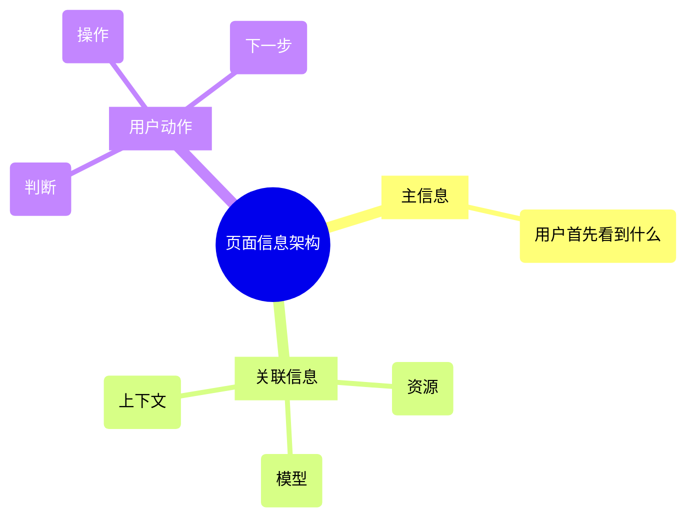
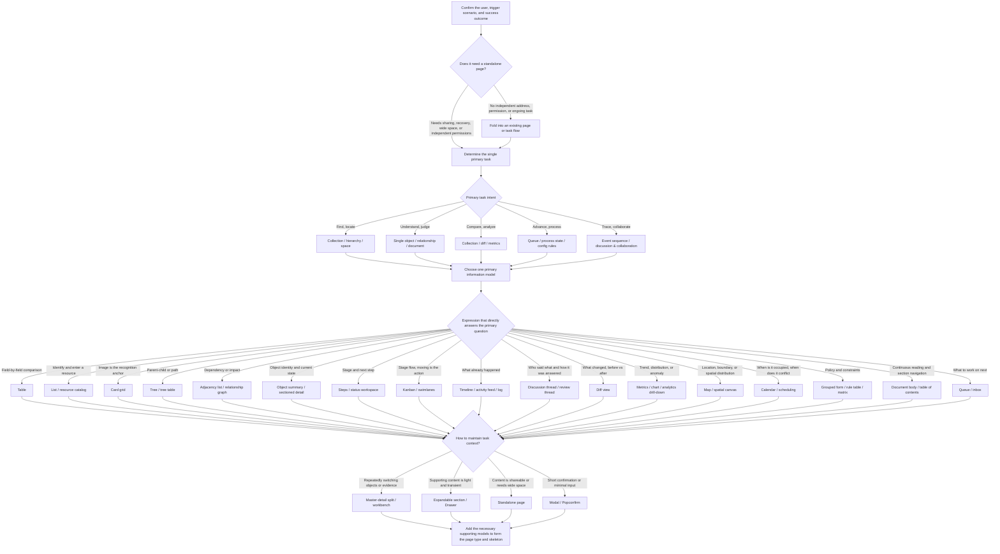

最近我开始自己做一个基础设施项目的前端。AI 很快就能把页面搭出来，增删改查、筛选、状态标签一项不少，第一眼甚至挺像那么回事。

真正用起来，别扭的地方就出来了：页面里的信息很多，却不知道先看什么；关联资源、上下文和状态散在各处；下一步该做什么，也得靠人自己在一堆字段里拼出来。

组件其实没有选错。问题在于，我一开始只把它当成 CRUD 页面来做：先列字段，再补筛选和操作，最后才发现用户还是不知道该从哪里开始。数据是齐的，页面却没有帮用户排出理解和行动的顺序。

后来我把自己会做的判断整理成了一份页面组织指南。表格、看板、日历这些组织信息的基本方式，我在指南里统称为“表达骨架”。

## 当大家都来写产品页面

我的工作一直以后端为主。虽然我也对前端和其他技术感兴趣，平时会做一些尝试，但真正投入工作的，还是后端。最近团队的前端资源缩减，我开始亲自承担前端项目。

这次我没有打算从零设计一套组件规范，而是选择 Ant Design 加 Ant Design Pro 作为基础。原因很实际：企业后台里常见的表格、表单、布局、导航和描述信息，都有比较成熟的现成方案，页面外壳和组件行为也容易保持一致。基础问题交给组件库处理，我可以把时间花在信息怎么组织、用户先看什么上面。

这套规范并不会替页面做决定。它只是先把实现的起点固定下来，避免每个页面都重新讨论颜色、间距和组件样式。真正需要判断的，还是页面要围绕什么对象展开，以及用户准备拿这些信息做什么。

这件事让我重新碰到一个老问题：代码写出来，页面不一定就设计好了。用 AI 写前端时，这个差别尤其明显。它能补组件、样式和交互，却不知道用户来到页面后最该先理解什么、判断什么，下一步又要做什么。

我想把自己在这方面的一些方案和判断拎出来，让团队同学也能用。页面“看着不对”往往只是一个感觉，只有具体说出主信息没立住、关联信息散了、操作放错了位置，才有办法一起讨论，也才好交给 AI 修改。

这份页面组织指南就是其中一部分。它既是我自己写前端时的检查表，也希望成为团队把 AI 用到前端项目里时，共用的一套判断依据。

## 如何组织信息架构

我看一个高密度页面，通常不会先去找组件。先把下面三个问题想清楚，后面的选择会容易很多。

1. 用户打开页面时，最重要的是看到什么？
2. 为了理解这件主信息，还要看到哪些关联资源、关联模型和上下文？
3. 用户看完后要作出什么反应、执行什么动作，或者继续思考什么？

我先把这三个问题过一遍，至少能知道用户进来要做什么。等这件事清楚了，再回头看表格、看板还是日历，通常不会选得太偏。

目前的 demo 用 Ant Design 实现。判断本身和组件库无关，换到其他技术栈时，具体组件还得结合项目调整。

## 从列表和详情走向复杂信息组织方式

CRUD 很适合处理数据操作，列表和详情页也一直有用。只是它们主要回答“这条记录怎么增删改查”，不太回答用户进入页面后先看什么、需要什么反馈，以及要依据哪些信息做决定。

API 只负责把数据和操作交出来，页面还得把它们之间的关系摆清楚：用户先看什么，接着比较什么，最后在哪里操作。

## 范例：GitHub Projects 信息布局

[GitHub Projects 的布局说明](https://docs.github.com/en/issues/planning-and-tracking-with-projects/customizing-views-in-your-project/changing-the-layout-of-a-view)很适合拿来做对照。同一个项目条目，可以放进表格、看板，也可以放到时间线式的路线图里。数据没变，用户读它的方式变了。

如果拿一批待开发任务来对照这些布局，三种视图分别会把注意力带到不同的地方：

| 眼前要回答的问题                   | 需要放在一起的信息       | 可选择的表达骨架       |
| ---------------------------------- | ------------------------ | ---------------------- |
| 哪些任务优先处理，分别由谁负责？   | 优先级、负责人等字段     | 表格，按列对照和排序   |
| 哪些任务还在进行，哪些已经完成？   | 任务所处阶段             | 看板，按状态分组       |
| 几项工作安排在什么时间，是否重叠？ | 开始、结束日期和持续时间 | 路线图，在时间轴上观察 |

排下一轮工作时，我会把优先级和负责人放在固定的列里，排好序后逐行看分工。换成卡片，同一个字段的位置就没那么稳定，比较起来反而要来回找。表格在这里的价值很简单：让比较发生在固定的位置。

跟进进度时，我关心的是“还有哪些在处理中”。把任务按状态排成几列，先找到阶段，再看里面的条目，会更符合这个动作。如果还能直接拖动卡片推进状态，页面位置和操作也能接上。

安排交付时间时，只知道“进行中”就不够了。把开始和结束日期放到时间轴上，几项工作的区间是否重叠会立刻显出来。至于是不是真的排不开，还要回头看负责人和工作量。

后台页面不需要把三种视图都做一遍。页面主要服务一种任务，就先把这一种做好；只有确实有多种高频用法时，才值得增加视图。每多一种视图，筛选、状态和操作就多一份维护成本。

[Notion 的数据库视图](https://www.notion.com/help/views-filters-and-sorts)也是类似的例子。准备发布一批内容时，挑封面可以切到图库，检查发布日期可以切到日历。日历能让我看到日期分布，但它不会自动告诉我资源有没有冲突；要回答这个问题，还得有时间范围和资源占用这些信息。

我平时也会看一些产品怎么处理类似问题。GitHub 让我印象最深的是，它总是围绕一个核心对象展开，不急着把所有信息都塞进来。Twitter 更像是把同一个对象放到不同场景里处理。淘宝面对的数据量很大，但商品和交易动作一直很突出。豆瓣的数据类型很多，页面却各有自己的组织方式。它们的样式当然不能直接搬过来，但看这些页面时，我会留意用户眼前到底要做什么。

所以我现在会先把页面要解决的事说清楚：用户来到这里，究竟要看懂什么、比较什么，还是推进什么。这样比一上来想着“做一个现代化后台”更容易找到方向。

## 如何选择合适的信息结构

guide 的 2.2 里，这个选择过程被画成了一条完整路径：先看系统里有哪些对象和关系，再看用户要完成什么，接着判断信息本身是什么结构，最后才落到具体的表达方式。

不能因为 API 返回了一个数组，就顺手做成表格；也不能因为路由里有一个 ID，就默认做成详情页。同一个对象，用户在查找时可能需要列表，处理时可能需要状态流转，协作时又可能需要讨论线程。

guide 里的完整分支图还会继续追问主任务和主问题。例如逐字段比较适合表格，图片是识别锚点时可以用卡片网格，阶段流转适合看板，关注时间占用和冲突才使用日历。记录有日期，只能说明数据里有日期，不能直接决定页面应该用哪种结构。

选完以后，我会再走一遍真实操作：用户最常比较的信息有没有放在一起，最常做的操作是不是就在旁边。如果还得反复打开详情，记住上一条记录再回来比较，结构和字段安排大概还得重看。

## 反列表和详情示例：卡片、看板、日历排期、仪表盘等

demo 把这些判断做成了几组可以直接打开的页面。看页面时，我主要会问：如果用户要认图、推进状态、安排时间，或者找出异常，哪些信息应该先出现？

demo 的代码在 [`alswl/guides`](https://github.com/alswl/guides) 仓库的 [`fe-page-guide-antd-demo`](https://github.com/alswl/guides/tree/master/fe-page-guide-antd-demo) 目录里。它是一个可以直接运行的配套项目：用 Vite + React 18 + TypeScript 搭起来，页面基础能力由 Refine 承接，界面使用 Ant Design v5 和 Ant Design Pro 的 ProComponents。数据是内存里的 mock，19 种表达骨架各自对应一个路由，打开就能看到具体页面长什么样。

这些页面用的是同一套技术栈，所以对照时更容易看出差别来自信息怎么排，而不是组件库换了。

### 卡片网格：以识别对象为主

挑素材或模板时，用户通常先看缩略图，确认它是不是自己要找的东西。这个时候图片应该是主要入口。要是还要比较价格、规格等字段，表格可能更省事。

拿模板来说，我一般先认版式，再看名称。把预览缩成表格最左边的一张小图，识别时最重要的内容反而被压掉了。卡片能把预览放在显眼的位置，名称和其他字段围着它排。如果每次选择都要核对一堆参数，那就不能只靠大图。

### 看板：让阶段一眼可见

看板最重要的是列的含义，以及卡片在列之间怎么移动。用户先看阶段分布，再决定下一步怎么推进。若只是按负责人筛选任务，列表已经够用，没必要硬做成看板。

“待处理、进行中、已完成”这种列名，位置本身就在表达进度。卡片里保留标题、负责人等识别信息就可以。列如果只是换了个名字的筛选条件，用户看起来会很累，操作也未必更快。

### 日历与排期：把时间占用摊开

日历适合处理真正和时间占用有关的事情，比如排班、会议室预订。要是只是想知道审批先提交还是先通过，时间线就更直接。

预订会议室时，用户要马上知道某个时间段有没有被占用，开始和结束时间不能藏在详情页里。审批记录则不一样，重点是事件先后，按时间线排开即可。

### 仪表盘：按问题组织指标

仪表盘最容易做成一堆大小相同的卡片。真正该先看的，是指标之间的关系，以及用户从概览进入细节的顺序。

如果所有指标都用一样的卡片摆开，用户还是得自己猜哪些应该一起看。我会先按问题分组：哪些数字用来发现异常，哪些趋势用来解释变化，明细入口放在什么位置。信息多，不代表每一块都要抢注意力。

### 层级树：保留对象的归属关系

树适合那些“我得知道它属于哪里”的信息。组织架构、分类目录需要保留父子关系；如果用户经常跨层级查找，再配一个列表或搜索框。

用户沿目录往下找时，树能保留“我现在在哪一层”的感觉。已经知道名称、只想快速定位时，搜索更快。这两种入口可以同时存在，不用让用户为了找一个已知条目，把整棵树一层层展开。

### 状态墙：先发现异常，再进入细节

状态墙先解决一个很现实的问题：异常到底在哪里。监控页面可以密，但不能让颜色、装饰和状态标识互相打架。

用户先找到需要关注的对象，再进去查原因。对象名称和状态要容易辨认，详细日志放到下一步就好。颜色确实方便扫视，但最好再配文字或其他标识，否则用户很难准确说出自己看到的是什么。

## 参考表：十九种信息呈现方式

下面把其余页面也放在一起，想看细节时可以点击图片打开原图。

| 表达骨架                                                                                                                     | 表达骨架                                                                                                                     |
| ---------------------------------------------------------------------------------------------------------------------------- | ---------------------------------------------------------------------------------------------------------------------------- |
|  分区详情           |  二维对照表         |
|  目录与发现 |  卡片网格         |
|  层级树                   |  关系列表     |
|  分步向导           |  追踪下钻     |
|  看板                     |  状态墙     |
|  事件时间线   |  讨论线程   |
|  连续文档                 |  并排比较         |
|  地图与画布     |  日历排期       |
|  仪表盘         |  主从工作台 |
|  配置表单           |                                                                                                                              |

## 直接让 Agent 来使用这套指南

这份指南可以直接放进项目仓库，作为 AI 检查前端页面时的参考。人先从业务出发，想清楚用户来这里要完成什么，再决定信息结构和表达骨架；AI 根据这些判断补方案、找不一致的地方，再把修改做出来。

可以把下面这段直接交给 Agent：

> 页面组织指南地址：
>
> https://github.com/alswl/guides/blob/master/fe-page-guide-antd.md
>
> 先阅读页面组织指南，并检查当前项目的目录结构。根据项目已有的文档约定，把指南复制到合适的位置；如果没有更合适的目录，放在 docs/fe-page-guide-antd.md。复制完成后告诉我实际保存路径，不要只把远程 URL 当作参考。
>
> 检查当前项目的任务管理页面。这个页面主要用来比较任务优先级和负责人，同时需要查看任务所处阶段。
>
> 结合需求、页面源码和实际页面，给出信息架构和页面表达方式的检查结果与改造建议：列出主信息、关联信息、用户要完成的动作，说明当前表达骨架是否适合、具体问题在哪里、对应的指南依据是什么，以及建议采用什么页面结构。无法从现有资料确定的业务意图请指出来。
>
> 先把检查结果和改造方案发给我，等我确认后再完成页面改造。保留现有业务功能、权限和数据交互，沿用项目的组件库。修改后运行项目已有检查，并在页面中验证字段比较、状态切换等操作，给出修改前后的截图和仍需人工判断的问题。

页面和任务描述要换成自己的业务。AI 可以列出几种候选方案，但主骨架和信息顺序不能只看它的输出，业务出发点还得由人来定。

检查报告要落到具体位置。只说“信息层次不清晰”没有多少用处，最好说明哪些信息应该放在一起、现在分散在哪里、准备怎么改。这样才能看出 AI 是不是解决了真正的问题。

把指南放进仓库，只是给了 AI 一份依据。还要告诉它页面入口和主要任务。如果 AI 只能看到源码，就先做源码检查；等页面跑起来，再补截图和实际交互验证。

验收时，我还是会沿着真实任务走一遍：信息是不是更容易找到，下一步操作有没有变清楚，原来的筛选、权限和数据交互是否还正常。

[指南与 demo 仓库](https://github.com/alswl/guides)里放了完整规则和示例。至于页面是否真的好用，还是得回到具体业务里试一遍。

