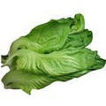

本文乃08-09校内日志存档，我一起给发布了，如果给大家阅读造成困难，我深感抱歉```

今早上，去买菜，在 边界市场 买的，青菜5毛一斤，芥菜1块钱一斤，鸡蛋3.8元一斤。

很多人不知道什么是芥菜，我今天翻了好久才找到普通话的芥菜是怎么回事。我家乡话是读(ga cai)。



今天看cctv2的美食美客，挺不错的节目。介绍的菜都挺好的，呵呵，然后特意去cctv的网站找了相关的电子杂志，其中有完全的视频以及菜谱和注意事项，大家可以下
载看看哦。

网址： [http://idm.cctv.com/mag/type_list/mag_list_7_1.html](http://idm.cctv.com/mag/type_list/mag_list_7_1.html)

今天看了点资料，呵呵，看了点做饭的技巧，介绍一下

1.荷包蛋如何煎得漂亮

前提:要用慢火

如果只煎一个蛋,放油时只要放平常的勺子一勺子就行了.

放入鸡蛋后5秒钟左右,用小勺盛些凉水在锅内油的边缘滴上4---6滴水(要均匀)

25秒后先在鸡蛋上撒上少许盐,把鸡蛋翻过来再煎30秒钟左右

如此再反复一次以上动作(水和盐不用加,但时间要缩短一半).即可.

但要使荷包蛋煎得漂亮，就要先将蛋由冰箱拿出来，至温度回升至约20摄氏度之后再煎。因为蛋从冰箱取出时，蛋白的黏性很强，会在蛋表面形成一层薄膜。要是蛋并不是很新
鲜，那层薄膜就相当明显。

2.调味的作用与方法

我向来认为，徐州的菜比溧阳的菜味道浓很多，把子肉非常好吃，小西门那边的把子肉好吃，很大程度上是因为他的调味料放的很多很杂，但配的比较好，香料的配置相当有讲法

调 味是烹饪中一项重要的内容，我国古代对菜肴的调味已十分讲究。2000多年前的《吕氏春秋》、《本味》篇就对饮食调味作了叙述：「调和之事，必以甘酸苦辛
咸，先后多少，其齐甚微，皆有自起」。北魏贾思勰著的《齐民要术》，对制盐、制酱、制醋、制豆豉、制酱制品、腌鱼及腌肉等技术，都作了具体介绍，仅制酱一
项，从荤到素就记述了10多种，而制醋又介绍了21种。可见古人把调味放在烹饪中相当重要的位置上。

调味在潮州菜中不单是一项技术，而且是一门重要的学问。潮州菜之所以能饮誉海内外，其中原料、精巧的烹制技艺，固然是十分重要，而调味也处于同等的地位。潮州菜的清淡
甘和鲜美，在很大程度上，有赖于厨师调味的功夫。

调味就是根据主、辅料的特点和菜肴的需求，在整个烹制过程的必要环节上，恰当而适量地配以必须的调味料，使菜肴产生令人喜爱的特殊美味。

一、调味的作用

1、去腥解腻

有 些原料带有腥味、膻味或其他异味，有些原料较为肥腻，都必须通过调味，除去或减少制出菜肴的腥与腻等。如鱼有腥味，故生炊鱼，一般应放上姜丝、葱、芹菜及
红辣椒，除去腥味。羊肉有较重的膻味，「红炖羊肉」便用葱、姜、甘草、桂皮、绍酒等味料调味，还配「南姜醋」酱碟，以去其膻味。以猪肉类为主料的菜肴，容
易因肥腻而使人厌食，常用胡椒粉、麻油、香菜、椒末与酒等调味，有的还配酸甜酱碟，或再用酸黄瓜、菠萝片、柑片之类围边，给顾客佐食去腻。

2、提鲜佐味

有 的菜肴原料营养价值高，但本身并没有什么滋味，除用一些配料之外，主要靠调味料调味，使之成为美味佳肴。如鱼翅是名贵原料，但它本身并没有什么美味，甚至
还带有腥味，没有调味料是不能烹成佳肴的。「红炖鱼翅」就用了绍酒、精盐、酱油、生葱、生姜、香菜、麻油、胡椒粉、上汤、二汤、浙醋、味精、红豉油等10
多种调味料，使之成为高级筵席上鲜味浓郁的高档名菜。再如海参、豆腐、竹笙、蛤士蟆等原料本身都没有或缺乏滋味，都需要味料协助提鲜和使之产生美味。

3、辅料定味

调 味能帮助某种原料，形成特有的滋味。同一种原料，可以烹制成几种以至10几种滋味不同的菜肴，主要是调味的作用。如燕窝若加入咸味味料之后，可制成「咸三
丝官燕」、「菜胆燕」等；若改放冰糖、清水，则制成的是「冰花甜燕」。咸甜两样，滋味大不相同。即使原料本身已非常鲜，通过调味也可使之变化无穷。如猪
肉，加南乳、南乳汁、白糖、姜、葱、酱油、蒜末可烹制为肉烂香滑、具南乳香味的「南乳扣肉」；加上汤、笋花、红辣椒、葱、绍酒、香菇等，可制成味道浓香的
「角玉肉」；加白醋、白糖、葱、辣椒、姜米、绍酒、酱油等，可制成酥香美味的「酸甜咕噜肉」等等。

4、杀菌消毒

调味料中有的具有杀灭或抑制微生物繁殖的作用。如盐、姜、葱等调味料，就能杀死微生物中的某些病菌，提高食品的卫生质量。食醋既能杀灭某些病菌，又能保护维生素不受损
失。蒜头具有灭杀多种病菌的功能和增强维生素B1功效的作用。

5、融合调和

烹饪原料中，有的含有特别强烈的气味，顾客不但不喜欢，甚至无法接受。如「油炸猪肠」，尽管猪肠经过反复漂洗，仍难尽除其臭味。在烹制这一菜肴时，用甘草、桂皮、八角
、南姜、酒等香辛味较浓的调料，加以腌卤，使原料融入香味，去除异味。

二、调味的方法

1、熟悉各种原料的性质特点，选准味料

有 的原料本身就已有其鲜美本味，调味就不是去改变或冲淡原料固有的美味，而是辅助原料本味的外溢。如鲜活海生动物其味都十分鲜美，烹调菜肴时常用的姜、葱、
芹菜、芫荽和少量的红辣椒，去除其腥味，使鲜美的本味更加突出。如果投入大量的麻辣或酸甜酱料，就会改变其固有美味，这是烹调中应避免的。

2、掌握菜肴的制烹要求，恰当投入味料

同 一原料，由于烹制菜肴的要求不同，所需味料有很大的差异。如以脚鱼（甲鱼）为主料的「清炖脚鱼」，要求味鲜美，除选用冬菇、排骨作配料外，味料只有少量的
姜、葱、蒜头、味精、精盐、胡椒粉，其作用是除异味，助本味，增美味。但「红焖脚鱼」的味料就大为不同，因这一菜肴要求香味浓郁，因此味料用炸蒜肉、姜
片、红辣椒、精盐、味精、胡椒粉、芝麻油、珠油、绍酒、猪油等。味料是服从菜肴制作的需要而选用的，厨师对菜肴的调味要求必先心中有数，才能恰当、合理地 投进味料。

菜肴的制作与烹调方法密切联系，味料的选择与应用的分量也必须注意菜肴所采用的烹制方法。例如属于清炖的汤类，一般必须清淡，不能用刺
激性很强的麻辣与浓香的调味料。红焖、红炖则不同，必须选用香味较为浓郁的味料，以增加菜肴美味。属烧烤与油炸类的菜肴，大都要配甜或酸甜的酱碟。

3、根据时令季节的变化和顾客的口味调味

夏季天气炎热，菜肴调味要淡；冬季寒冷，调味就要浓一些。淡与浓，不仅表现在投放味料数量的多少，还可适当变换调味料的种类，并通过合理搭配来实现。同时调味也要考虑
顾客的口味，才能迎合顾客的需求。4、掌握调味的时间和方法

（1） 加热前调味。加热前调味是原料未下鼎烹饪时，就已把味料投放。潮州菜中用烧、炸、焗、炊等烹调方法烹制的菜肴，很多要在加热前调味。有的是因为原料体型
大，不事先调味就难以入味；有的是加热中不可揭盖调味，需事前投下味料；也有是为了使原料能快速入味。如「豆酱焗鸡」，加热前需把豆酱中的豆粒压烂后连同
豆酱汁与绍酒、芝麻酱、味精、酱油等拌匀，涂于鸡身内外，再放入砂锅上焗。又如「干烧水鸭」，先用姜、酒、葱、川椒和酱油腌制后，才进行加热烹制。许多生
炊海鱼、河鱼，都在加热前调味。部分炖品也于炖前调味，如「清炖水鸭」的姜、葱、盐等味料在入蒸笼前便投放。一切卤品的烹制，都是配齐各种调味料之后，才
加热卤制。加热前的调味，有的是定味，有的只是起初步调味作用，这取决于菜肴的烹制要求与烹调方法。

（2）加热中调味。加热过程投放味料，决定了菜肴的滋味，称正式调味或决定性调味。许多烹调方法如滚、焗、（火屈）清、煲等都在加热中调味。但有些菜肴，往往为了增加
其美味，在加热之前仍要作初步调味。

（3）加热后调味。有些菜肴在加热前或加热过程中经过调味，已基本定味，但不能说是完全定味，还需要再次调味。有些菜肴在烹调前、烹调中都没调味、在烹调后才调味。

潮州菜大多数菜肴都跟配酱碟，如鱼翅类配浙醋、芫荽，生炊龙虾配橘油，羊肉类跟配南姜醋等，起到辅助调味、增加美味的作用。

许多菜肴都经多次调味，即用上述几种方法的互相结合调味。

潮州菜之所以美味爽口，为消费者所喜欢，善于精巧细致调味，是一个重要的因素。而这种复杂多层次的调味，又反映潮菜烹调技艺的精妙。

3.如何蒸出香滑入味的排骨

首先要放味拌匀，使之入味，再加生粉搅匀，然后加油拌匀，最后加姜、蒜等搅匀。蒸时要用中火，用中火蒸可使蒸气通过外层的肉渗入骨内，从而达到全熟。
很多视频在炸的时候都可以用生粉裹一下，使味道可以保留的更充分，更入味
