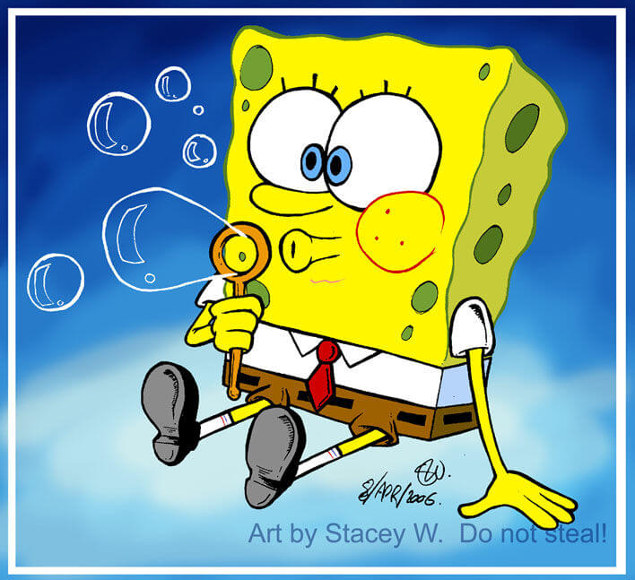

主角是一块居住在海洋深处的黄色海绵(住所是一个大菠萝(即凤梨)中)，他是一个可爱、慷慨大方、友好、可信赖的朋友。他露出龅牙的笑容，非常富有表现力的脸和身体，
以及他纯真美好的天性使他非常可爱。

特征：穿着方形裤子，黄颜色的海绵，露出两颗大牙齿。天真乐观，充满善意，但是尽管他出于好意，仍免不了陷入麻烦之中，闹不少笑话。

[caption id="attachment_12331" align="alignnone" width="566" caption="海绵宝宝"][/caption]

《海绵宝宝》虽然是低龄动画，但由于剧情幽默而充满想象力，也很适合成年人观看，回忆一下童真，而且有些内容的确好笑，看完之后也会感叹一下里面的精神。

正在迅雷下，速度还行，150Kb/s左右，如果心情比较糟糕的话（比如最近的我），看看这个还是很容易放松的

