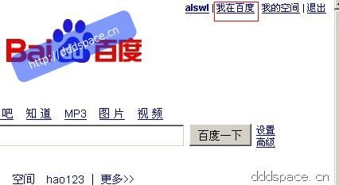
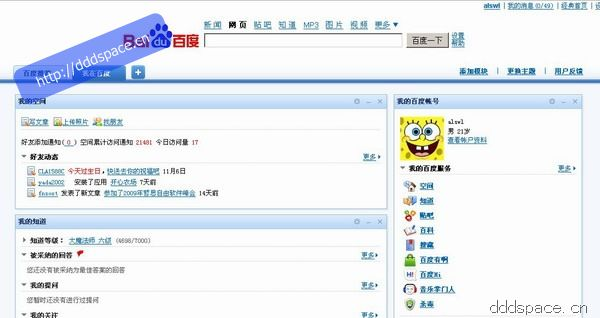
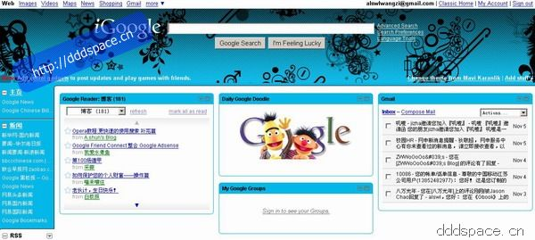

今天上网，偶然发现百度主页右上角出现了「[我在百度](http://my.baidu.com/index.html?my=1&tn=baidu_myps_p
g)」。

这个应该是模仿Google的iGoogle。我测试了一下，非登录用户是没有这个功能的。而iGoogle在未登录情况下也能使用。

「我在百度」登录之后是有「我的空间」、「我的知道」、「我的百度帐号」、「我的贴吧」、「我的百科」这几个模块。通过顶部的「添加模块」可以继续增加几个功能：「百
度地图」、「百度财经」「我的登录」等几个小功能，还可以添加RSS源（不得不想起Google Reader）。

「我在百度」的Tab左边「百度推荐」里有一些新闻、音乐、视频推荐，还有「我的日历」（感觉想模仿Google Calendar）。

总体来说呢，[有道](http://www.youdao.com)早就有了个性化首页，Baidu现在推出晚了点，具体怎么发展，得不得用户人心，咱们拭目以待吧
。

