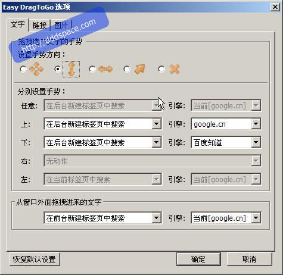
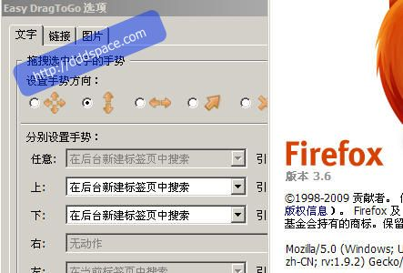

Easy DragToGo是一款很不错的FireFox插件，能够实现一些鼠标手势功能。你可以在[Easy DragToGo :: Firefox 附加组件](https://addons.mozilla.org/zh-CN/firefox/addon/6639)下载这个插件。

下面是一段[官方](http://addons.sociz.com/firefox/700/)的介绍。

> 轻松使用拖曳手势打开标签页。

>

> 拖曳对象：选取的文字、链接、图片。

特点：内核短小精悍，手势动作灵敏准确。

>

> 功能：

>

> * 链接 -- 在新前台、新后台和当前标签页打开链接，链接另存为；

* 文字 -- 在新前台、新后台和当前标签页搜索（可选搜索引擎），对看似网址的文字，当作网址打开；  
* 图片 -- 在新前台、新后台和当前标签页查看或打开链接，图片另存、直接保存在指定目录（默认以当前页面域名为子目录）；  
* 可开启延时取消动作的功能（默认没有开启）；  
* 若按住"Ctrl"键拖动目标放下：若是链接，将对链接中的文字进行搜索；若是文字，强制当作链接打开（自动去除空格和转换全角字母）；  
* 可自定义代码；  
* 最多可以设置 4 个方向的手势（默认只选取了比较简单的上下两个方向）。
>

> 延时取消动作和自定义代码可参考以下的链接：[http://mozilla.sociz.com
/redirect.php?goto=findpost&pid=125854&ptid=21043](http://mozilla.sociz.com
/redirect.php?goto=findpost&pid=125854&ptid=21043)

>

> 尤其适合只需要通过简单拖放来打开标签页的用户。

Easy DragToGo图图

但是似乎作者最近很忙，自从2009 年06月13日以来都没有进行插件更新。导致的结果就是在FireFox升级到3.6之后，Easy DragToGo悲惨的标
记上了"**这是一个针对旧版本Firefox的附加组件**"字样。我苦苦等了近两个月，依然没有等到作者放出新版本，终于忍不住找第三方修改版。

很幸运，在[「Firefox扩展」Easy DragToGo 1.1.2.4a修改版 -- 支持在Firefox 3.6和3.7a1拖动文本框文字搜索 | 软件集散地](http://my219.cn/archives/41051.html)找到了修改版的Easy DragToGo，上面说可以在FireFox
3.7a1下使用，我实测在3.6下没有问题。喜欢Easy　DragToGo的朋友们这下可以满意了。

有图为证

最后，下载地址（xpi格式的文件，直接拖拽到FireFox就可以了）

[下载地址](http://down.qiannao.com/space/file/grayciel/share/2010/1/25/EasyDragToG
o1.1.2.4a.xpi.7z/.page) ‖
[下载地址](http://www.ziddu.com/download/8320161/EasyDragToGo1.1.2.4a.xpi.7z.html)

[下载地址](http://my219.cn/archives/41051.html) ‖
[下载地址](http://dl.dropbox.com/u/4248324/EasyDragToGo1.1.2.4a.xpi.7z)

[下载地址](http://goaruna.com/bmpj) ‖ [下载地址](http://u.115.com/file/f6ffd613cf)

[下载地址](http://www.uushare.com/user/my219cn/file/2492897) ‖
[下载地址](http://www.filefront.com/15422223/EasyDragToGo1.1.2.4a.xpi.7z)

[下载地址](http://cid-25076445a5c25e27.skydrive.live.com/self.aspx/.Public/2010.01
.19/EasyDragToGo1.1.2.4a.xpi.7z) ‖
[下载地址](http://www.brsbox.com/filebox/down/fc/f19722a7b4297149e3a8ac16f87b2229)

