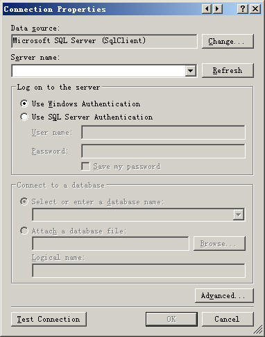

在系统开发中，数据库连接字符串经常被保存到.config/.ini等配置文件中，以提高系统的灵活性。上大学时候，为了实现灵活配置数据库的效果，用拼字符串的方
法来动态生成连接字符串，这种方法充满了Bad Smell。

昨天用CodeSmith时候，看到它的数据连接配置界面，如此的眼熟，如下图。

Google了一下，原来这家伙的名字叫做DataConnectionDialog，所属命名空间为Microsoft.VisualStudio.Data。

使用的方法也很简单，引用Microsoft.Data.ConnectionUI.dll和Microsoft.Data.ConnectionUI.Dialog
.dll，这两个文件位于Microsoft Visual Studio 9.0Common7IDE下面。

这两个dll并没有其他依赖关系，可以放心的放到自己的程序中使用。

使用代码如下

    
    DataConnectionDialog dataConnectionDialog = new DataConnectionDialog();
    DataSource.AddStandardDataSources(dataConnectionDialog);
    if (DataConnectionDialog.Show(dataConnectionDialog) == DialogResult.OK)
    {
    	targetDBConnectionString = dataConnectionDialog.ConnectionString;
    }

dataConnectionDialog.ConnectionString是完整的连接字符串，这样就可以比较优美的动态获取连接字符串了。

参考文章

  * [DataConnectionDialog 旧事重提 - 名牌热狗 - 博客园](http://www.cnblogs.com/yans/archive/2010/12/04/1896285.html)
  * [C#--WinForm系统平台之登录界面及数据连接 - 天高行健，地厚载物 - 51CTO技术博客](http://jayai.blog.51cto.com/510093/256313)
  * [DataConnectionDialog Class (Microsoft.VisualStudio.Data)](http://msdn.microsoft.com/zh-cn/library/microsoft.visualstudio.data.dataconnectiondialog(v=vs.80).aspx)

最后给大家拜个晚年，祝大家新年新气象。。。（此处省略1000字）

