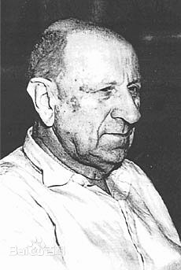

作为战斗民族的俄罗斯民族，不但能在热带风暴级的灿鸿中进行正常起降，
历来也盛产各种奇葩人物。
最近我有看到一本描述一个科学家的如何生活的书，叫「奇特的一生」。
让人拍案称奇。

主人公是一位名叫柳比歇夫的科学家，想必他在「回首往事时候没有因为虚度年华而悔恨」，
因为他将自己的一生都精确的奉献到分类学、地蚤研究上面。
他的工作投入，不是单纯激情洋溢投入，而是精确到分钟级别的投入，
是奉献完整一生的投入。

除了学术上面的成功，他的时间记录法也很牛逼，甚至让苏联科学院进行研究。怎么描述他的牛逼呢？如果他生活在今天，大致会这样写：

> 今天我 19:00 - 19:25 看了新闻联播，感受到社会各阶级在党的领导下面获得令人振奋的成绩
>
> 19:25 休息了一会，避过无聊的天气预报时间
>
> 19:30 - 20:30 学习了「XXX 的讲话精神研究」
>
> 附加工作：20:35 - 20:40 小解，顺便刷了一会朋友圈作为今天的娱乐放松，评论了隔壁老王老婆的出行照片

看到没有，他精确的记录了自己的时间使用记录，犹如脑子里面有个精确的 GTD
管理器，那个年代 David Allen 还没出生呢，肯定也谈不上了解 Get Things Done。苏联真是靠各类牛逼人物撑起了一战、二战时候工业大跃进和各种黑科技的崛起。

简单记录时间当然不能带来效率和成果的提升，柳比歇夫明显没有纳什这种神经病天才的聪明，他能获得这样比较高的成就，必须还有真正的大招。

第一招是他有坚定的奋斗目标：「创立生物自然分类法」。我们暂不管这不出名的法则是什么，能在 1918 年（他时年 28 岁，我擦，和我现在差不多大啊）就提出自己一生奋斗的目标，着实了不起。
从书中的记录来看，28 岁的青年教师柳比歇夫，
在日记里面描述他想要做什么事情，需要具备什么素质，
并且在估算重要里程碑时间点。

我估摸着，在战争中成长起来的人，不仅仅需要幸运，还需要勇气和坚韧意志，
19 世纪初年，沙皇政权摇摇欲坠，布尔什维克们应该还在密谋革命造反，
民众生活艰苦（感觉好像民国时期的中国）。
这种时代的大环境造就了各阶级人物命运的跌宕起伏，附带效应是出产优秀的文人和思想家。
柳比歇夫既然在这个时期成长，那也会渴望建树功勋，做点改变世界的事情。

第二招是，他就去做了。

「听过了很多大道理，却依然过不好这一生」，无非是缺在执行。
柳比歇夫的时间记录法，不是简单作为一个日记本在使用，
关键点在于回顾和计划。通过过去的记录，分析自我，总结经验，判断未来。

哎哟，道理说起来都简单，做起来都难，柳比歇夫作为一个很好的例子，
告诉我们，一个资质普通的人，决定牺牲自我，奉献到某个特定事业时候，
可以获得的成绩，他完成了「立言」。

在这个物欲横流，信息多得炸掉脑仁，各类媒体都在抢占眼珠的时代，能够不忘初心，
去做点实际的事情，是一件不容易的事情。
对快 30 的我来说，别说「立言」，就光「立命」，
就已经让我困苦不堪，在这和平年代，没有家仇国恨美国梦，想要做点牛逼的事情，就得需要勇气和爱来驱动。

