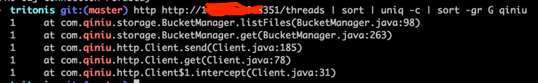
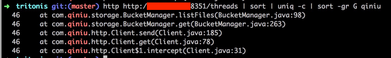

早晨刚到公司， HAProxy 报警，Trtornis（第三方云存储网关，用来统一管理阿里云和七牛云的对象存储） 全飘红。

<!-- more -->

检查日志，并没有 ERROR 信息，但是大量 WARN 报错。

```
WARN  [2015-12-09 11:01:02,730] org.eclipse.jetty.util.thread.QueuedThreadPool: dw{STARTED,8<=50<=50,i=0,q=1024} rejected org.eclipse.jetty.io.AbstractConne
ction$2@62c021c6
WARN  [2015-12-09 11:01:02,731] org.eclipse.jetty.io.SelectorManager: Could not process key for channel java.nio.channels.SocketChannel[connected local=/10.
1.1.78:8350 remote=/10.1.1.74:63290]
! java.util.concurrent.RejectedExecutionException: org.eclipse.jetty.io.AbstractConnection$2@62c021c6
! at org.eclipse.jetty.util.thread.QueuedThreadPool.execute(QueuedThreadPool.java:362) [tritonis-shaded.jar:0.0.1-SNAPSHOT]
! at org.eclipse.jetty.io.AbstractConnection$FillingState.onEnter(AbstractConnection.java:379) ~[tritonis-shaded.jar:0.0.1-SNAPSHOT]
! at org.eclipse.jetty.io.AbstractConnection.next(AbstractConnection.java:273) ~[tritonis-shaded.jar:0.0.1-SNAPSHOT]
! at org.eclipse.jetty.io.AbstractConnection$ReadCallback.succeeded(AbstractConnection.java:563) ~[tritonis-shaded.jar:0.0.1-SNAPSHOT]
! at org.eclipse.jetty.io.FillInterest.fillable(FillInterest.java:82) ~[tritonis-shaded.jar:0.0.1-SNAPSHOT]
! at org.eclipse.jetty.io.SelectChannelEndPoint.onSelected(SelectChannelEndPoint.java:109) ~[tritonis-shaded.jar:0.0.1-SNAPSHOT]
! at org.eclipse.jetty.io.SelectorManager$ManagedSelector.processKey(SelectorManager.java:636) [tritonis-shaded.jar:0.0.1-SNAPSHOT]
! at org.eclipse.jetty.io.SelectorManager$ManagedSelector.select(SelectorManager.java:607) [tritonis-shaded.jar:0.0.1-SNAPSHOT]
! at org.eclipse.jetty.io.SelectorManager$ManagedSelector.run(SelectorManager.java:545) [tritonis-shaded.jar:0.0.1-SNAPSHOT]
! at org.eclipse.jetty.util.thread.NonBlockingThread.run(NonBlockingThread.java:52) [tritonis-shaded.jar:0.0.1-SNAPSHOT]
! at org.eclipse.jetty.util.thread.QueuedThreadPool.runJob(QueuedThreadPool.java:635) [tritonis-shaded.jar:0.0.1-SNAPSHOT]
! at org.eclipse.jetty.util.thread.QueuedThreadPool$3.run(QueuedThreadPool.java:555) [tritonis-shaded.jar:0.0.1-SNAPSHOT]
! at java.lang.Thread.run(Thread.java:745) [na:1.8.0_51]
```

这是七牛 API 调用出现问题，通过应用 Metrics API 检查 Threads：

`http http://A-DOMAIN:8351/threads | sort | uniq -c | sort -gr G qiniu`

正常的实例：



异常的实例：



确认是七牛服务慢导致现成爆掉，但是 46 这个值来自于哪里？

检查了 App 的配置文件，的确配置了 `maxThreads` 为 50:

```
server:
  gzip:
    enabled: false
  requestLog:
    appenders: []
  maxThreads: 50
  applicationConnectors:
    - type: http
      port: 8350
      acceptorThreads: 2
      selectorThreads: 2
  adminConnectors:
    - type: http
      port: 8351
```

一般对应服务不稳定，有个简单策略，超时，那么七牛服务超时是多少？找了一下相关代码，下巴都没合上：

```
# com.qiniu.http.Client
    this.httpClient.setConnectTimeout((long)Config.CONNECT_TIMEOUT, TimeUnit.SECONDS);
    this.httpClient.setReadTimeout((long)Config.RESPONSE_TIMEOUT, TimeUnit.SECONDS);

# com.qiniu.common.Config
public static int CONNECT_TIMEOUT = 10000;
public static int RESPONSE_TIMEOUT = 30000;
```

超时时间 8h，吓得我赶紧关掉了显示器。
赶紧将这个 Connection 改成了 2 分钟，Connect 改成了 5s。

咨询了七牛的工程师故障当天的状况：

> sorry 忘了回复，问题已经定位，早上因为有个别用户list请求数量过大，导致了整个list接口出现大量满请求，影响返回是list接口的调用 和 portal上内容管理界面列取文件key的速度，目前已经恢复

> 大量慢请求，这个已经内部有告警和恢复机制，11点25恢复的

国内一线的云服务供应商也会出这样不可用故障，即便是有服务放在云上，还是要自己留一个心眼，多关注可用性啊。
