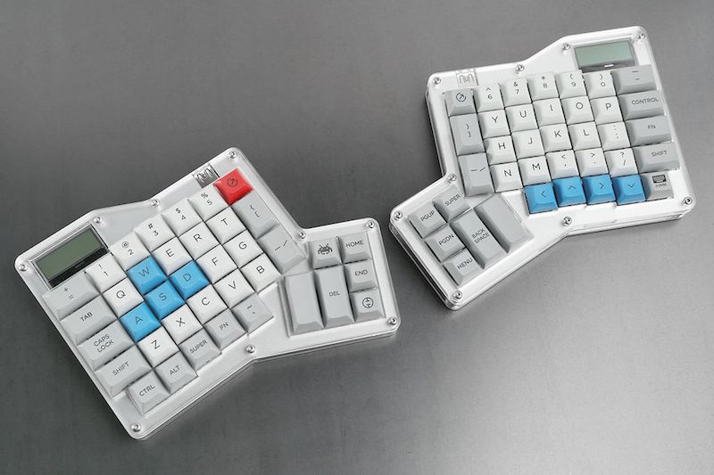
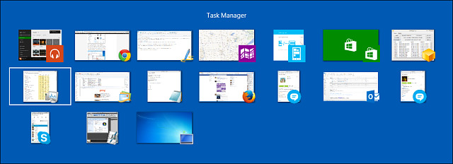
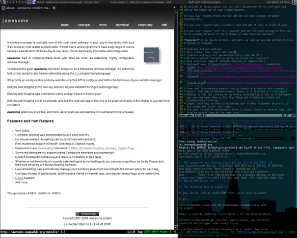
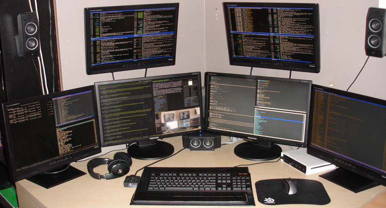

团队里的同学有时看见我键指如飞，可以用快捷键将 Mac 的窗口玩转于手心。他们表示酷炫非常，
心生羡慕的同时，希望掌握这门技艺，我就把使用的 Phoenix 介绍给大家。结果过了一段时间，
发现普及率并不高，本着好为人师的精神，今天我就来八一八这款优秀的桌面管理工具。

在介绍我使用的工具之前，我要先介绍一下我选择的原因和历史。

ps：配图是我长草多年的 Ergodox Infinity。（@夫人，看到这里的时候，请留步思考 5s）。

## Alt+Tab = 苦难的历史

当我还年轻的时候，曾经对 Alt+Tab 这个快捷键愤慨无比，觉得这种设计虽然简单但是很蠢。

<!-- more -->

- **命中率低**。要在茫茫图标中查找自己需要的窗口，如果开了 20 个应用，切换到一个非常用窗口至多可能需要 20-1 次按键。
  不要跟我说有 Alt+Shift+Tab 的反向循环操作，估计大部分用户都不知道。而且 正向/反向 切换伤脑子。
- **交互方式耗时**。由于 Alt+Tab 的操作需要用户进行反馈才能进行，是 `眼-手-眼-手` 的操作反馈方式，
  这种交互模式费时费脑子。跟这种需要实时反馈对立的交互模式应当是类似「一键呼出」的操作。
- **在大显示器、多显示器的环境下面，Alt-Tab 模式没有做任何优化**。
- 频繁切出窗口进行切换，容易让人分神，比如切换时候看到某个播放器的标题，在放一首喜欢的歌，很可能吸引过去。

有人会问，难道不优化都是缺陷么？
我的答案是肯定的。Alt+Tab 是几乎除鼠标之外的唯一一种窗口操作方式。如果它不能跟上时代的步伐，
对大显示器、多显示器做优化，那就是不作为，不努力，不上进。跟不上变化是要被淘汰的！

## 平铺式窗口管理器

在被 Windows Alt-Tab 虐了多年之后，我长大了，开始接触 Linux，但是这种痛苦仍然时刻包围着我。
当我分期购买一个外置显示器之后，这种痛苦到达到了顶端。
恰好彼时我是 [ArchLinux](https://www.archlinux.org/) 的信徒，很快就发现了一片桃源：
自己安装 [Window manager](https://wiki.archlinux.org/index.php/window_manager)。

我重新认识了桌面系统世界，除了介绍常规的 Gnome / KDE / xfce 之外，还有一类窗口管理系统，他们叫做「平铺式窗口管理器」。
（严格来说，Gnome / KDE / xfce 属于 Desktop environment，层级比「窗口管理系统」要高，我这里不做严格区分）。

什么是平铺式窗口管理器？来一个直观的认识：

官方的解释是……呵呵，自己点进去看解释吧。平铺式桌面管理器（包括同时支持平铺式和堆叠式的混合式桌面管理器）给我带来了新的认知，
原来桌面系统是可以进行接口编程的，我不那么 care 到底是哪种风格，我 care 的是，
能否通过编程定制来解决我的 Alt-Tab 问题。

## 我期望的窗口管理模式

- 快速启动最常用的应用，同时也能将其快速呼出
- 对大屏幕友好，现在显示器普遍是大屏幕，可以自由控制窗体的移动，方便多个窗口同时进行操作
- 对多屏幕友好，多屏幕间的切换，要友好。可以快速屏幕间切换
- 对键盘友好，对鼠标友好，全键盘操作模式，但同时要对鼠标友好，比如鼠标跟随焦点功能，毕竟一些操作还是鼠标方便
- 帮助集中注意力，将操作界面隔离成多个目的区分的空间，比如写作时候，期望只有一个 Evernote + Chrome 在眼前

## 我在 Mac 下面的方案

呜呼，感谢伟大的 [Jason Milkins](https://github.com/jasonm23/) 做了一堆尝试，
创造了一堆乱七八糟的桌面管理器。然后感谢 [Kasper Hirvikoski](https://github.com/kasper)
在 Jason 拍拍屁股走人之后，接过了 Jason 的棒子，将 Phoenix 这个项目快速推进，解决了一堆导致不可用的 bug，
并新增了很多特性。

回到要介绍的主角身上，[Phoenix](https://github.com/kasper/phoenix)：

> A lightweight OS X window and app manager scriptable with JavaScript

基本特性是：

- Javascript 作为配置文件，定制性超级强
- 支持 App / Window / Space / Screen 等对象的操作

基于 Phoenix，我达成了我的窗口管理模式的目标：

- 快速启动
  - 使用 `Option` + \` / 1 / 2 / 3 / 4 / 8 / 9 / e / a / s / z /, / . / / 启动
  - iTerm / Chrome / Safari / QQ / Bearychat / Wechat / Neteasy Music / MacVim / IntelliJ IDEA / Macdown / Mail / Evernote / Finder
- 窗口操作
  - Option + - / =
    - 大小控制
  - Option + m
    - 窗口移动到屏幕中央
  - Option + Space
    - 鼠标找回到窗口中央
- 屏幕内操作
  - Option + J / K
    - 焦点在同屏幕窗口切换
  - Ctrl + Option + J / K / H / L
    - 窗口移动
- 屏幕间操作
  - Option + H / L
    - 焦点左右屏幕切换
- Space 操作
  - Option + I / O
    - Space 左右切换
  - Option + Ctrl + I / O
    - 将当前窗口移动到相邻 Space
  - Option + Enter
    - 将当前窗口移动到 Work Space
  - Option + Delete
    - 将当前窗口移动到 Park Space
  - Work / Park Space 就是用来帮助我集中精力的

我的配置文件在 [.oOo./mac/phoenix at master · alswl/.oOo.](https://github.com/alswl/.oOo./tree/master/mac/phoenix)。
我的配置文件可以开箱即用，但这是我自己的工作模式，想要获得自己最舒适的效果，需要自己进行一些研究和定制。

## 其他一些替代方案

- Mac
  - SizeUp # 简单的桌面平铺工具，不支持一键切换
  - Spectacle # 类 SizeUp
  - Divvy # 类 SizeUp，收费
  - Slate # 支持配置，支持一键切换（推荐）
- Linux
  - Awesome
    - [平铺式窗口管理器-Awesome | HaHack](http://hahack.com/tools/awesome/)
    - [我的 Awesome 配置文件（停止位置）](https://github.com/alswl/awesome)
  - xmonad
- Windows
  - [fuhsjr00/bug.n: Tiling Window Manager for Windows](https://github.com/fuhsjr00/bug.n)

---

我曾经写过一篇 [Linux 程序员的 Mac 安装记录](http://blog.alswl.com/2013/12/mac/)，
告诉大家我在 Mac 上面常用的工具、包管理器。
