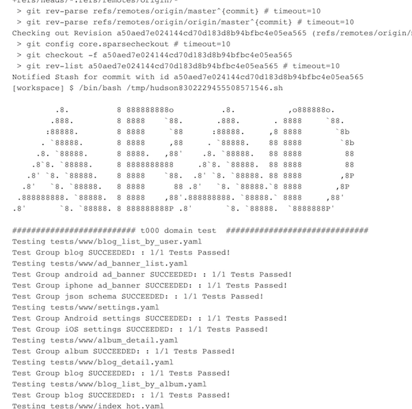

为了提高测试，工程师需要对自己提交的产物进行测试，一般是单元测试、集成测试。
之后提交物流转到 QA 团队，QA 团队根据需求描述对提交物进行测试，
这个测试过程非常耗费人力。
尤其是当开发交付的质量不高时候，很可能自身没有经过测试，会遇到主干流程都无法进行的状况。

如果在 QA 人工介入测试之前，就进行一轮黑盒自动化集成测试，可以大大地提高 QA 团队的工作效率。
基于这样的判断，我们团队花了一些时间，将基于 API 的自动化测试系统搭建起来。
现在将这个系统的选型和运行状况拎出来，和大家分享。


## 确认测试范围、目标和意义

- 范围
    - 后台输出的 API 级别 URL
    - 使用场景
        - 打包时候的冒烟
        - Dev / QA 手工添加添加新特性用例
- 目标
    - 覆盖大部分的 URL，当期设计为 top 10 URL，仅包含 GET 接口
    - 选型时，需要考虑非幂等（POST / DELETE / PUT）等接口
- 意义
    - 提高开发效率，一种自动化的 IT 测试方案
    - 提高测试效率，减少人工集成测试成本
    - 提高工程质量，通过覆盖率提升，保证工程质量逐步提升，放心开发新功能


## 特性需求

选型一个系统，不是看市面上有哪些可以供选择，而是看我需要什么样特性的一款产品。
如果自己的需求和市面上的现成产品差异过大，也可以考虑自己定制。

- Required
    - 开源
    - 免费
    - 使用 DSL 或者简单代码描述测试用例
    - 支持细粒度的单 API 测试和构建带过程的测试用例
    - HTTP API
- Optional
    - CI 集成
    - UI

## 挑选出来的选型和评价

- [API Monitoring and Testing · Runscope](https://www.runscope.com/)
    - 收费
    - 非开源
    - 有监控特性
- [Bamboo - Continuous integration, deployment & release management | Atlassian](https://www.atlassian.com/software/bamboo)
    - 收费
    - CI
- [Continuous Integration Product and Features - CircleCI](https://circleci.com/features/)
    - CI
    - 收费
- Sauce Labs
    - 客户端测试，收费
- Apiary
    - API 设计工具 + API Test
- [http://frisbyjs.com/](http://frisbyjs.com/)
    - code
    - npm
    - open source
    - NO UI
- [https://github.com/vowsjs/api-easy](https://github.com/vowsjs/api-easy)
    - 同上
    - 真是热爱造轮子的 JS 生态圈
- [https://github.com/visionmedia/supertest](https://github.com/visionmedia/supertest)
    - 同上
    - 从 Star 看，这个质量最高
- [http://dareid.github.io/chakram/](http://dareid.github.io/chakram/)
    - code
    - npm
    - open source
    - NO UI
- [https://vrest.io/](https://vrest.io/)
    - 收费
    - 不开源
    - 无插件
- [http://swagger.io/open-source-integrations/](http://swagger.io/open-source-integrations/)
    - for API
    - 生态环境强大
    - [https://github.com/cachecontrol/hippie-swagger](https://github.com/cachecontrol/hippie-swagger)
    - 用户端似乎在尝试用 swagger
- [http://robotframework.org/](http://robotframework.org/)
    - 一个通用自动化测试工具
    - DSL
    - 扩展性较强
    - 活跃度在降低 [https://github.com/robotframework/robotframework/graphs/contributors](https://github.com/robotframework/robotframework/graphs/contributors)
- [https://cucumber.io/](https://cucumber.io/)
    - [https://cucumber.io/docs/reference](https://cucumber.io/docs/reference)
    - 和 Robotframework 相似，通用自动化测试工具
    - DSL
    - 活跃度降低 [https://github.com/cucumber/cucumber-jvm/graphs/contributors](https://github.com/cucumber/cucumber-jvm/graphs/contributors)
- [https://www.solanolabs.com/](https://www.solanolabs.com/)
    - Airbnb 在用
    - 收费
    - 云端的通用测试环境
- [https://github.com/christophd/citrus](https://github.com/christophd/citrus)
    - [http://www.citrusframework.org/](http://www.citrusframework.org/)
    - 依赖 mvn / ant，离代码太近
    - 项目不够活跃
- 代码内测试
    - src/it/com/duitang/xxx
    - eg. tritornis
    - Spring
        - [http://docs.spring.io/spring/docs/current/spring-framework-reference/html/integration-testing.html](http://docs.spring.io/spring/docs/current/spring-framework-reference/html/integration-testing.html)
        - [http://docs.spring.io/autorepo/docs/spring-framework/3.2.x/spring-framework-reference/html/testing.html](http://docs.spring.io/autorepo/docs/spring-framework/3.2.x/spring-framework-reference/html/testing.html)

这部分工作，是和团队的其他成员一起去看的，大家各自分头寻找一些产品，然后进行评测，给出结论。

经过讨论，我们将重点关注放在这么几款下面：

- supertest
- robotframework
- swagger
- 讨论时候的新发现 [https://github.com/svanoort/pyresttest](https://github.com/svanoort/pyresttest)


## 搭建 demo，进行试用

在确定选用那几款产品之后，就可以集中精力在几款候选者里面。搭建相应的环境，对他们进行实际测试。

supertest：

- 功能太简单了，简单到几乎可以自己写掉，不算一个 test framework

pyresttest：

- 哈哈哈，YAML based，dreamed feature
- 支持 YAML / extractor / validator
- 天生支持 host 为参数
- create for me!!!

hippie-swagger：

- 在使用上，和 supertest 差异不大
- 仍然需要自己定义，在 swagger 描述文件不存在时候会抛错，描述文件不符合时会抛错

robotframework：

- 较为复杂
- 有 YAML 了，不用试了


## 使用感觉

经过一个季度的试用，我们基于 pyresttest 的项目 abao 运行较稳定。
尽量在工程师提交代码之后，运行一次，从而可以在早期发现问题。

由于是基于 Python 的源代码，我们还给 pyresttest 开发了几款插件：

*   cookie_extractor：用来解析特定的 cookie
*   file_choice_generator：从文件随机选择预设数据
*   file_seq_generator：从文件顺序选择预设数据

在和 CI 的配合方面，我们在 Jinkins 搭建了 abao / abao-master 项目，
前者响应每次 Push 请求，都会自动构建一遍，后者每天凌晨会将 master 运行一遍。


感谢项目贡献者：

```
project  : abao
 repo age : 5 months
 active   : 32 days
 commits  : 109
 authors  :
    39  Chery.Peng  35.8%
    33  3D          30.3%
    17  yanqi.chen  15.6%
    11  橙子        10.1%
     7  fiona66     6.4%
     2  雪糕        1.8%
```

----

参考文档

- [Integrations Directory](https://github.com/integrations)
- [http://www.infoq.com/cn/search.action?queryString=%E8%87%AA%E5%8A%A8%E5%8C%96%E6%B5%8B%E8%AF%95&page=1&searchOrder=&sst=guKeEhPzzhUs7xpS](http://www.infoq.com/cn/search.action?queryString=%E8%87%AA%E5%8A%A8%E5%8C%96%E6%B5%8B%E8%AF%95&page=1&searchOrder=&sst=guKeEhPzzhUs7xpS)
- [http://www.infoq.com/cn/news/2014/02/autotest-2013](http://www.infoq.com/cn/news/2014/02/autotest-2013)
- [http://www.infoq.com/cn/articles/cucumber-robotframework-comparison](http://www.infoq.com/cn/articles/cucumber-robotframework-comparison)
- [http://www.infoq.com/cn/articles/http-api-automated-test-from-manual-to-platform](http://www.infoq.com/cn/articles/http-api-automated-test-from-manual-to-platform)
- [http://nerds.airbnb.com/testing-at-airbnb/](http://nerds.airbnb.com/testing-at-airbnb/)
- Google keywords
    - integration api test framework
    - github intergration test
