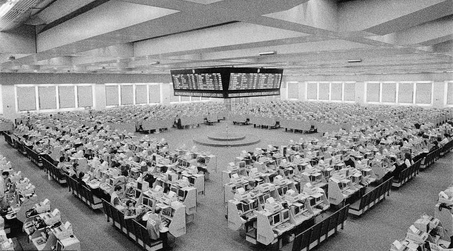

最近在团队中给大家做了一个分享，泛泛地聊了一些有关「监控」的话题。
其实做分享对分享者的作用往往大于参与者。
这是一次将自己知识的梳理的过程，于是我将这次分享整理成这篇文章。

<!-- more -->

## 目的 🎯

我们先来聊聊，什么是「监控」，以及我们期望通过「监控」完成哪些目的？

传统意义上的监控，是指：

>   通过一些手段和工具，关注运行中的**硬件、软件、用户体验**的关键数据，将其暴露出来。
>   当关键数据出现异常时候发出警告，进行人工或者自动的响应。

我们平时看到的最常见的监控系统，比如 Zabbix，提供了丰富的模板，
可以监控服务器的 Load / CPU Usage / Alive 这些常规指标。
并在出现问题时候，对其进行报警通知。
随后运维工程师们会上线进行应急操作，case by case 的处理故障。

我将上面的使用目的归纳为：

*   故障发生时提供数据报警
*   提供历史数据以供分析

故事到这里似乎可以结束了，可监控真的是这么简单的么？
当然没，随着时代的进步，用户对服务提出了更为严苛的要求，
同时我们也有能力进一步控制平均故障修复时间
（[MTBF](https://en.wikipedia.org/wiki/Mean_time_between_failures)），
上述描述的做法已经不能满足我们了。

现在让我们切换一下视角，从传统的 OPS 的视角切换到 SRE
（[Site Reliability Engineering](https://en.wikipedia.org/wiki/Site_reliability_engineering)）的视角。
当我们在关注网站整体的可用性时，我们会发现：
故障警报处理当然很重要，但是我们根本上想减少甚至避免 MTBF。
我们有两种手段：
一种是去除单点故障，让问题自然发生，但是不对线上造成影响；
另一种是在问题出现的早期就发现并进行及时修复。
前者是高可用范畴，后者就是我们今天关注的「监控」了。

监控的目的是要**将灾难消灭在襁褓里；在灾难即将出现或者发生问题时，
给大家展示直接的原因**。

那为了达成这两个目标，我们需要回到问题的本质，重新思考两个问题：

1.  监控哪些对象？
2.  如何识别故障？

## 对象 🐘🐘

我们说的监控对象，一般指的都是某个资源，
资源即持有某种其他方需要的某些属性的载体，包括硬件、软件。
除了资源这种类型，还有一种常见的监控对象是「体验」，即终端用户的访问感受，
这块内容我们暂时略去。

让我们来先看一下常见的资源：

*   硬件
    *   服务器
    *   网络设备
*   软件
    *   Application
    *   Infrastructure

这个分类是粗粒度的描述，为了落地地描述监控对象对象的健康状况，
我们还要进一步细化。以「服务器」为例，我们可以将其监控的内容细化为以下监控项：

*   CPU
*   Memory
*   Network interface
*   Storage devices
*   Controllers

如何评估这些监控项的健康状况？我们使用
[SLI（Service Level Indicator）](https://en.wikipedia.org/wiki/Service_level_indicator)。
比如**可用性**就是一个最容易理解的 SLI。
这里我将资源归为两类，面向用户提供服务的资源和面向存储的资源，
以下是针对这两类资源的常见 SLI：

*   User-facing Service
    *   Availability
    *   Latency
    *   Throughput
*   Storage System
    *   Latency
    *   Throughput
    *   durability

基于 SLI 建立的数字关键指标，称之为
[Service Level Objective](https://en.wikipedia.org/wiki/Service_level_objective)。
SLO 往往是一组数字范围，比如 CPU 负载的 SLO 可以设置为 0.0-6.0（针对 8 核 CPU）。
不同的资源、不同的业务场景，会有不一样的 SLO 设计。

看到这里，我们已经聊了要监控哪些指标，那么接下来我们聊聊如何用量化的思想，
帮助指标更易于识别、分析和决策。

## 量化的思想 🔢

刚开始担任线上救火队成员时候，当有个系统出现问题时候，我经常听到这样的描述：
网站挂了、页面打不开了，CPU 出问题了，内存爆了，线程池炸了等等。
这样的表述虽然没错，但带来的可用价值太少，信息熵太低。
这样的说辞多了，就给人产生一种不靠谱，不科学的感觉。

那怎样才能成为科学的描述？
古希腊哲学家在思考宇宙的时候，提出了一种心智能力，
从而打开了科学的窗子，这就是 Reasonable，中文名叫理智，这成为了自然科学的基石。
使用 Reasonable 探讨意味着探讨要深入问题的本质，不停留在表象，挖掘出真正有价值的内容。

但是光有 Reasonable 还不够，B站粉丝建了一个微博，每天会检查
[今天B站炸了吗](http://weibo.com/yamanasion?refer_flag=1001030201_&is_hot=1)，
他只能告诉我们炸没炸，不能给工程师带来实际的用处。
在科学的发展历史上，我们可以发现在亚里士多德的著作里没有任何数据公式。
他对现象只有描述，只是定性分析，通过描述性状来阐述定理。
这个定性的研究方式到了伽利略那里才出现了突破。
这里我们可以引入第二个关键词是  Quantifier，量化。
伽利略率先使用定量分析的方法，并将其运用到动力学和天文学，从而开创了近代科学。

如果我们以定量的方式来描述网站挂没挂，就会变成：网站的响应耗时在 30s，基本无法使用。
描述线程池出问题，就会变成：active 线程数量是 200，已经到达 maxCount 数量，无法进行分配。
你看，通过这样的描述，我们一下子就能发现问题出在哪里。

## USE 💡

现在我们已经了解了「监控哪些对象？」，以及尝试用「量化」这个法宝来「识别故障」。
那有没有一些最佳实践帮助大家高效的识别故障呢？这里我推荐 Brend Gregg 大神的 [USE 方法](http://www.brendangregg.com/usemethod.html)。
Brend Gregg 是 Netflix 的首席 SRE，著有 [Systems Performance Book](http://www.brendangregg.com/sysperfbook.html)，
目前已经出版中文版 [性能之巅:洞悉系统、企业与云计算](https://www.amazon.cn/%E5%9B%BE%E4%B9%A6/dp/B0140I5WPK)。

USE 分别是三个单词的首字母缩写：

*   Utilization：使用率，CPU running percent，硬盘的 IO 
*   Saturation：饱和度，一般偏存储型资源，内存使用，硬盘使用
*   Error：错误数

我们可以为每个资源找到各自的 USE 度量指标，具体的 Check List 清单可以参考
[USE Method: Rosetta Stone of Performance Checklists](http://www.brendangregg.com/USEmethod/use-rosetta.html)。

这里举个例子，前段时间在设计 MySQL HA 方案时候，同时关注了 MySQL 的监控方案，
那么针对 MySQL，我们要做哪些监控呢？下面是使用 USE 方法设计出来的 SLI：

*   Business
    *   Questions：语句计总，Throughput
    *   Slow_queries：慢查询计总，Error
    *   Com_select：查询语句计总，Throughput
    *   Com_insert：插入语句计总，Throughput
    *   Com_update：更新语句计总，Throughput
*   Threads & Connections
    *   Threads_connected：当前连接数，Utilization
    *   Threads_running：当前使用中连接数，Utilization
    *   Aborted_connects：尝试连接失败数，Error
    *   Connection_errors_max_connections：由于连接数超标从而失败的连接数，Error
*   Buffer
    *   Innodb_buffer_pool_pages_total：内存使用页数，Utilization
    *   Innodb_buffer_pool_read_requests：读请求数计总，Utilization

## 完 🏁

如果你对我上面描述的还意犹未尽，建议你可以看 [Effective Monitoring and Alerting](https://book.douban.com/subject/19992841/)。
虽然本书没有中文版，但是关于监控、报警的原理解析很到位，值得一看。
另外还有一本 [SRE: Google运维解密](https://book.douban.com/subject/26875239/)，
里面有不少篇幅在讲「SLA」，也是和监控、报警息息相关的。

这次讲了一些概念性的内容，期望对大家有帮助，下一次我再分享一篇文章，聊聊 Metrics。
