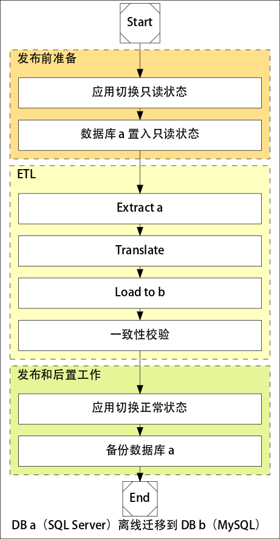
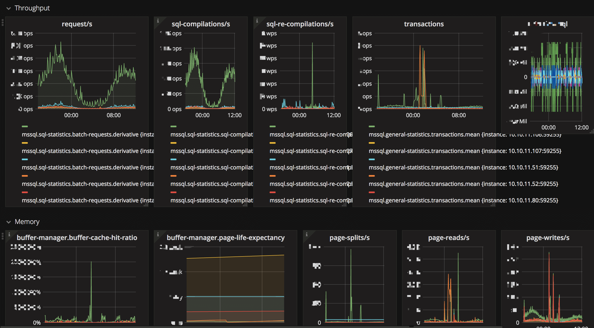
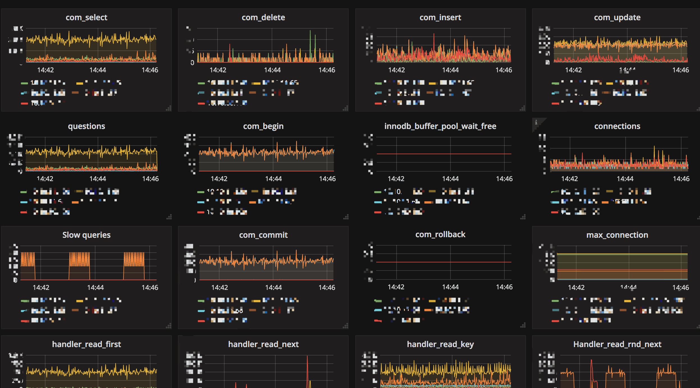

该系列三篇文章已经全部完成：

*   [从 SQL Server 到 MySQL（一）：异构数据库迁移 - Log4D](https://blog.alswl.com/2018/03/sql-server-migration-1/)
*   [从 SQL Server 到 MySQL（二）：在线迁移，空中换发动机 - Log4D](https://blog.alswl.com/2018/05/sql-server-migration-2/)
*   [从 SQL Server 到 MySQL（三）：愚公移山 - 开源力量 - Log4D](https://blog.alswl.com/2018/06/sql-server-migration-3/)

## 背景

沪江成立于 2001 年，作为较早期的教育学习网站，
当时技术选型范围并不大：
Java 的版本是 1.2，C# 尚未诞生，MySQL 还没有被 Sun 收购，
版本号是 3.23。
工程师们选择了当时最合适的微软体系，并在日后的岁月里，
逐步从 ASP 过度到 .net，数据库也跟随 SQL Server 进行版本升级。

十几年过去了，技术社区已经发生了天翻地覆的变化。
沪江的技术栈还基本在 .net 体系上，这给业务持续发展带来了一些限制。
人才招聘、社区生态、架构优化、成本风险方面都面临挑战。
集团经过慎重考虑，发起了大规模的去 Windows 化项目。
这其中包含两个重点子项目：开发语言从 C# 迁移到 Java，
数据库从 SQL Server 迁移到 MySQL。

本系列文章就是向大家介绍，
从 SQL Server 迁移到 MySQL 所面临的问题和我们的解决方案。

<!-- more -->

## 迁移方案的基本流程

设计迁移方案需要考量以下几个指标：

*   迁移前后的数据一致性
*   业务停机时间
*   迁移项目是否对业务代码有侵入
*   需要提供额外的功能：表结构重构、字段调整

经过仔细调研，在平衡复杂性和业务方需求后，
迁移方案设计为两种：停机数据迁移和在线数据迁移。
如果业务场景允许数小时的停机，那么使用停机迁移方案，
复杂度低，数据损失风险低。
如果业务场景不允许长时间停机，或者迁移数据量过大，
无法在几个小时内迁移完成，那么就需要使用在线迁移方案了。

数据库停机迁移的流程：

停机迁移逻辑比较简单，使用 ETL（Extract Translate Load）
工具从 Source 写入 Target，然后进行一致性校验，最后确认应用运行 OK，
将 Source 表名改掉进行备份。

在线迁移的流程：

在线迁移的方案稍微复杂一些，流程上有准备全量数据，然后实时同步增量数据，
在数据同步跟上（延迟秒级别）之后，进行短暂停机（Hang 住，确保没有流量），
就可以使用新的应用配置，并使用新的数据库。

## 需要解决的问题

从 SQL Server 迁移到 MySQL，核心是完成异构数据库的迁移。

基于两种数据迁移方案，我们需要解决以下问题：

*   两个数据库的数据结构是否可以一一对应？出现不一致如何处理？
*   MySQL 的使用方式和 SQL Server 使用方式是否一致？有哪些地方需要注意？
*   如何确保迁移前后的数据一致性？
*   在迁移中，如何支持数据结构调整？
*   如何保证业务不停情况下面，实现在线迁移？
*   数据迁移后如果发现业务异常需要回滚，如何处理新产生的数据？

为了解决以上的问题，我们需要引入一整套解决方案，包含以下部分：

*   指导文档 A：SQL Server 转换 MySQL 的数据类型对应表
*   指导文档 B：MySQL 的使用方式以及注意点
*   支持表结构变更，从 SQL Server 到 MySQL 的 ETL 工具
*   支持 SQL Server 到 MySQL 的在线 ETL 工具
*   一致性校验工具
*   一个回滚工具

让我们一一来解决这些问题。

## SQL Server 到 MySQL 指导文档

非常幸运的是，MySQL 官方早就准备了一份如何其他数据库迁移到
MySQL 的白皮书。
[MySQL :: Guide to Migrating from Microsoft SQL Server to MySQL](https://www.mysql.com/it/why-mysql/white-papers/guide-to-migrating-from-sql-server-to-mysql/)
里提供了详尽的 SQL Server 到 MySQL 的对应方案。
包含了：

*   SQL Server to MySQL - Datatypes 数据类型对应表
*   SQL Server to MySQL - Predicates 逻辑算子对应表
*   SQL Server to MySQL – Operators and Date Functions 函数对应表
*   T-SQL Conversion Suggestions 存储过程转换建议

需要额外处理的数据类型：

| SQL Server           | MySQL                   |
| ----                 | ------------            |
| IDENTITY             | AUTO_INCREMENT          |
| NTEXT, NATIONAL TEXT | TEXT CHARACTER SET UTF8 |
| SMALLDATETIME        | DATETIME                |
| MONEY                | DECIMAL(19,4)           |
| SMALL MONEY          | DECIMAL(10,4)           |
| UNIQUEIDENTIFIER     | BINARY(16)              |
| SYSNAME              | CHAR(256)               |

在实际进行中，还额外遇到了一个用来解决树形结构存储的字段类型
Hierarchyid。这个场景需要额外进行业务调整。

我们在内部做了针对 MySQL 知识的摸底排查工作，
并进行了若干次的 MySQL 使用技巧培训，
将工程师对 MySQL 的认知拉到一根统一的线。

关于存储过程使用，我们和业务方也达成了一致：所有 SQL Server
存储过程使用业务代码进行重构，不能在 MySQL 中使用存储过程。
原因是存储过程增加了业务和 DB 的耦合，会让维护成本变得极高。
另外 MySQL 的存储过程功能和性能都较弱，无法大规模使用。

最后我们提供了一个 MySQL 开发规范文档，借数据库迁移的机会，
将之前相对混乱的表结构设计做了统一了约束（部分有业务绑定的设计，
在考虑成本之后没有做调整）。

## ETL 工具

ETL 的全称是 Extract Translate Load（读取、转换、载入），
数据库迁移最核心过程就是 ETL 过程。
如果将 ETL 过程简化，去掉 Translate 过程，
就退化为一个简单的数据导入导出工具。
我们可以先看一下市面上常见的导入导出工具，
了解他们的原理和特性，方便我们选型。

MySQL 同构数据库数据迁移工具：

*   [mysqldump](https://dev.mysql.com/doc/refman/5.7/en/mysqldump.html)
    和 [mysqlimport](https://dev.mysql.com/doc/refman/5.7/en/mysqlimport.html)
    MySQL 官方提供的 SQL 导出导出工具
*   [pt-table-sync](https://www.percona.com/doc/percona-toolkit/LATEST/pt-table-sync.html)
    Percona 提供的主从同步工具
*   [XtraBackup](https://www.percona.com/software/mysql-database/percona-xtrabackup)
    Percona 提供的备份工具

异构数据库迁移工具：

*   [Database migration and synchronization tools](https://www.convert-in.com/)
    ：国外一家提供数据库迁移解决方案的公司
*   [DataX](https://github.com/alibaba/DataX)
    ：阿里巴巴开发的数据库同步工具
*   [yugong](https://github.com/alibaba/yugong)
    ：阿里巴巴开发的数据库迁移工具
*   [MySQL Workbench](https://www.mysql.com/cn/products/workbench/)
    ：MySQL 提供的 GUI 管理工具，包含数据库迁移功能
*   [Data Integration - Kettle](https://community.hds.com/docs/DOC-1009855)
    ：国外的一款 GUI ETL 工具
*   [Ispirer](https://www.ispirer.cn/products/sql-server-to-mysql-migration)
    ：提供应用程序、数据库异构迁移方案的公司
*   [DB2DB 数据库转换工具](http://www.szmesoft.com/DB2DB) 
    ：一个国产的商业数据库迁移软件
*   [Navicat Premium](https://www.navicat.com/en/products/navicat-premium)
    ：经典的数据库管理工具，带数据迁移功能
*   [DBImport](http://www.cnblogs.com/cyq1162/p/5637978.html)
    ：个人维护的迁移工具，非常简陋，需要付费

看上去异构数据库迁移工具和方案很多，但是经过我们调研，其中不少是为老派的传统行业服务的。
比如 Kettle / Ispirerer，他们关注的特性，不能满足互联网公司对性能、迁移耗时的要求。
简单筛选后，以下几个工具进入我们候选列表（为了做特性对比，加入几个同构数据库迁移工具）：

| 工具名称        | 热数据备份保证一致性                        | batch 操作 | 支持异构数据库 | 断点续接 | 开源 | 开发语言 | GUI |
| ---             | ---                                         | ---        | ---            | ---      | ---  | ---      | --- |
| mysqldump       | V 使用 `single-transaction`                 | X          | X              | X        | V    | C        | X   |
| pt-table-sync   | V 使用 transaction 或 `lock table` 的 FTWRL | V          | X              | V        | V    | Pell     | X   |
| DataX           | X                                           | V          | V              | X        | V    | Java     | X   |
| yugong          | X                                           | V          | V              | V        | V    | Java     | X   |
| DB2DB           | X                                           | V          | V              | X        | X    | .net     | V   |
| MySQL Workbench | X                                           | ?          | V              | X        | V    | C++      | V   |

由于异构数据库迁移，真正能够进入我们选型的只有
DataX / yugong / DB2DB / MySQL Workbench。
经过综合考虑，我们最终选用了三种方案，
DB2DB 提供小数据量、简单模式的停机模式支持，
足以应付小数据量的停机迁移，开发工程师可以自助完成。
DataX 为大数据量的停机模式提供服务，
使用 JSON 进行配置，通过修改查询 SQL，可以完成一部分结构调整工程。
yugong 的强大可定制性也为在线迁移提供了基础，
我们在官方开源版本的基础之上，增加了以下额外功能：

*   支持 SQL Server 作为 Source 和 Target
*   支持 MySQL 作为 Source
*   支持 SQL Server 增量更新
*   支持使用 YAML 作为配置格式
*   调整 yugong 为 fat jar 模式运行
*   支持表名、字段名大小写格式变化，驼峰和下划线自由转换
*   支持表名、字段名细粒度自定义
*   支持复合主键迁移
*   支持迁移过程中完成 Range / Time / Mod / Hash 分表
*   支持新增、删除字段

关于 yugong 的二次开发，我们也积累了一些经验，这个我们下篇文章会来分享。

## 一致性校验工具

在 ETL 之后，需要有一个流程来确认数据迁移前后是否一致。
虽然理论上不会有差异，但是如果中间有程序异常，
或者数据库在迁移过程中发生操作，数据就会不一致。

业界有没有类似的工具呢？
有，Percona 提供了 pt-table-checksum 这样的工具，
这个工具设计从 master 使用 `checksum` 来和 slave 进行数据对比。
这个设计场景是为 MySQL 主从同步设计，
显然无法完成从 SQL Server 到 MySQL 的一致性校验。
尽管如此，它的一些技术设计特性也值得参考：

*   一次检查一张表
*   每次检查表，将表数据拆分为多个 trunk 进行检查
*   使用 `REPLACE...SELECT` 查询，避免大表查询的长时间带来的不一致性
*   每个 trunk 的查询预期时间是 0.5s
*   动态调整 trunk 大小，使用指数级增长控制大小
*   查询超时时间 1s / 并发量 25
*   支持故障后断点恢复
*   在数据库内部维护 src / diff，meta 信息
*   通过 Master 提供的信息自动连接上 slave
*   必须 Schema 结构一致

我们选择 yugong 作为 ETL 工具的一大原因也是因为它提供了多种模式。
支持 CHECK / FULL / INC / AUTO 四种模式。
其中 CHECK 模式就是将 yugong 作为数据一致性检查工具使用。
yugong 工作原理是通过 JDBC 根据主键范围变化，将数据取出进行批量对比。

这个模式会遇到一点点小问题，如果数据库表没有主键，将无法进行顺序对比。
其实不同数据库有自己的逻辑主键，Oracle 有 `rowid`，
SQL Server 有 `physloc`。这种方案可以解决无主键进行比对的问题。

## 如何回滚

我们需要考虑一个场景，在数据库迁移成功之后业务已经运行了几个小时，
但是遇到了一些 Critical 级别的问题，必须回滚到迁移之前状态。
这时候如何保证这段时间内的数据更新到老的数据库里面去？

最朴素的做法是，在业务层面植入 DAO 层的打点，
将 SQL 操作记录下来到老数据库进行重放。
这种方式虽然直观，但是要侵入业务系统，直接被我们否决了。
其实这种方式是 binlog statement based 模式，
理论上我们可以直接从 MySQL 的 binlog 里面获取数据变更记录。
以 row based 方式重放到 SQL Server。

这时候又涉及到逆向 ETL 过程，
因为很可能 Translate 过程中，做了表结构重构。
我们的解决方法是，使用 Canal 对 MySQL binlog 进行解析，
然后将解析之后的数据作为数据源，
将其中的变更重放到 SQL Server。

由于回滚的过程也是 ETL，基于 yugong，
我们继续定制了 SQL Server 的写入功能，
这个模式类似于在线迁移，只不过方向是从 MySQL 到 SQL Server。

## 其他实践

我们在迁移之前做了大量压测工作，
并针对每个迁移的 DB 进行线上环境一致的全真演练。
我们构建了和生产环境机器配置一样，
数据量一样的测试环境，并要求每个系统在上线之前都进行若干次演练。
演练之前准备详尽的操作手册和事故处理方案。
演练准出的标准是：能够在单次演练中不出任何意外，时间在估计范围内。
通过演练我们保证了整个操作时间可控，减少操作时候的风险。

为了让数据库的状态更为直观的展现出来，
我们对 MySQL / SQL Server 添加了细致的 Metrics 监控。
在测试和迁移过程中，可以便利地看到数据库的响应情况。

为了方便 DBA 快速 Review SQL。
我们提供了一些工具，直接将代码库中的 SQL 拎出来，
可以方便地进行 SQL Review。
再配合其他 SQL Review 工具，
比如 [Meituan-Dianping/SQLAdvisor](https://github.com/Meituan-Dianping/SQLAdvisor)，
可以实现一部分自动化，提高 DBA 效率，避免线上出现明显的 Slow SQL。

## 最后

基于这几种方案我们打了一套组合拳。经过将近一年的使用，
进行了 28 个通宵，迁移了 42 个系统，
完成了包括用户、订单、支付、电商、学习、社群、内容和工具的迁移。
迁移的数据总规模接近百亿，所有迁移项目均一次成功。
迁移过程中积累了丰富的实战经验，保障了业务快速向前发展。

下一篇：[从 SQL Server 到 MySQL（二）：在线迁移，空中换发动机 - Log4D](https://blog.alswl.com/2018/05/sql-server-migration-2/)
