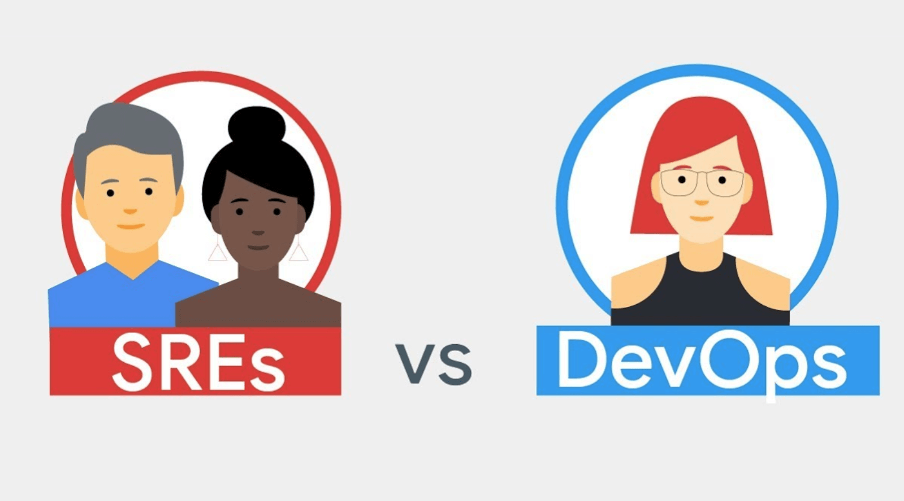
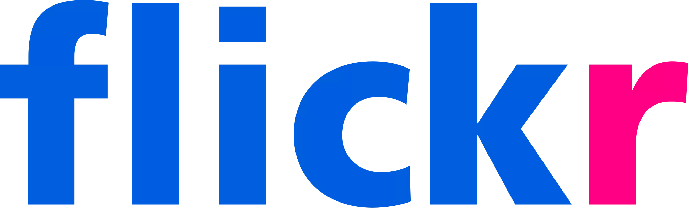

最近有一位朋友和我聊职业发展方向问题，聊了不少 DevOps 和 SRE 话题。
我几年前刚接触这两个概念时也常常将之混淆，可惜当时没有人来解答我困惑。
现在这虽然已经极为流行，但是我发现我这位朋友对这两个职位还存在一些误区。
于是我给了一些见解并整理成文章以饕大众。

最常见的误区：

- DevOps 新概念，好高级哦
- SRE 是高级版 DevOps
- 运维可以轻松转身 DevOps 工程师

让我一一给你讲解吧。

<small>[image via YouTube](https://www.youtube.com/watch?v=uTEL8Ff1Zvk)</small>

<!-- more -->

## DevOps 和 SRE 定义

DevOps 是字面上 Dev 开发 / Ops 运维两者组合，
严格意义上 DevOps 如下（via [DevOps - Wikipedia](https://en.wikipedia.org/wiki/DevOps)）：

> DevOps（Development 和 Operations 的组合词）是一种重视“软件开发人员（Dev）
> ”和“IT 运维技术人员（Ops）”之间沟通合作的文化、运动或惯例。

SRE 全称是 Site Reliability Engineering，最早是由 Google 提出，并且在其工程实践中发扬光大。
他们还出了一本同名书籍「[Site Reliability Engineering](https://landing.google.com/sre/book.html)」，
让这个理念在互联网工程师圈子里广泛传播。

Google 对 SRE 解释是（via [Site Reliability Engineering - Wikipedia](https://en.wikipedia.org/wiki/Site_Reliability_Engineering)）：

> Site reliability engineering (SRE) is a discipline that incorporates aspects of
> software engineering and applies that to operations whose goals are to
> create ultra-scalable and highly reliable software systems.

我将其翻译翻译为中文：

> 网站稳定性工程师是致力于打造「高扩展、高可用系统」，并将其贯彻为原则的软件工程师。

从定义来看，DevOps 是文化、运动和惯例，而 SRE 是有严格任职要求的职位。
文化是软性定义，文化有更多概念可以捏造，而 SRE 定义精准，就少了想象空间（也可能 SRE 门槛高 😄）。
按 Google 给出的说法是，SRE 工程师实践了 DevOps 文化。这个观点没错，但是国内的 DevOps 逐步独立出 DevOps 工程师，
所以在本文，我着重讨论的是 DevOps 工程师和 SRE 工程师两种职位对比。

## 两者产生背景和历史

互联网需求催生了 DevOps 。在最传统软件企业中，是只有 Dev 没有 Ops，
那时 Ops 可能还是只是技术支持人员。开发按照瀑布流：需求分析、系统设计、开发、测试、交付、运行，
传统软件发布是一个重量级操作。一旦发布，Dev 几乎不再直接操作。
80 后可能会记得 QQ 每年都会有一个大版本发布吧，QQ 2000 / 2003 / 2004 等等。
此时 Ops 不用和 Dev 直接高频接触，甚至针对一些纯离线业务，压根没有设立 Ops 这个岗位。

互联网浪潮之后，软件由传统意义上桌面软件演变为面向网站、手机应用。
这时候业务核心逻辑，比如交易，社交行为都不在用户桌面完成，而是在服务器后端完成。
这给互联网企业给予了极大操作空间：随时可以改变业务逻辑，这促进了业务快速迭代变更。
但即便这样，Dev 和 Ops 是极其分裂的两个环节。Ops 不关心代码是如何运作的，Dev 不知道代码如何运行在服务器上。

当业界还沉浸在可以每周发布版本喜悦中时，2009 年，Flicker 提出了每天发布 10+ 次概念，大大震撼了业界。
Flicker 提出了几个核心理念：

- 业务快速发展，需要拥抱变更，小步快跑
- Ops 目标不是为了网站稳定和快速，而是推动业务快速发展
- 基于自动化工具提高 Dev / Ops 联接：代码版本管理、监控
- 高效沟通：IRC / IM Robot（现在那些 ChatBot 套路，10 年前就被 Flicker 玩过了）
- 信任、透明、高效、互助的沟通文化

原文 SlideShare 在这
[10+ Deploys Per Day: Dev and Ops Cooperation at Flickr](https://www.slideshare.net/jallspaw/10-deploys-per-day-dev-and-ops-cooperation-at-flickr)

真是让人难以想象，今天各种培训公司和一些知名大 V 在呼唤这些 DevOps 理念，
竟然在 2009 年一份幻灯片中就展现淋漓尽致。经典总是不过时，在尘封下闪耀着智慧光芒。
有些人将 DevOps 和运维自动化等同，这是只看到表象。
DevOps 目标是提高业务系统交付速度，并为之提供相关工具、制度和服务。
一些个人或培训机构添油加醋和衍生含义，都是围绕这 DevOps 本质而发散。

接下来聊聊 SRE 历史， SRE 出现要晚一些。在 2003 年时候 Google 的 Ben Treynor
招募了几个软件工程师，这个团队设立目的是帮助 Google 生产环境服务运行更稳定、健壮、可靠。
不同于中小型规模公司，Google 服务于十几亿用户服务，短暂服务不可用会带来致命后果。
因此 Google 走在了时代最前面，SRE 产生了。

这个职位为大规模集群服务，小型团队不需要这样职位设定（可能也招不起真正 SRE 😊）。
Google 在探索若干年之后，SRE 团队开始将自己心得体会写在线上，并在 2016 年将此书出版。

## 两者的职能不同

DevOps 文化，那么就没有一个具象职能要求。现在不少公司将 DevOps 职能单独抽取出来，称之为 DevOps 工程师。
那让我们看看 DevOps 工程师关心什么：DevOps 文化目的是提交交付速度， DevOps 工程师就自然会关心软件 / 服务的整个生命周期。

一个简单的公式：`速度 = 总量 / 时间`，添上工程行业术语，即 `交付速度 = （（功能特性 * 工程质量） / 交付时间） * 交付风险`。

功能特性交给产品经理和项目经理管理，DevOps 工程师需要关心剩下几个因素：工程质量 / 交付时间 / 交付风险。
DevOps 工程师职能如下：

- 管理应用全生命周期（需求、设计、开发、QA、发布、运行）
- 关注全流程效率提升，挖掘瓶颈点并将其解决
- 自动化运维平台设计和研发工作（标准化、自动化、平台化）
- 支持运维系统，包括 虚拟化技术、资源管理技术、监控技术、网络技术

SRE 关键词是「高扩展性」「高可用性」。高扩展性是指当服务用户数量暴增时，
应用系统以及支撑其服务（服务器资源、网络系统、数据库资源）可以在不调整系统结构，不强化机器本身性能
，仅仅增加实例数量方式进行扩容。高可用性是指，应用架构中任何环节出现不可用时，比如应用服务、网关、数据库
等系统挂掉，整个系统可以在可预见时间内恢复并重新提供服务。当然，既然是「高」可用，
那么这个时间一般期望在分钟级别。SRE 职能可以概括为以下：

- 为 应用、中间件、基础设施等提供 选型、设计、开发、容量规划、调优、故障处理
- 为业务系统提供基于可用性、可扩展性考虑决策，参与业务系统设计和实施
- 定位、处理、管理故障，优化导致故障发生相关部件
- 提高各部件资源利用率

## 工作内容不同

职责不同导致两个职位工作内容也不尽相同，我将 DevOps 工程师和 SRE 工程师职能列举如下：

- DevOps
  - 设定应用生命管理周期制度，扭转流程
  - 开发、管理 开发工程师 /QA 工程师使用 开发平台系统
  - 开发、管理 发布系统
  - 开发、选型、管理 监控、报警系统
  - 开发、管理 权限系统
  - 开发、选型、管理 CMBD
  - 管理变更
  - 管理故障
- SRE
  - 管理变更
  - 管理故障
  - 制定 SLA 服务标准
  - 开发、选型、管理 各类中间件
  - 开发、管理 分布式监控系统
  - 开发、管理 分布式追踪系统
  - 开发、管理 性能监控、探测系统（dtrace、火焰图）
  - 开发、选型、培训 性能调优工具

很有趣的对比，DevOps 和 SRE 都会关心应用生命周期，特别是生命周期里面中变更和故障。
但是 DevOps 工作内容是主要为开发链路服务，一个 DevOps Team 通常会提供一串工具链，
这其中会包括：开发工具、版本管理工具、CI 持续交付工具、CD 持续发布工具、报警工具、故障处理。
而 SRE Team 则关注更为关注变更、故障、性能、容量相关问题，会涉及具体业务，产出工具链会有：
容量测量工具、Logging 日志工具、Tracing 调用链路跟踪工具、Metrics 性能度量工具、监控报警工具等。

## DevOps 和 SRE 关系

DevOps 首先是一种文化，后期逐渐独立成一个职位；SRE 一开始就明确是一个职位；
不少同学把 DevOps 和 SRE 搞混，是被两者表象锁迷惑，看上去这两者都有的工具属性、自动化要求也相似。
甚至有一些开发同学把这类运维工作都统一理解为：服务器 + 工具 + 自动化。这是盲人摸象，管中窥豹。

从技能上来说，两者都需要较强的运维技能。
在职业发展天花板上，DevOps 可能缺乏 SRE 在一些专业领域的技能：
计算机体系结构能力；高吞吐高并发优化能力；可扩展系统设计能力；复杂系统设计能力；业务系统排查能力。
两者都需要软实力，但是 SRE 面临复杂度更高，挑战更大，要求也更高：

- 分析问题、解决问题能力
- 对业务系统更了解
- 具备高并发、高可用系统设计实施经验
- 对整个系统链路有更全面认识

DevOps 具有普遍意义，现代互联网公司都需要 DevOps，但是并非所有团队对高可用性、高扩展性存在需求，它们不需要 SRE。
DevOps 工程师掌握相关技能之后，也有机会可以发展为 SRE 工程师。
而一位合格 SRE 工程师，在有选择情况下面，我相信不会去转型为 DevOps 工程师。

从专业背景来看，无论是 DevOps 还是 SRE 工程师，都需要研发背景，前者需要开发工具链，后者需要有较强架构设计经验。
如果有运维工程师想转型成为 DevOps 或者 SRE，那么需要补上相关技术知识。
毕竟，不是会搭建一套 Jenkins + Kubernetes 就可以自称为 DevOps / SRE 工程师。

怎么样，有没有解开这几个常见误区呢？希望你看到这里可以豁然开朗，最后附上两个工程师的技能点，
期望有志成为这两种工程师的同学，加油努力。

## 附录：技能点

DevOps：

- Operator 技能
  - Linux Basis
    - 基本命令操作
    - Linux FHS（Filesystem Hierarchy Standard 文件系统层次结构标准）
    - Linux 系统（差异、历史、标准、发展）
  - 脚本
    - Bash / Python
  - 基础服务
    - DHCP / NTP / DNS / SSH / iptables / LDAP / CMDB
  - 自动化工具
    - Fabric / Saltstack / Chef / Ansible
  - 基础监控工具
    - Zabbix / Nagios / Cacti
  - 虚拟化
    - KVM 管理 / XEN 管理 / vSphere 管理 / Docker
    - 容器编排 / Mesos / Kubernetes
  - 服务
    - Nginx / F5 / HAProxy / LVS 负载均衡
    - 常见中间件 Operate（启动、关闭、重启、扩容）
- Dev
  - 语言
    - Python
    - Go（可选）
    - Java（了解部署）
  - 流程和理论
    - Application Life Cycle
    - 12 Factor
    - 微服务概念、部署、生命周期
    - CI 持续集成 / Jenkins / Pipeline / Git Repo Web Hook
    - CD 持续发布系统
  - 基础设施
    - Git Repo / Gitlab / Github
    - Logstash / Flume 日志收集
    - 配置文件管理（应用、中间件等）
    - Nexus / JFrog / Pypi 包依赖管理
    - 面向 开发 / QA 开发环境管理系统
    - 线上权限分配系统
    - 监控报警系统
    - 基于 Fabric / Saltstack / Chef / Ansible 自动化工具开发

SRE：

- 语言和工程实现
  - 深入理解开发语言（假设是 Java）
    - 业务部门使用开发框架
    - 并发、多线程和锁
    - 资源模型理解：网络、内存、CPU
    - 故障处理能力（分析瓶颈、熟悉相关工具、还原现场、提供方案）
  - 常见业务设计方案和陷阱（比如 Business Modeling，N+1、远程调用、不合理 DB 结构）
  - MySQL / Mongo OLTP 类型查询优化
  - 多种并发模型，以及相关 Scalable 设计
- 问题定位工具
  - 容量管理
  - Tracing 链路追踪
  - Metrics 度量工具
  - Logging 日志系统
- 运维架构能力
  - Linux 精通，理解 Linux 负载模型，资源模型
  - 熟悉常规中间件（MySQL Nginx Redis Mongo ZooKeeper 等），能够调优
  - Linux 网络调优，网络 IO 模型以及在语言里面实现
  - 资源编排系统（Mesos / Kubernetes）
- 理论
  - 容量规划方案
  - 熟悉分布式理论（Paxos / Raft / BigTable / MapReduce / Spanner 等），能够为场景决策合适方案
  - 性能模型（比如 Pxx 理解、Metrics、Dapper）
  - 资源模型（比如 Queuing Theory、负载方案、雪崩问题）
  - 资源编排系统（Mesos / Kurbernetes）

## Ref

- [DevOps - 维基百科，自由的百科全书](https://zh.wikipedia.org/wiki/DevOps)
- [Site reliability engineering - Wikipedia](https://en.wikipedia.org/wiki/Site_reliability_engineering)
- [StuQ 技能图谱](http://skill-map.stuq.org/)
- [The Twelve-Factor App （简体中文）](https://12factor.net/zh_cn/)
- [Google - Site Reliability Engineering](https://landing.google.com/sre/book/chapters/communication-and-collaboration.html)
- [What's the Difference Between DevOps and SRE? - YouTube](https://www.youtube.com/watch?v=uTEL8Ff1Zvk)
