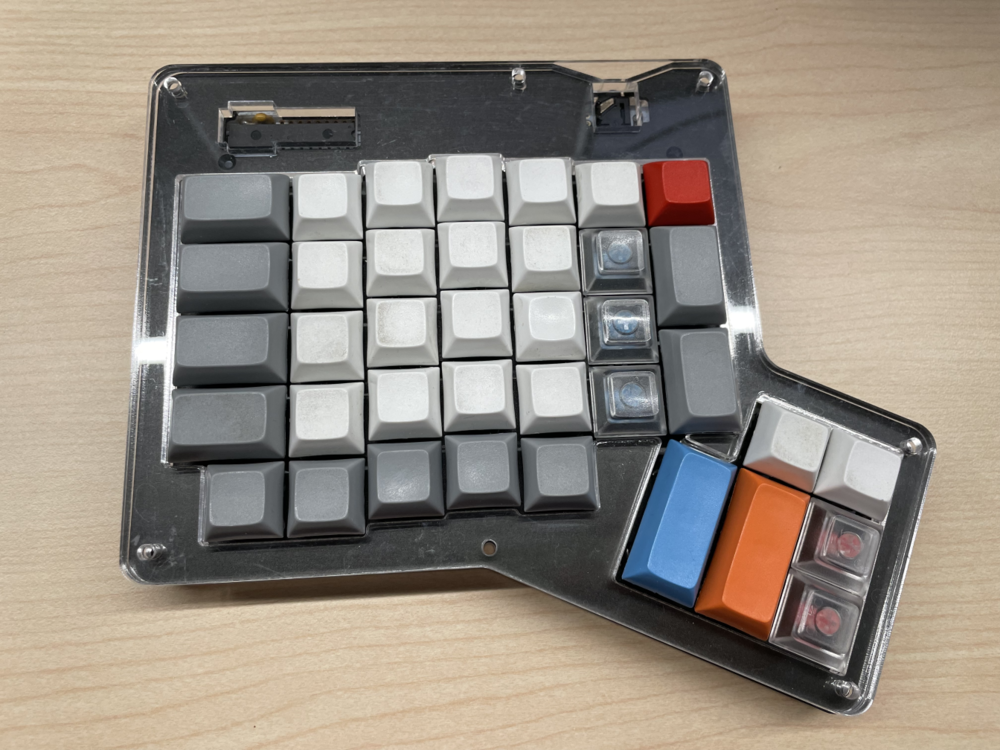

> 为了做好万全的准备，如何在 35 岁毕业后能够顺利入职电子厂？
>
> 从修键盘学起

## 原因

我使用的键盘是 ErgoDox，一个人体工程学设计的分体键盘。关于 ErgoDox 更多详情可以见我之前的 [回答](https://www.zhihu.com/question/52088337/answer/141073759)。

（前任键帽配色 + 手托）：

经过七八年工作，它进过水，进过咖啡，还进过豆浆，现在终于有几个键不灵活了，按起来有粘滞感，无法提供顺畅的 coding feel 了。

在使用备胎 Filco 几个月之后，我终于下定决心，要将 ErgoDox 修好。

## 准备

- 电烙铁
- 吸锡器
- 焊锡
- 键轴
- 精工螺丝起子套件
- 拔键器
- 起键轴小起子

没有焊接经验的朋友，可以学习一下如何焊接：

[女生都能学会的键盘焊接换轴教程\_哔哩哔哩\_bilibili](https://www.bilibili.com/video/BV1xt4y157LM/)

[电烙铁的错误和正确使用方法\_哔哩哔哩\_bilibili](https://www.bilibili.com/video/BV1Ui4y177kk/)

## 过程

<mark><b>检查要换哪些键轴，按一按，听一听</b></mark>

<mark><b>卸下外壳卸下伪装</b></mark>

<mark><b>去除对应的键帽（注意，F J 键帽不一样哦）</b></mark>

<mark><b>融化焊锡，用吸锡器将融化的焊锡吸走</b></mark>

<mark><b>用键轴小起子，将其从正面摘除，记得有个软卡子，要上下方向（即 cherry logo 方向 + 对面用力）</b></mark>

<mark><b>看看进去的咖啡和豆浆</b></mark>

<mark><b>将新的键轴焊上去，效果</b></mark>

<mark><b>吸锡器吸走的碎屑吐出来的样子</b></mark>

<mark><b>最后完成组装</b></mark>

## 总结

又有了那种打字畅快的感觉了~

青春回来了~

最后分享一下我的 ErgoDox Layout 配置：

- [alswl/ergodox-firmware/blob/master/src/keyboard/ergodox/layout/alswl-layout.c](https://link.zhihu.com/?target=https%3A//github.com/alswl/ergodox-firmware/blob/master/src/keyboard/ergodox/layout/alswl-layout.c) 我的 Layout，一共五层：普通模式 / Funtion Key / Number Pad / MediaKey / Arrow
- [alswl/ergodox-firmware/blob/master/src/main.c#L127](https://link.zhihu.com/?target=https%3A//github.com/alswl/ergodox-firmware/blob/master/src/main.c%23L127) 修改了 LED 灯，让 LED 灯来表示 Layout 状态
- [alswl/teensy_loader_cli](https://link.zhihu.com/?target=https%3A//github.com/alswl/teensy_loader_cli)[alswl/teensy_loader_cli](https://link.zhihu.com/?target=https%3A//github.com/alswl/teensy_loader_cli) Mac 下面可以工作的 teensy loader cli，官方提供的点击 Reset 按钮没有响应

若有收获，就点个赞吧。
