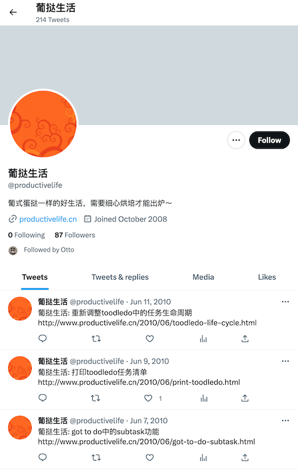

最近我完成了从 Toodledo 到 Obsidian Tasks（Obsidian 插件）的切换。这两款软件都是极其强大的时间管理工具。虽然 Toodledo 可能是最好的 GTD 软件，但是 Obsidian Tasks 在查询和知识库结合方面的能力发挥出了 1+1 > 2 的效果。

放弃一个合作了十几年的老朋友 Toodledo 让我有些伤感，但是这个过程也促使我总结了一下我在时间管理这个命题上的尝试，并分享了一些我的经验。


<small>Image frrom Pixelbay</small>

## 什么是 GTD

在这个快节奏的现代生活中，我们都会遇到大量的任务和信息，而如何有效地管理时间和任务成为了许多人的挑战。在读书时期，我也曾经陷入任务管理的困境。从 2009 年开始，我尝试过使用[日历](https://blog.alswl.com/2010/01/use-google-calendar-to-manage-the-time/)、[笔记](https://blog.alswl.com/2010/04/desktop-recording-tool-boogunote/)等工具来组织我的任务和信息，但效果并不理想。直到后来我接触到了 [DoIt.im](https://doit.im/)，进而发现了 David Allen 的书《[Getting Things Done](https://book.douban.com/subject/1316569/)》，这本书带给了我一种全新的任务管理思路——GTD。往后数十年，我一直使用这个模式来管理自己的时间。

GTD 是由 David Allen 所创立的一种个人时间管理方法 ，旨在帮助人们更有效地管理自己的时间和任务，从而提高工作效率和生产力。这种方法的基本思想是==将所有任务分解为具体的行动步骤，并将它们组织在一个可靠的系统中，以便于跟进和管理==。通过这种方法，人们可以更轻松地掌控自己的工作和生活，减少压力和焦虑，从而更加专注和高效地完成任务。

那么如何实现 GTD 呢？以下是基本的步骤：

1.  收集：收集所有任务、想法、计划、待办事项，可以用笔记本、手机、电脑等多种工具。
2.  组织：审视待办任务，分类所有任务和行动步骤，并回顾过往未完成的项目。
    -   分类：审视收集到的任务，将所有任务和行动步骤分类，常见分类包括项目、上下文、时间等，以更清晰地了解任务的优先级和关联性。如果可以快速执行（<2m）就立刻执行。
    -   回顾：定期回顾任务和行动步骤，确保它们的进度和状态得到及时跟进，更好地掌控任务和生活，从而更加高效地完成任务。
3.  执行：专注于当前任务，避免分散注意力，借助时间管理和注意力控制的技巧提高效率。


注，我整理的结构和外部工具略有差异。==我将分类、回顾都合并到组织步骤==，因为我发现组织本质是做计划，做计划纪要看收集的待办事项，也要回顾进行中项目和已完成项目，何不都在组织环节一起做好？

## 我曾经使用过的在线 GTD 服务

我曾使用过多个在线任务管理软件，包括 Doit.im、Remember The Milk、OmniFocus和Toodledo等，下面分享一下我的使用历程和对比这些软件的差异。

### Doit.im

我接触 GTD 就是从 Doit.im 开始。这是一款国产软件，也是我非常喜欢的一款应用程序。Doit.im 支持 GTD 的基本功能，提供了清晰的任务列表、分类、优先级等功能，还支持多种回顾模式和多平台同步。然而，我后来放弃了它，因为我发现了更为强大的 Toodledo。


<small>Image frrom doit.im</small>

### Remember The Milk

我寻找下一款管理工具时，找到了 Remember The Milk（RTM）这个应用。RTM 提供了基本的任务管理功能，如添加任务、设置提醒、归档任务等等，并支持多平台同步，可以在电脑、手机等多个设备上使用。

然而，有些人可能不太喜欢 RTM 的用户界面设计，因为它看起来可能有些过时，不够现代化。此外，一些高级功能需要付费使用。当时我还是一个穷学生，没有为软件付费的能力，所以很快放弃了使用 RTM。

### Toodledo

我从善用佳软了解到 [Toodledo](https://xbeta.info/gtd-toodledo.htm) 这款任务管理工具（善用佳软是一个著名的软件使用分享网站，我在学生时代从这里获取了相当多的工具和思路）。


<small>Image frrom toodledo.com</small>

我很快在 [葡挞生活](http://www.productivelife.cn/) 找到了一份非常完整的教程介绍 Toodledo 高级使用手法，尤其从其中获得了使用 Search 模块的方法。可惜现在网站已经无法打开了。不过，我们可以从一些其他渠道的截图中，略窥当时 Toodledo 的风采：



<small>Image frrom twitter.com/productivelife</small>

Toodledo 很快成为了我最喜欢的任务管理工具。它提供了非常全面的任务管理功能，支持任务分类、排序、筛选等，同时还支持多种回顾模式和自定义字段。此外，Toodledo 还支持多平台同步，并且具有强大的 API，可以方便地与其他应用程序集成。

下面介绍一些 Toodledo 中做得很不错的功能：

#### 循环任务功能

Toodledo 支持循环任务功能，用户可以将一个任务设置为循环任务，并指定它的重复周期，比如每天、每周、每月等。当任务完成后，它会自动重复出现在任务列表中，以便用户再次处理。这个功能可以帮助用户更好地管理一些常规性的任务：日常会议、每日邮件处理、每日 Review 等等。


#### 丰富时间功能类型

Toodledo 对日期的支持非常丰富，用户可以根据任务的具体情况选择不同的 Due 类型，比如 Due（截止时间）、Timer（计时器）、Length（时常评估） 等等。这样一来，用户可以更加精细地管理任务的时间，有效地提高工作效率。另外，基于 Timer 计时器，我可以==方便地统计一天的时间耗用情况==，更好地把控时间成本。我还开发了一个 [Python 脚本](https://github.com/alswl/toodledo_a)用来分析每周的时间耗用。


#### Search 功能

Toodledo 的 Search 功能非常强大，==支持丰富的逻辑查询（提供了条件组合的与或查询）==，用户可以根据任务名称、标签、日期、优先级等多个条件进行查询。这个功能可以帮助用户组织任务，提高任务管理的效率，我一度无法离开 Toodledo 也是因为，任务组织这个步骤我高度依赖这项功能。


###  OmniFocus

由于 Toodledo 产品功能上一直不思进取，访问比较慢。我还曾经探索式短暂使用了 OmniFocus，这是一款专业的Mac平台任务管理工具，它提供了任务分解、项目管理、上下文等功能，并可通过AppleScript等方式进行扩展。OmniFocus 支持多种同步服务，包括Omni Sync Server、WebDAV、FTP等，用户可以根据自己的需求选择不同的服务。所有任务数据都是存储在本地的，因此用户可以在没有网络连接的情况下继续使用软件。

付费使用一段时间之后，我发现 ==OmniFocus 的搜索功能和 Toodledo 的 Search 功能实在无法相提并论==，它不能满足我的需求。


<small>Image frrom www.omnigroup.com/omnifocus</small>

### 其他一些

我还曾经尝试过一些任务管理工具，包括 Trello、Asana、Basement、Tower、Teambition 等等，

但是由于它们的功能设计往往是为团队协作设计的，而我主要是个人使用，因此使用起来不够便捷。另外，这些软件的自定义搜索功能（当时）往往也比较弱，无法满足我的需求。最终我都返回到了 Toodledo 怀抱，直到现在。


## 我如何组织一天的任务？


> GTD 最难的是，如果确定下一个任务是什么？我是如何组织的呢。
> 每个任务比较重要的属性是 Context / Goal（项目）/ Status / Due，并将任务区分为单独任务、父子任务（一般周期比较长）和项目内任务。
> 每天开展工作是先看单独任务，再看父子任务，在看项目任务，一边看一遍调整每个任务的 Due，并最终展现到一个 Search（work-now）中间（其中 work 是一个 Context）。

我认为在 GTD 的体系中，收集和处理阶段相对机械和简单，真正考验人的是**组织**阶段：

-   分类：如何快速检阅所有任务并对它们进行分类和标记；
-   下一步：如何确定下一个任务的优先级。

下面我将分享一些我个人的理念和操作方法。

### 分类即快速检阅

为了更好地组织任务，我们需要注意任务的重要属性，包括 ==Context（环境）、Project（项目）、Status（状态）和 Due（截止时间）==。Context 决定了当前环境下要做什么，是一个简单的过滤器。我将 Context 分为 Computer / Work / Mobile。Project 则将任务归属到不同的项目中，一个项目的周期比较长，并且其中的任务具有强相关性。Status 描述这个任务是立即可处理（Next）还是需要等待（Waiting），有些任务是周期性的则为 Active。Due 则是描述时间属性，一般有到点干（On），在这个时间之前（Due）以及尽量（Optional）。

除此之外，其他属性，如优先级（Priority）、类型（Folder）也需要考虑，但不是最重要的。

为了更好地管理任务，我每天早上都会打开==四个视图：single、subtask、project-xxx 和 inbox==。

-   single 是单独任务（包括重复任务），这里面的任务都是独立的，可以根据优先级进行排序。
-   subtask 是多重任务，有些任务并不是当天可以完成，必须将任务拆分为小任务，否则会打击完成任务的信心。
-   project-xxx 针对特定项目做的分类，我会按照固定模板对每个项目进行分类成十几个任务。
-   inbox 其实就是收集的产物，需要进行简单分类处理。


### 下一个任务是什么

以下是筛选清单，用于确定需要立即进行的任务：

-   **Top**：任务优先级高
-   **Due 3 天内且非重复类型**：需要进行检查和准备工作
-   **Due 明天**：需要立即进行
-   **High + Next**：任务优先级较高，且已经具备行动条件
-   **计时器不为空**：说明已经开始执行，但可能会被其他事情打断
-   **Waiting**：表示需要和别人合作，需要检查进度


清单中的任务按照优先级、截止日期和执行状态的综合考虑排序。每次进入工作状态之后，只需要从这个清单中筛选出靠前的几个任务进行执行。


## 再见 Toodledo

最近，我对一直使用的任务管理服务 Toodeldo 的==稳定性==越来越失望。他们[换了新的服务提供商](https://blog.toodledo.com/hello-from-the-new-toodledo-team/)，服务出现不稳定的频率更高，而新团队的产品能力也让我产生了一些质疑。因此，我决定开始寻找下一个更好的任务管理服务。

对于云服务的信任度已经降到了冰点，因为 Kindle 在中国停止服务的事件让我对云服务的可靠性产生了疑虑。因此，我开始寻找一些==本地化的任务管理方案==，这些方案可以通过网盘（例如 iCloud）进行服务，这样可以更好地保护我的数据和隐私。

虽然离开 Toodledo，我对 Toodledo 还是充满感情，毕竟我使用它已经超过了 12 年，付费了 8 年，而且它的产品理念深刻影响了我时间管理的策略。我也基于 Toodledo 开发了好几个工具和插件。

## 彩蛋 1 优雅订阅 Toodledo 日历

Toodledo 提供了日历订阅能力，将待办事项显示在各类日历软件中。但原始的信息非常混乱，没有考虑任务的 Time，并且时间也是计算错误。为此我开发了一个 Web 服务，叫做 [toodledo_calendar_filter](https://github.com/alswl/toodledo_calendar_filter)。

它可以将 Toodledo 的任务更友好地显示在日历系统上。具体来说，它可以过滤 Toodledo 的 iCal，只显示那些具有到期日期和时长的任务。如果你也有相关需求可以直接使用我提供的在线服务（https://toodledo-calendar-filter.alswl.com）。

Before：


After：


## 彩蛋 2 让 Toodledo 具备 Gmail 快捷键

当你使用 Toodledo 进行任务管理时，你是否感到操作繁琐，鼠标使用效率不高，非常怀念 Gmail 风格的快捷键？如果是这样，那么我的项目 [alswl/toodledo\_calendar\_filter](https://github.com/alswl/toodledo_calendar_filter) 可以帮助你解决这个问题。

它是一个针对 Toodledo 的油猴脚本，提供了一系列 Gmail 风格的快捷键，让你可以像使用 Gmail 一样快速操作 Toodledo，包括移动任务（`j` / `k`）、任务操作（`x` 标记完成，`enter` 启动任务）、切换任务视图（`g s` 跳转搜索）等等。它在 Chrome / Safari / Firefox 上运行稳定，如果你想要提高 Toodledo 的使用效率，不妨试一试吧。

## 彩蛋 3 go-toodledo

为了快速收集任务，我曾经使用一个 Github 上面 CLI 小工具（[wsargent/toodledo](https://github.com/wsargent/toodledo)）。

后来出于担心 v1 版本 API 下线，我自己做了一个叫做 [go-toodledo ](https://github.com/alswl/go-toodledo)小项目，一开始这个项目只是提供最简单的 CLI 功能。后来我逐步补充了完整 SDK、CLI 全功能，甚至还提供了一个==互动式的 TUI 小应用==，让用户可以方便在 Terminal 地使用 Toodledo。


Toodledo 官方并没有提供 OpenAPI 接口，我以逆向的方式生成了一份 [go-toodledo/swagger.yaml](https://github.com/alswl/go-toodledo/blob/master/api/swagger.yaml)，如果还有其他人有对 Toodledo API 开发需求，可以基于这份 API 直接使用。

## 最终获胜者 Obsidian Tasks

Obsidian是一款基于本地文件的个人知识管理（KMS）和笔记应用程序，可帮助用户将其笔记和想法组织、链接和分析。它是一款纯粹的本地软件，我们可以使用网盘 / NAS 等方式进行多端同步。

Obsidian Tasks 则是一款==强大的 Obsidian 插件==，它可以让你在 Obsidian 中轻松地管理任务和待办事项。这个插件可以通过简单的语法将任务添加到你的笔记中，并根据任务的完成情况自动标记任务的状态。你可以使用 Obsidian Tasks 来跟踪个人任务、工作任务、学习任务等等。此外，它还具有一些其他功能，例如自定义任务样式、创建过滤器来查找任务，以及可以根据任务状态自动移动任务。Obsidian + Obsidian Tasks 是一个完美组合，可以帮助你更好地管理你的待办事项，提高你的生产力。


<small>Image frrom https://github.com/obsidian-tasks-group/obsidian-tasks</small>

我的个人 KMS 已经完整地从 Notion 迁移到了 Obisidian，现在使用 Obisidan Tasks 迁移成本很低。经过一段时间对 Obsidian Tasks 的学习，我将原来的使用模式较为顺利搬到了 Obsidian Tasks。我接着之前两个场景**整理**和**下一个任务**来介绍如何高效使用 Obsidian Tasks。

我通过以下几种形式组织待办任务：

-   使用 `[ ]` 标记的普通文档任务，一般是零散小任务。
-   使用以 `.todo.md` 结尾的专用文档，以对项目进行统筹。
-   使用带有 `#todo` 标签的文档，一般是一个大事项，我会在顶部拆分出一个 `TODO` 队列，拆分出若干个Tasks，拆完之后我会去掉 `#todo` 标签。

基于这个组织结构，我轻松搞定**整理**和**下一个任务**这两个：

### 分类即快速检阅

使用几个视图==将 Obsidian Tasks 中记录的任务进行多个视图呈现==，分别是：

-   今日视角
    -   non repeated：一次性任务，往往更重要
    -   repeat：重复性任务，比如周会、约会，往往偏事务性
-   时间视角
    -   即将到期时间（7 天内）
-   Single Tasks：没有在 `.todo` 结尾的文件内，即分散在各个日常事务的碎任务
-   Project：按项目进行排列的任务
-   有 `#todo` 标签的任务，往往是一个文档需要整体来处理

这几个视图可以让你更好地将任务进行分类，并快速检阅各个任务。通过这些视图，你可以更好地管理你的待办事项，提高你的生产力。

`View.todo.md`：

````markdown
## Today

non repetead:
```tasks
((not done) AND (due before in 1 day)) OR (done on today)
is not recurring
```
repeated:
```tasks
((not done) AND (due before in 1 day)) OR (done on today)
is recurring
```

## Today complete

```tasks
done
done on today
```


## Due in 7 days(no repeat)

```tasks
not done
due before in 7 day
is not recurring
```


## Singles Tasks（non project）

```tasks
not done
status.type is not CANCELLED
NOT (path includes .todo)
NOT (path includes .notodo)
```

## Projects

- [[a project 0.2.0.todo]]
- [[b project 2.0.todo]]


## TODO

> merge to tasks or .todo later

```query
tag:#todo 
```


## Help

> [Queries Syntax](https://obsidian-tasks-group.github.io/obsidian-tasks/queries/)

````

### 下一个任务是什么

在 Obsidian 的 Daily Note 插件中，设置模板为 `_templates/dailly`，这样每天就获得一个随时可以使用的当天待办事项。

这是我的 Dailly 设置，通过四个区块区分今天到期 / 今天到期（重复，往往事务性，不重要） / 今日完成 / 今日新任务（一般是 Single）。


````markdown
## TODO

Tasks view - today:
```tasks
((not done) AND (due before {{date}})) OR (done on {{date}})
is not recurring
```

Tasks view - today(repeated):
```tasks

((not done) AND (due before {{date}})) OR (done on {{date}})
is recurring
```

Tasks view - today done:
```tasks
done
done on {{date}}
```

New tasks:

````


## 最后

时间管理是现代工作者不可避免的话题，也是我们时常为之烦恼的问题。GTD的方法论恰恰提供了一种轻松而高效的管理方式，让我们能够==迅速结束拖延、分心的状态，全身心地投入工作==。

工具很重要，但并不能解决所有问题。要做好时间管理，最重要的是要清楚==自己的目标是什么==。当你心里有一个重要的使命时，它会不断地在你脑海中浮现，这时候甚至不需要 GTD 工具的管理。

希望本文介绍的 GTD 方法可以在你的工作和生活中带来帮助，让你更高效地完成自己的任务，同时也不要忘记享受生活的美好。记住，时间是有限的，珍惜每分每秒，抓住每一个机会，让自己的人生更加精彩！

（ChatGPT 的中文真的是好正能量啊）
