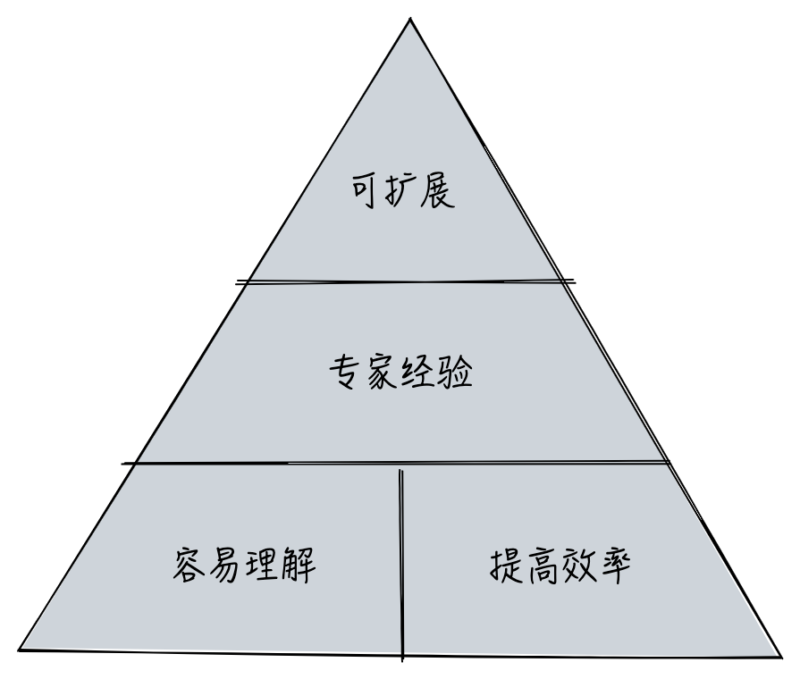
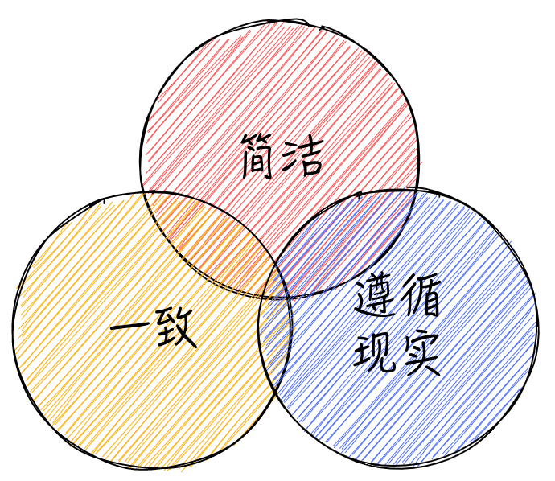
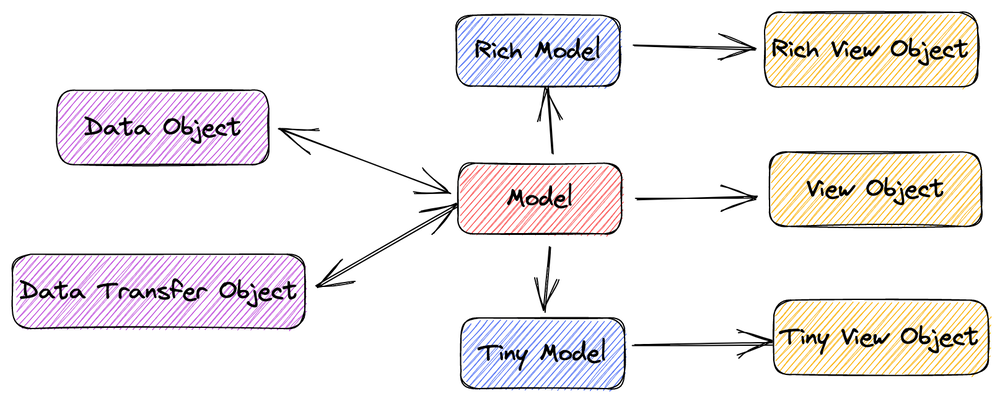
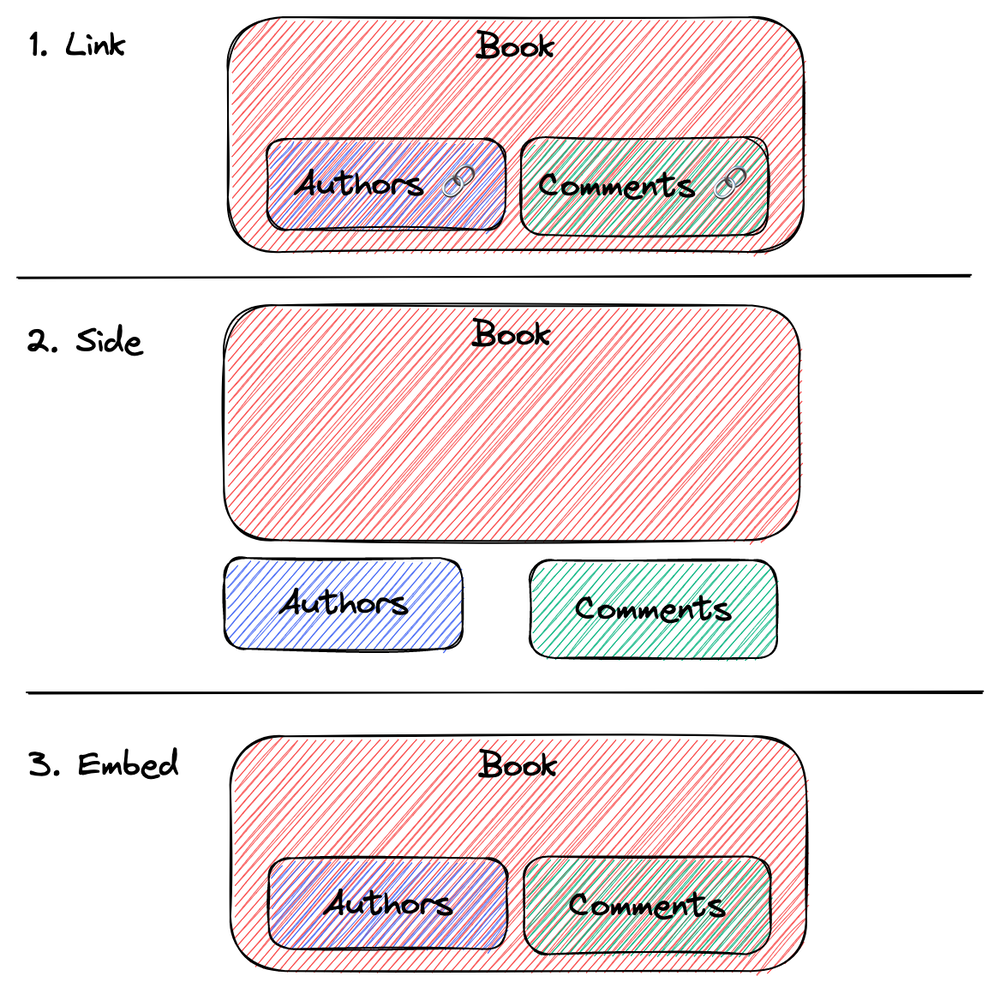
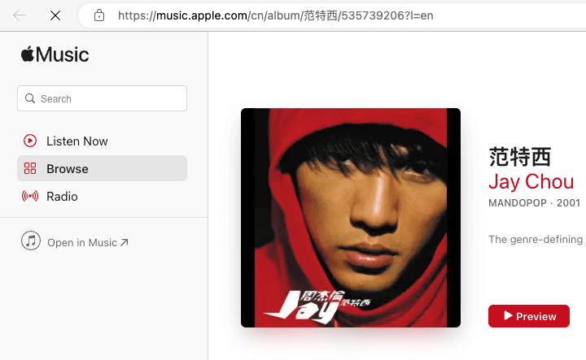

当开始创建一个新系统，或参与一个新团队或项目时，都会面临一个简单却深刻的问题：这个系统（Web Server）的 API 是否有设计规范？


<small>image by stable difussion, prompt by alswl</small>

这个问题困扰了我很长时间，始于我求学时期，每一次都需要与团队成员进行交流和讨论。
从最初的自由风格到后来的 REST，我经常向项目组引用 [Github v3](https://docs.github.com/en/rest?apiVersion=2022-11-28) 和
Foursqure API（已经无法访问，暴露年龄） 文档。
然而，在实践过程中，仍然会有一些与实际工作或公司通用规范不匹配的情况，
这时候我需要做一些补充工作。最终，我会撰写一个简要的 `DEVELOPMENT.md` 文档，以描述设计方案。

但我对该文档一直有更多的想法，它还不够完善。因此，我想整理出一份<mark>简单（Simple）而实用（Pragmatic）</mark>的 Web API 最佳实践，也就是本文。


## 为什么我们需要 API 统一规范

这个问题似乎很明显，但是深入剖析涉及团队协作效率和工程设计哲学。

API（Application Programming Interface，应用程序编程接口）是不同软件系统之间交互的桥梁。在不同软件系统之间进行通信时，
API 可以通过标准化的方式进行数据传输和处理，从而实现各种应用程序的集成。

当我们开始撰写 API 文档时，就会出现一个范式（Design Pattern），这是显式还是隐式的，
是每个人一套还是公用同一套。这就像我们使用统一的 USB 接口一样，统一降低了成本，避免了可能存在的错误。具体来说，这有以下几个原因：

- 容易理解，提高效率：服务提供方和消费方使用统一形式、结构和使用方式，以及统一的生产消费协议，从而减少沟通成本。
- 专家经验：它包含最佳的工程实践，常见场景都有对应的解决方案，避免了每个人都要重新思考整个 API 系统。
  例如，如何处理 API 缓存？如何进行鉴权？如何进行数据格式处理？
- 面向未来的扩展，需要稳定的协议：协议是抽象的、独立于实现的，不是每个人都具备
  设计面向不确定系统的能力，一些广泛使用的技术则为更广泛的场景做了规划。



<small>image by alswl</small>

虽然使用统一规范确实有一些成本，需要框架性的了解和推广，但我相信在大部分场景下，
统一规范所带来的收益远远高于这些成本。

然而，并非所有的情况下都需要考虑 API 规范。对于一些短生命周期的项目、影响面非常小的内部项目和产品，
可能并不需要过多关注规范。 此外，在一些特殊的业务场景下，
协议底层可能会发生变化，这时候既有的规范可能不再适用。但即使如此，我仍然建议重新起草新的规范，而不是放弃规范不顾。


## 规范的原则

在制定 API 规范时，我们应该遵循一些基本原则，以应对技术上的分歧，我总结了三个获得广泛认可的原则：

- 简洁：简洁是抵抗复杂性的最直接和最有效的策略，利用简洁原则降低复杂度，避免复杂性的滋生和扩散；
- 一致性：统一的设计模式和延续的设计风格有助于降低工程成本和工程师的心理负担；
- 遵循现实：遵循现有工程领域的抽象和分层（例如 HTTP，REST，RBAC，OIDC 等），不要自己发明新的概念，
  要始终思考这个问题是否只有自己遇到了（答案肯定是否定的）。



<small>image by alswl</small>


## REST 到底行不行？

在 Web API 领域，[RESTful API](https://en.wikipedia.org/wiki/Representational_state_transfer) 已经成为广受欢迎的协议。
其广泛适用性和受众范围之广源于其与 HTTP 协议的绑定，这使得 RESTful API 能够轻松地与现有的 Web 技术进行交互。如果您对 REST 不熟悉，
可以查看 [阮一峰的 RESTful API 设计指南](https://www.ruanyifeng.com/blog/2014/05/restful_api.html) 以及
[RESTful API 设计最佳实践](https://www.oschina.net/translate/best-practices-for-a-pragmatic-restful-api?print)。

REST 是一种成熟度较高的协议，[Leonard Richardson](https://martinfowler.com/articles/richardsonMaturityModel.html#level0)
将其描述为四种成熟度级别：


<small>image by alswl</small>

1. The Swamp of POX，使用 HTTP 承载 Legacy 协议（XML）
2. Resources：使用资源抽象
3. HTTP Verbs：使用丰富的 HTTP Verbs
4. Hypermedia Controls：使用 `rel` 链接进行 API 资源整合，[JSON:API](https://jsonapi.org/) 是登峰造极的表现

REST 的核心优势在于：

-   它充分利用了 HTTP 协议的设计（HTTP Protocol）
-   它具有出色的资源定位能力（Identification of resources）
-   它设计了完备的资源操作方式（Manipulation of resources）
-   它具备自解释性（Self-descriptive messages）
-   它支持多种形态的呈现方式（hypermedia as the engine of application state）

然而，<mark>REST 并非一种具体的协议或规范，而是一种风格理念</mark>。尽管 REST 定义了一些规则和原则，如资源的标识、统一接口、无状态通信等，
但它并没有规定一种具体的实现方式。因此，在实际开发中，不同的团队可能会有不同的理解和实践，
从而导致 API 的不一致性和可维护性降低。

此外，REST 也有一些局限性和缺陷：

-   并非所有请求都可以用资源描述，比如登录（`/login`）操作，转换成 `session` 就非常绕口；
    同样的问题在转账这种业务也会出现。HTTP 有限的动词无法支撑所有业务场景。
-   REST 并未提供针对必然面临的问题，如分页、返回体具体结构、错误处理和鉴权等，明确的解决方案。
-   对于复杂的查询（如搜索 Search），RESTful API 的查询参数可能会变得非常复杂，难以维护。

因此，虽然 REST 风格是一个不错的指导思想，但在具体实现时需要结合具体业务需求和技术特点，有所取舍，才能实现良好的 API 设计。
最后，我们是否需要 Web API 设计规范，遵循 REST 风格呢？我认为 REST 能够解决 90% 的问题，但还有 10% 需要明确规定细节。


## Web API 规范的选择题

因为我们的协议基于 HTTP 和 REST 设计，我们将以 HTTP 请求的四个核心部分为基础展
开讨论，这些部分分别是：URL、Header、Request 和 Response。


### URL 最佳实践

我的 URL 设计启蒙来自于 [Ruby on Rails](https://guides.rubyonrails.org/routing.html)。
在此之前，我总是本能地将模型信息放到 URL 之上，但实际上良好的 URL 设计应该是针对系统信息结构的规划。
因此，URL 设计不仅仅要考虑 API，还要考虑面向用户的 Web URL。

为了达到良好的 URL 设计，我总结了以下几个规则：

-   定位资源（这就回答分页是否应该在 Header）
-   自解释（可读性强，URL 自身即包含核心信息）
-   安全（不能包含用户认证信息，OAuth 为了解这个花了很多精力，防伪造）

通常情况下，URL 的模型如下所示：

`/$(prefix)/$(module)/$(model)/$(sub-model)/$(verb)?$(query)#${fragment}`

其中，Prefix 可能是 API 的版本，也可能是特殊限定，如有些公司会靠此进行接入层分流；
Module 是业务模块，也可以省略；Model 是模型；SubModel 是子模型，可以省略；
Verb 是动词，也可以省略；Query 是请求参数；Fragment 是 HTTP 原语 Fragment。

需要注意的是，并非所有的组成部分都是必须出现的。例如，SubModel 和 Verb 等字段可
以在不同的 URL 风格中被允许隐藏。

**设计风格选择**

注：**请注意，方案 A / B / C 之间没有关联，每行上下也没有关联**

| 问题                                                                  | 解释（见下方单列分析）            | 方案 A       | 方案 B         | 方案 C                                       |
| ---                                                                   | ---                               | ---          | ---            | ---                                          |
| API Path 里面 Prefix                                                  |                                   | `/apis`      | `/api`         | 二级域名                                     |
| Path 里面是否包含 API 版本                                            | **版本在 URL 的优势**             | ✅           | 🚫             |                                              |
| Path 是否包含 Group                                                   |                                   | ✅           | 🚫             |                                              |
| Path 是否包含动作                                                     | **HTTP Verb 不够用的情况**        | ✅           | 🚫 （纯 REST） | 看情况（如果 HTTP Verb CRUD 无法满足就包含） |
| 模型 ID 形式                                                          | **Readable Stable Identity 解释** | 自增 ID      | GUID           | <mark>Readable Stable ID</mark>              |
| URL 中模型单数还是复数                                                |                                   | 单数         | 复数           | 列表复数，单向单数                           |
| 资源是一级（平铺）还是多级（嵌套）                                    | **一级和多级的解释**              | 一级（平铺） | 多级（嵌套）   |                                              |
| 搜索如何实现，独立接口（`/models/search`）还是基于列表`/models/` 接口 |                                   | 独立         | 合并           |                                              |
| 是否有 Alias URL                                                      | **Alias URL 解释**                | ✅           | 🚫             |                                              |
| URL 中模型是否允许缩写（或精简）                                      | **模型缩写解释**                  | ✅           | 🚫             |                                              |
| URL 中模型多个词语拼接的连字符                                        |                                   | `-`          | `_`            | Camel                                        |
| 是否要区分 Web API 以及 Open API（面向非浏览器）                      |                                   | ✅           | 🚫             |                                              |

**版本在 URL 的优势**

我们在设计 URL 时遵循一致性的原则，无论是哪种身份或状态，都会使用相同的 URL 来访问同一个资源。
这也是 Uniform Resource Location 的基本原则。虽然我们可以接受不同的内容格式（例如 JSON / YAML / HTML / PDF / etc），
但是我们希望资源的位置是唯一的。

然而，问题是，对于同一资源在不同版本之间的呈现，是否应该在 URL 中体现呢？这取决于设计者是否认为版本化属于位置信息的范畴。

根据 RFC 的设计，除了 URL 还有 [URN（Uniform Resource Name）](https://en.wikipedia.org/wiki/Uniform_Resource_Name)，
后者是用来标识资源的，而 URL 则指向资源地址。实际上，URN 没有得到广泛的使用，以至于 URI 几乎等同于 URL。

**HTTP Verb 不够用的情况**

在 REST 设计中，我们需要使用 HTTP 的 GET / POST / PUT / DELETE / PATCH / HEAD 等动词对资源进行操作。
比如使用 API `GET /apis/books` 查看书籍列别，这个自然且合理。
但是，当需要执行类似「借一本书」这样的动作时，
我们没有合适的动词（BORROW）来表示。针对这种情况，有两种可行的选择：

1. 使用 POST 方法与自定义动词，例如 `POST /apis/books/borrow`，表示借书这一动作；
2. 创建一个借书记录，使用资源新增方式来结构不存在的动作，例如 `POST /apis/books/borrow-log/`；

这个问题在复杂的场景中会经常出现，例如用户登录（`POST /api/auth/login` vs `POST /api/session`）和帐户转账（vs 转账记录创建）等等。
<mark>API 抽象还是具体，始终离不开业务的解释。</mark>我们不能简单地将所有业务都笼统概括到 CRUD 上面，
而是需要合理划分业务，以便更清晰地实现和让用户理解。

在进行设计时，我们可以考虑是否需要为每个 API 创建一个对应的按钮来方便用户的操作。
如果系统中只有一个名为 `/api/do` 的 API 并将所有业务都绑定在其中，虽然技术上可行，
但这种设计不符合业务需求，每一层的抽象都是为了标准化解决特定问题的解法，TCP L7 设计就是这种理念的体现。


**Readable Stable Identity 解释**

在标记一个资源时，我们通常有几种选择：

- 使用 ID：ID 通常与数据库自增 ID 绑定。
- 使用 GUID：例如 UUID，尽管不那么精确。
- 使用可读性和稳定性标识符（Readable Stable Identity）：通常使用名称、UID 或特定 ID（如主机名、IP 地址或序列号）来标识，
  要求该标识符具有稳定性且全局唯一，在内部系统中非常有用。

我个人有一个设计小技巧：使用 `${type}/${type-id}` 形式的 slug 来描述标识符。Slug 是一种人类可读的唯一标识符，
例如 `hostname/abc.sqa` 或 `ip/172.133.2.1`。
这种设计方式可以在可读性和唯一性之间实现很好的平衡。

> A slug is a human-readable, unique identifier, used to identify a resource instead of a less human-readable identifier like an id .

from [What’s a slug. and why would I use one? | by Dave Sag](https://itnext.io/whats-a-slug-f7e74b6c23e0)


PS：文章最末我还会介绍一套 Apple Music 方案，这个方案兼顾了 ID / Readable / Stable 的特性。

**一级和多级的解释**

URL 的层级设计可以根据建模来进行，也可以采用直接单层结构的设计。具体问题的解决方式，
例如在设计用户拥有的书籍时，可以选择多级结构的 `/api/users/foo/books` 或一级结构的 `/api/books?owner=foo`。

技术上这两种方案都可以，<mark>前者尊重模型的归属关系，后者则是注重 URL 结构的简单</mark>。

多级结构更直观，但也需要解决可能存在的多种组织方式的问题，例如图书馆中书籍按照作者或类别进行组织？
这种情况下，可以考虑在多级结构中明确模型的归属关系，
例如 `/api/author/foo/books`（基于作者）或 `/api/category/computer/books`（基于类别）。


**Alias URL 解释**

对于一些频繁使用的 URL，虽然可以按照 URL 规则进行设计，但我们仍然可以设计出一个更为简洁的 URL，
以方便用户的展示和使用。这种设计在 Web URL 中尤其常见。比如一个图书馆最热门书籍的 API：

```
# 原始 URL
https://test.com/apis/v3/books?sort=hot&limit=10

# Alias URL
https://test.com/apis/v3/books/hot
```

**模型缩写解释**

通常，在对资源进行建模时，会使用较长的名称来命名，例如书籍索引可能被命名为 `BookIndex` ，而不是 `Index`。
在 URL 中呈现时，由于 `/book/book-index` 的 URL 前缀包含了 Book，我们可以减少一层描述，
使 URL 更为简洁，例如使用 `/book/index`。这种技巧在 Web URL 设计中非常常见。

此外，还有一种模型缩写的策略，即提供一套完整的别名注册方案。别名是全局唯一的，
例如在 Kubernetes 中， [Deployment](https://kubernetes.io/docs/reference/generated/kubernetes-api/v1.26/#deployment-v1-apps)
是一种常见的命名，而 `apps/v1/Deployment` 是通过添加 Group 限定来表示完整的名称，
同时还有一个简写为 `deploy`。这个机制依赖于 Kubernetes 的 API Schema 系统进行注册和工作。

### Header 最佳实践

我们常常会忽略 Header 的重要性。实际上，HTTP 动词的选择、HTTP 状态码以及各种身
份验证逻辑（例如 Cookie / Basic Auth / Berear Token）都依赖于 Header 的设计。


**设计风格选择**

| 问题                                   | 解释（见下方单列分析） | 方案 A                 | 方案 B                         | 方案 C   |
| ---                                    | ---                    | ---                    | ---                            | ---      |
| 是否所有 Verb 都使用 POST              | **关于全盘 POST**      | ✅                     | 🚫                             |          |
| 修改（Modify）动作是 POST 还是 PATCH？ |                        | POST                   | PATCH                          |          |
| HTTP Status 返回值                     | **2XX 家族**           | 充分利用 HTTP Status   | 只用核心状态（200 404 302 等） | 只用 200 |
| 是否使用考虑限流系统                   |                        | ✅ 429                 | 🚫                             |          |
| 是否使用缓存系统                       |                        | ✅  ETag / Last Modify | 🚫                             |          |
| 是否校验 UserAgent                     |                        | ✅                     | 🚫                             |          |
| 是否校验  Referrral                    |                        | ✅                     | 🚫                             |          |


**关于全盘 POST**

有些新手（或者自认为有经验的人）可能得出一个错误的结论，即除了 GET 请求以外，
所有的 HTTP 请求都应该使用 POST 方法。甚至有些人要求 [所有行为（即使是只读的请求）也应该使用 POST 方法](https://www.zhihu.com/question/336797348)。
这种观点通常会以“简单一致”、“避免缓存”或者“运营商的要求”为由来支持。

然而，我们必须明白 HTTP 方法的设计初衷：它是用来描述资源操作类型的，从而派生出了包括缓存、安全、幂等性等一系列问题。
在相对简单的场景下，省略掉这一层抽象的确不会带来太大的问题，但一旦进入到复杂的领域中，
使用 HTTP 方法这一层抽象就显得非常重要了。<mark>这是否遵循标准将决定你是否能够获得标准化带来的好处</mark>，
类比一下就像一个新的手机厂商可以选择不使用 USB TypeC 接口。
技术上来说是可行的，但同时也失去了很多标准化支持和大家心智上的约定俗成。

我特别喜欢一位 [知乎网友](https://www.zhihu.com/people/huixiong-19) 的
[评论](https://www.zhihu.com/question/336797348/answer/2198634068)：「<mark>路由没有消失，只是转移了</mark>」。

**2XX 家族**

HTTP 状态码的用途在于表明客户端与服务器间通信的结果。2XX 状态码系列代表服务器已经成功接收、
理解并处理了客户端请求，回应的内容是成功的。以下是 2XX 系列中常见的状态码及其含义：

- 200 OK：请求已成功处理，服务器返回了响应。
- 201 Created：请求已经被成功处理，并且在服务器上创建了一个新的资源。
- 202 Accepted：请求已被服务器接受，但尚未执行。该状态码通常用于异步处理。
- 204 No Content：请求已成功处理，但是服务器没有返回任何响应体内容。

2XX 系列的状态码表示请求已被成功处理，这些状态码可以让客户端明确知晓请求已被正确处理，从而进行下一步操作。

是否需要全面使用 2XX 系列的状态码，取决于是否需要向客户端明确/显示的信息，
告知它下一步动作。如果已经通过其他方式（包括文档、口头协议）描述清楚，
那么确实可以通盘使用 200 状态码进行返回。但基于行为传递含义，
或是基于文档（甚至口头协议）传递含义，哪种更优秀呢？是更为复杂还是更为简洁？


### Request 最佳实践


**设计风格选择**

| 问题                                                | 解释（见下方单列分析） | 方案 A      | 方案 B       | 方案 C             |
| ---                                                 | ---                    | ---         | ---          | ---                |
| 复杂的参数是放到 Form Fields 还是单独一个 JSON Body |                        | Form Fields | Body         |                    |
| 子资源是一次性查询还是独立查询                      |                        | 嵌套        | 独立查询     |                    |
| 分页参数存放                                        |                        | Header      | URL Query    |                    |
| 分页方式                                            | **分页方式解释**       | Page based  | Offset based | Continuation token |
| 分页控制者                                          | **分页控制着解释**     | 客户端      | 服务端       |                    |

**分页方式解释**

我们最为常见的两种分页方式是 Page-based 和 Offset-based，可以通过公式进行映射。
此外，还存在一种称为 Continuation Token 的方式，其技术类似于 Oracle 的
[rownum 分页方案](https://stackoverflow.com/questions/241622/paging-with-oracle)，使用参数 `start-from=?` 进行描述。
虽然 Continuation Token 的优缺点都十分突出，使用此种方式可以将顺序性用于替代随机性。

**分页控制着解释**

在某些情况下，我们需要区分客户端分页（Client Pagination）和服务器分页（Server Pagniation）。
客户端分页是指下一页的参数由客户端计算而来，而服务器分页则是由服务器返回 `rel` 或 JSON.API 等协议。
使用服务器分页可以避免一些问题，例如批量屏蔽了一些内容，如果使用客户端分页，可能会导致缺页或者白屏。


### Response 最佳实践

**设计风格选择**

| 问题                           | 解释（见下方单列分析）     | 方案 A               | 方案 B                      | 方案 C     |
| ---                            | ---                        | ---                  | ---                         | ---        |
| 模型呈现种类                   | **模型的几种形式**         | 单一模型             | 多种模型                    |            |
| 大模型如何包含子模型模型       | **模型的连接、侧载和嵌入** | 嵌入                 | 核心模型 + 多次关联资源查询 | 链接       |
| 字段返回是按需还是归并还是统一 |                            | 统一                 | 使用 `fields` 字段按需      |            |
| 字段表现格式                   |                            | Snake                | Camel                       |            |
| 错误码                         |                            | 无自定，使用 Message | 自定义                      |            |
| 错误格式                       |                            | 全局统一             | 按需                        |            |
| 时区                           |                            | UTC                  | Local                       | Local + TZ |
| HATEOAS                        |                            | ✅                   | 🚫                          |            |

**模型的几种形式**

在 API 设计中，对于模型的表现形式有多种定义。虽然这并不是 API 规范必须讨论的话题，但它对于 API 设计来说是非常重要的。

我将模型常说的模型呈现方式分为一下几类，这并非是专业的界定，借用了 Java 语境下面的一些定义。
这些名称在不同公司甚至不同团队会有不一样的叫法：



<small>image by alswl</small>

- Business Object（BO）：原始的业务模型
- Data Object（DO）：存储到 RDBMS 的模型，所以必须是打平的字段结构，有时候一个 BO 会对应到多个 DO
- View Object（VO）：呈现到表现层的模型，只保留用户需要看到信息，比如会去掉敏感信息
- Data Transfer Object（DTO）：用来在 RPC 系统进行传输的模型，一般和 原始的 Model 差异不大，根据不同序列化系统会有差异
  （比如枚举的处理）

除此之外，还经常使用两类：Rich Model 和 Tiny Model（请忽略命名，不同团队叫法差异比较大）：

- Rich Model：用来描述一个丰富模型，这个模型包含了几乎所有需要用的的数据，也允许子资源进行嵌套
- Tiny Model：是一个精简模型，往往用来在列表 API 里面被使用

**模型的连接、侧载和嵌入**

在 API 设计中，我们经常需要处理一个模型中包含多个子模型的情况，例如 Book 包含 Comments。
对于这种情况，通常有三种表现形式可供选择：链接（Link）、侧载（Side）和嵌入（Embed）。



<small>image by alswl</small>

链接（有时候这个 URL 也会隐藏，基于客户端和服务端的隐式协议进行请求）：

```json
{
  "data": {
    "id": 42,
    "name": "朝花夕拾",
    "relationships": {
      "comments": "http://www.domain.com/book/42/comments",
      "author": [
        "http://www.domain.com/author/鲁迅"
      ]
    }
  }
}
```

侧载：

```json
{
  "data": {
    "id": 42,
    "name": "朝花夕拾",
    "relationships": {
      "comments": "http://www.domain.com/book/42/comments",
      "authors": [
        "http://www.domain.com/author/鲁迅"
      ]
    }
  },
  "includes": {
    "comments": [
      {
        "id": 91,
        "author": "匿名",
        "content": "非常棒"
      }
    ],
    "authors": [
      {
        "name": "鲁迅",
        "description": "鲁迅原名周树人"
      }
    ]
  }
}
```

嵌入：

```json
{
  "data": {
    "id": 42,
    "name": "朝花夕拾",
    "comments": [
      {
        "id": 91,
        "author": "匿名",
        "content": "非常棒"
      }
    ],
    "authors": [
      {
        "name": "鲁迅",
        "description": "鲁迅原名周树人"
      }
    ]
  }
}
```

### 其他

还有一些问题没有收敛在四要素里面，但是我们在工程实践中也经常遇到，我将其捋出来：

**我不是 HTTP 协议，怎么办？**

Web API 中较少遇到非 HTTP 协议，新建一套协议的成本太高了。在某些特定领域会引入一些协议，
比如 IoT 领域的 [MQTT](https://mqtt.org/)。

此外，RPC 是一个涉及广泛领域的概念，其内容远远不止于协议层面。
通常我们会将 HTTP 和 RPC 的传输协议以及序列化协议进行对比。
我认为，本文中的许多讨论也对 RPC 领域具有重要意义。

有些团队或个人计划使用自己创建的协议，但我的观点是应尽量避免自建协议，因为真正需要创建协议的情况非常罕见。
如果确实存在强烈的需要，那么我会问两个问题：是否通读过 HTTP RFC 文档和 HTTP/2 RFC 文档？


**我不是远程服务（RPC / HTTP 等），而是 SDK 怎么办？**

本文主要讨论的是 Web API（HTTP）的设计规范，并且其中一些规则可以借鉴到 RPC 系统中。
然而，讨论的基础都是建立在远程服务（Remote Service）的基础之上的。
如果你是 SDK 开发人员，你会有两个角色，可能会作为客户端和远程服务器进行通信，
同时还会作为 SDK 提供面向开发人员的接口。对于后者，以下几个规范可以作为参考：

后者可以参考一下这么几个规范：

- Azure SDK 设计规范 [General Guidelines: API Design | Azure SDKs](https://azure.github.io/azure-sdk/general_design.html)
- Posix API 范例（比如 File [Low-Level I/O (The GNU C Library)](https://www.gnu.org/software/libc/manual/html_node/Low_002dLevel-I_002fO.html))

**认证鉴权方案**

一般而言，Web API 设计中会明确描述所采用的认证和鉴权系统。
需要注意区分「认证」和「鉴权」两个概念。关于「认证」这一话题，可以在单独的章节中进行讨论，因此本文不会展开这一方面的内容。

在 Web API 设计中，常见的认证方式包括：HTTP Basic Auth、OAuth2 和账号密码登录等。
常用的状态管理方式则有 Bearer Token 和 Cookie。此外，在防篡改等方面，还会采用基于 HMac 算法的防重放和篡改方案。


**忽略掉的话题**

在本次讨论中，我未涉及以下话题：异步协议（Web Socket / Long Pulling / 轮训）、CORS、以及安全问题。
虽然这些话题重要，但是在本文中不予展开。


**什么时候打破规则**

有些开发者认为规则就是为了打破而存在的。现实往往非常复杂，我们难以讨论清楚各个细节。
如果开发者觉得规则不符合实际需求，有两种处理方式：修改规则或打破规则。
然而，我更倾向于讨论和更新规则，明确规范不足之处，确定是否存在特殊情况。
如果确实需要创建特例，一定要在文档中详细描述，告知接任者和消费者这是一个特例，说明特例产生的原因以及特例是如何应对的。


## 一张风格 Checklist

### Github 风格

Github 的 API 是我常常参考的对象。它对其业务领域建模非常清晰，提供了详尽的文档，使得沟通成本大大降低。
我主要参考以下两个链接：
API 定义 [GitHub REST API documentation](https://docs.github.com/en/rest?apiVersion=2022-11-28) 和
面向应用程序提供的 API 列表 [Endpoints available for GitHub Apps](https://docs.github.com/en/rest/overview/endpoints-available-for-github-apps?apiVersion=2022-11-28)
，该列表几乎包含了 Github 的全部 API。

| 问题                                                                  | 选择                                                      | 备注                                                                                                                                              |
| ---                                                                   | ---                                                       | ---                                                                                                                                               |
| **URL**                                                               |                                                           |                                                                                                                                                   |
| API Path 里面 Prefix                                                  | 二级域名                                                  | https://api.github.com                                                                                                                            |
| Path 里面是否包含 API 版本                                            | 🚫                                                        | Header `X-GitHub-Api-Version` [API Versions](https://docs.github.com/en/rest/overview/api-versions?apiVersion=2022-11-28)                         |
| Path 是否包含 Group                                                   | 🚫                                                        |                                                                                                                                                   |
| Path 是否包含动作                                                     | 看情况（如果 HTTP Verb CRUD 无法满足就包含）              | 比如 `PUT /repos/{owner}/{repo}/pulls/{pull_number}/merge` `POST /repos/{owner}/{repo}/releases/generate-notes`                                   |
| 模型 ID 形式                                                          | Readable Stable Identity                                  |                                                                                                                                                   |
| URL 中模型单数还是复数                                                | 复数                                                      |                                                                                                                                                   |
| 资源是一级（平铺）还是多级（嵌套）                                    | 多级                                                      |                                                                                                                                                   |
| 搜索如何实现，独立接口（`/models/search`）还是基于列表`/models/` 接口 | 独立                                                      |                                                                                                                                                   |
| 是否有 Alias URL                                                      | ?                                                         |                                                                                                                                                   |
| URL 中模型是否允许缩写（或精简）                                      | 🚫                                                        | 没有看到明显信息，基于多级模型也不需要，但是存在 `GET /orgs/{org}/actions/required_workflows`                                                     |
| URL 中模型多个词语拼接的连字符                                        | `-` 和 `_`                                                | `GET /repos/{owner}/{repo}/git/matching-refs/{ref}` vs `GET /orgs/{org}/actions/required_workflows`                                               |
| 是否要区分 Web API 以及 Open API（面向非浏览器）                      | 🚫                                                        |                                                                                                                                                   |
| **Header**                                                            |                                                           |                                                                                                                                                   |
| 是否所有 Verb 都使用 POST                                             | 🚫                                                        |                                                                                                                                                   |
| 修改（Modify）动作是 POST 还是 PATCH？                                | PATCH                                                     |                                                                                                                                                   |
| HTTP Status 返回值                                                    | 充分利用 HTTP Status                                      | 常用，包括限流洗损                                                                                                                                |
| 是否使用考虑限流系统                                                  | ✅ 429                                                    |                                                                                                                                                   |
| 是否使用缓存系统                                                      | ✅  ETag / Last Modify                                    | [Resources in the REST API#client-errors](https://docs.github.com/en/rest/overview/resources-in-the-rest-api?apiVersion=2022-11-28#client-errors) |
| 是否校验 UserAgent                                                    | ✅                                                        |                                                                                                                                                   |
| 是否校验 Referrral                                                    | 🚫                                                        |                                                                                                                                                   |
| **Request**                                                           |                                                           |                                                                                                                                                   |
| 复杂的参数是放到 Form Fields 还是单独一个 JSON Body                   | Body                                                      | 参考 [Pulls#create-a-pull-request](https://docs.github.com/en/rest/pulls/pulls?apiVersion=2022-11-28#create-a-pull-request)                       |
| 子资源是一次性查询还是独立查询                                        | 嵌套                                                      | 从 Pulls 进行判断                                                                                                                                 |
| 分页参数存放                                                          | URL Query                                                 |                                                                                                                                                   |
| 分页方式                                                              | Page                                                      | [Using pagination in the REST API](https://docs.github.com/en/rest/guides/using-pagination-in-the-rest-api?apiVersion=2022-11-28)                 |
| 分页控制者                                                            | 服务端                                                    | 同上                                                                                                                                              |
| **Response**                                                          |                                                           |                                                                                                                                                   |
| 模型呈现种类                                                          | 多种模型                                                  | 比如 Commits 里面的 明细和 Parent [Commits](https://docs.github.com/en/rest/commits/commits?apiVersion=2022-11-28)                                |
| 大模型如何包含子模型模型                                              | 核心模型 + 多次关联资源查询？| 没有明确说明，根据几个核心 API 反推                                                                                                               |
| 字段返回是按需还是归并还是统一                                        | 统一                                                      |                                                                                                                                                   |
| 字段表现格式                                                          | Snake                                                     |                                                                                                                                                   |
| 错误码                                                                | 无                                                        | [Resources in the REST API#client-errors](https://docs.github.com/en/rest/overview/resources-in-the-rest-api?apiVersion=2022-11-28#client-errors) |
| 错误格式                                                              | 全局统一                                                  | [Resources in the REST API#client-errors](https://docs.github.com/en/rest/overview/resources-in-the-rest-api?apiVersion=2022-11-28#client-errors) |
| 时区                                                                  | 复合方案（ISO 8601 > Time-Zone Header > User Last > UTC） | [Resources in the REST API#Timezones](https://docs.github.com/en/rest/overview/resources-in-the-rest-api?apiVersion=2022-11-28#timezones)         |
| HATEOAS                                                               | 🚫                                                        |                                                                                                                                                   |

### Azure 风格

Azure 的 API 设计遵循 [api-guidelines/Guidelines.md at master · microsoft/api-guidelines](https://github.com/Microsoft/api-guidelines/blob/master/Guidelines.md)，
这篇文章偏原理性，另外还有一份实用指导手册在 [Best practices in cloud applications](https://learn.microsoft.com/en-us/azure/architecture/best-practices/index-best-practices)
和 [Web API design best practices](https://learn.microsoft.com/en-us/azure/architecture/best-practices/api-design)。

需要注意的是，Azure 的产品线远比 Github 丰富，一些 API 也没有遵循 Azure 自己的规范。
在找实例时候，我主要参考
[REST API Browser ](https://learn.microsoft.com/en-us/rest/api/?view=Azure)，
[Azure Storage REST API Reference ](https://learn.microsoft.com/en-us/rest/api/storageservices/)。
如果具体实现和 Guidelines.md 冲突，我会采用 Guidelines.md 结论。


| 问题                                                                  | 选择                     | 备注                                                                                                                                                                                                                                       |
| ---                                                                   | ---                      | ---                                                                                                                                                                                                                                        |
| **URL**                                                               |                          |                                                                                                                                                                                                                                            |
| API Path 里面 Prefix                                                  | 二级域名                 |                                                                                                                                                                                                                                            |
| Path 里面是否包含 API 版本                                            | 🚫                       | `x-ms-version`                                                                                                                                                                                                                             |
| Path 是否包含 Group                                                   | ✅                       |                                                                                                                                                                                                                                            |
| Path 是否包含动作                                                     | 🚫？                     | 没有明确说明，但是有倾向使用 `comp` 参数来进行动作，保持 URL 的 RESTful 参考 [Lease Container (REST API) - Azure Storage](https://learn.microsoft.com/en-us/rest/api/storageservices/lease-container?tabs=azure-ad)                        |
| 模型 ID 形式                                                          | Readable Stable Identity | [Guidelines.md#73-canonical-identifier](https://github.com/Microsoft/api-guidelines/blob/master/Guidelines.md#73-canonical-identifier)                                                                                                     |
| URL 中模型单数还是复数                                                | 复数                     | [Guidelines.md#93-collection-url-patterns](https://github.com/Microsoft/api-guidelines/blob/master/Guidelines.md#93-collection-url-patterns)                                                                                               |
| 资源是一级（平铺）还是多级（嵌套）                                    | 多级 / 一级              | [api-design#define-api-operations-in-terms-of-http-methods](https://learn.microsoft.com/en-us/azure/architecture/best-practices/api-design#define-api-operations-in-terms-of-http-methods)，注 MS 有 `comp=?` 这种参数，用来处理特别的命令 |
| 搜索如何实现，独立接口（`/models/search`）还是基于列表`/models/` 接口 | ?                        | 倾向于基于列表，因为大量使用 `comp=` 这个 URL Param 来进行子命令，比如 [Incremental Copy Blob (REST API) - Azure Storage](https://learn.microsoft.com/en-us/rest/api/storageservices/incremental-copy-blob)                                |
| 是否有 Alias URL                                                      | ?                        |                                                                                                                                                                                                                                            |
| URL 中模型是否允许缩写（或精简）                                      | ?                        |                                                                                                                                                                                                                                            |
| URL 中模型多个词语拼接的连字符                                        | Camel                    | [Job Runs - List - REST API (Azure Storage Mover)](https://learn.microsoft.com/en-us/rest/api/storagemover/job-runs/list?tabs=HTTP)                                                                                                        |
| 是否要区分 Web API 以及 Open API（面向非浏览器）                      | 🚫                       |                                                                                                                                                                                                                                            |
| **Header**                                                            |                          |                                                                                                                                                                                                                                            |
| 是否所有 Verb 都使用 POST                                             | 🚫                       |                                                                                                                                                                                                                                            |
| 修改（Modify）动作是 POST 还是 PATCH？                                | PATCH                    | [Agents - Update - REST API (Azure Storage Mover)](https://learn.microsoft.com/en-us/rest/api/storagemover/agents/update?tabs=HTTP)                                                                                                        |
| HTTP Status 返回值                                                    | 充分利用 HTTP Status     | [Guidelines.md#711-http-status-codes](https://github.com/Microsoft/api-guidelines/blob/master/Guidelines.md#711-http-status-codes)                                                                                                         |
| 是否使用考虑限流系统                                                  | ?                        |                                                                                                                                                                                                                                            |
| 是否使用缓存系统                                                      | ✅                       | [Guidelines.md#75-standard-request-headers](https://github.com/Microsoft/api-guidelines/blob/master/Guidelines.md#75-standard-request-headers)                                                                                             |
| 是否校验 UserAgent                                                    | 🚫                       |                                                                                                                                                                                                                                            |
| 是否校验 Referrral                                                    | 🚫                       |                                                                                                                                                                                                                                            |
| **Request**                                                           |                          |                                                                                                                                                                                                                                            |
| 复杂的参数是放到 Form Fields 还是单独一个 JSON Body                   | Body                     | 参考 [Agents - Create Or Update - REST API (Azure Storage Mover)](https://learn.microsoft.com/en-us/rest/api/storagemover/agents/create-or-update?tabs=HTTP)                                                                               |
| 子资源是一次性查询还是独立查询                                        | ?                        |                                                                                                                                                                                                                                            |
| 分页参数存放                                                          | ?                        | 没有结论                                                                                                                                                                                                                                   |
| 分页方式                                                              | Page based               |                                                                                                                                                                                                                                            |
| 分页控制者                                                            | 服务端                   | [Agents - List - REST API (Azure Storage Mover)](https://learn.microsoft.com/en-us/rest/api/storagemover/agents/list?tabs=HTTP)                                                                                                            |
| **Response**                                                          |                          |                                                                                                                                                                                                                                            |
| 模型呈现种类                                                          | 单一模型                 | 推测                                                                                                                                                                                                                                       |
| 大模型如何包含子模型模型                                              | ?                        | 场景过于复杂，没有单一结论                                                                                                                                                                                                                 |
| 字段返回是按需还是归并还是统一                                        | ?                        |                                                                                                                                                                                                                                            |
| 字段表现格式                                                          | Camel                    |                                                                                                                                                                                                                                            |
| 错误码                                                                | 使用自定错误码清单       | 至少在各自产品内                                                                                                                                                                                                                           |
| 错误格式                                                              | 自定义                   |                                                                                                                                                                                                                                            |
| 时区                                                                  | ?                        |                                                                                                                                                                                                                                            |
| HATEOAS                                                               | ?                        | [api-design#use-hateoas-to-enable-navigation-to-related-resources](https://learn.microsoft.com/en-us/azure/architecture/best-practices/api-design#use-hateoas-to-enable-navigation-to-related-resources)                                   |


Azure 的整体设计风格要比 Github API 更复杂，同一个产品的也有多个版本的差异，看
上去统一性要更差一些。这种复杂场景想用单一的规范约束所有团队的确也是更困难的。
我们可以看到 Azaure 团队在 Guidelines 上面努力，他们最近正在推出 vNext 规范。

### 我个人风格

我个人风格基本继承自 Github API 风格，做了一些微调，更适合中小型产品开发。
我的改动原因都在备注中解释，改动出发点是：简化 / 减少歧义 / 考虑实际成本。如果备注里面标记了「注」，则是遵循 Github 方案并添加一些观点。


| 问题                                                                  | 选择                                         | 备注                                                           |
| ------------------------------------------------------------          | -------------------------------------------- | ------------------------------------------------------------   |
| **URL**                                                               |                                              |                                                                |
| API Path 里面 Prefix                                                  | `/apis`                                      | 我们往往只有一个系统，一个域名要承载 API 和 Web Page           |
| Path 里面是否包含 API 版本                                            | ✅                                           |                                                                |
| Path 是否包含 Group                                                   | ✅                                           | 做一层业务模块拆分，隔离一定合作边界                           |
| Path 是否包含动作                                                     | 看情况（如果 HTTP Verb CRUD 无法满足就包含） |                                                                |
| 模型 ID 形式                                                          | Readable Stable Identity                     |                                                                |
| URL 中模型单数还是复数                                                | 复数                                         |                                                                |
| 资源是一级（平铺）还是多级（嵌套）                                    | 多级 + 一级                                  | 注：80% 情况都是遵循模型的归属，少量情况（常见在搜索）使用一级 |
| 搜索如何实现，独立接口（`/models/search`）还是基于列表`/models/` 接口 | 统一 > 独立                                  | 低成本实现一些（早期 Github Issue 也是没有 `/search` 接口      |
| 是否有 Alias URL                                                      | 🚫                                           | 简单点                                                         |
| URL 中模型是否允许缩写（或精简）                                      | ✅                                           | 一旦做了精简，需要在术语表标记出来                             |
| URL 中模型多个词语拼接的连字符                                        | `-`                                          |                                                                |
| 是否要区分 Web API 以及 Open API（面向非浏览器）                      | 🚫                                           |                                                                |
| **Header**                                                            |                                              |                                                                |
| 是否所有 Verb 都使用 POST                                             | 🚫                                           |                                                                |
| 修改（Modify）动作是 POST 还是 PATCH？                                | PATCH                                        |                                                                |
| HTTP Status 返回值                                                    | 充分利用 HTTP Status                         |                                                                |
| 是否使用考虑限流系统                                                  | ✅ 429                                       |                                                                |
| 是否使用缓存系统                                                      | 🚫                                           | 简单一些，使用动态数据，去除缓存能力                           |
| 是否校验 UserAgent                                                    | ✅                                           |                                                                |
| 是否校验 Referrral                                                    | 🚫                                           |                                                                |
| **Request**                                                           |                                              |                                                                |
| 复杂的参数是放到 Form Fields 还是单独一个 JSON Body                   | Body                                         |                                                                |
| 子资源是一次性查询还是独立查询                                        | 嵌套                                         |                                                                |
| 分页参数存放                                                          | URL Query                                    |                                                                |
| 分页方式                                                              | Page                                         |                                                                |
| 分页控制者                                                            | 客户端                                       | 降低服务端成本，容忍极端情况空白                               |
| **Response**                                                          |                                              |                                                                |
| 模型呈现种类                                                          | 多种模型                                     | 使用的 BO / VO / Tiny / Rich                                   |
| 大模型如何包含子模型模型                                              | 核心模型 + 多次关联资源查询                  |                                                                |
| 字段返回是按需还是归并还是统一                                        | 统一                                         | Tiny Model（可选） / Model（默认） / Rich Model（可选）        |
| 字段表现格式                                                          | Snake                                        |                                                                |
| 错误码                                                                | 无                                           | 注：很多场景只要 message                                       |
| 错误格式                                                              | 全局统一                                     |                                                                |
| 时区                                                                  | ISO 8601                                     | 只使用一种格式，不再支持多种方案                               |
| HATEOAS                                                               | 🚫                                           |                                                                |

## 题外话 - Apple Music 的一个有趣设计



<small>image from Apple Music</small>

我最近在使用 Apple Music 时注意到了其 Web 页面的 URL 结构：

`/cn/album/we-sing-we-dance-we-steal-things/277635758?l=en`

仔细看这个 URL 结构，可以发现其中 Path 包含了人类可读的 slug，分为三个部分：`alumn/$(name)/$(id)` （其中包含了 ID）。
我立即想到了一个问题：中间的可读名称是否无机器意义，纯粹面向自然人？
于是我测试了一个捏造的地址：`/cn/album/foobar/277635758?l=en`。
在您尝试访问之前，您能猜出结果是否可以访问吗？

这种设计范式比我现在常用的 URL 设计规范要复杂一些。我的规范要求将资源定位使用两层 slug 组织，即 `$(type)/$(id)`。
而苹果使用了 `$(type)/(type-id)/$(id)`，同时照顾了可读性和准确性。

## 题外话 - 为什么 GraphQL 不行

[GraphQL](https://graphql.org/) 是一种通过使用自定义查询语言来请求 API 的方式，它的优点在于可以提供更灵活的数据获取方式。
相比于 RESTful API 需要一次请求获取所有需要的数据，GraphQL 允许客户端明确指定需要的数据，从而减少不必要的数据传输和处理。

然而，GraphQL 的过于灵活也是它的缺点之一。由于它没有像 REST API 那样有一些业务场景建模的规范，
开发人员需要自己考虑数据的处理方式。
这可能导致一些不合理的查询请求，对后端数据库造成过度的压力。此外，GraphQL 的实现和文档相对较少，也需要更多的学习成本。

因此，虽然 GraphQL 可以在一些特定的场景下提供更好的效果，但它并不适合所有的 API 设计需求。
实际上，一些公司甚至选择放弃支持 GraphQL，例如 Github 的 [一些项目](https://github.blog/changelog/2022-08-18-deprecation-notice-graphql-for-packages/)。


## 最后

> Complexity is incremental （复杂度是递增的）
> - John Ousterhout ([via](https://web.stanford.edu/~ouster/cgi-bin/cs190-winter18/lecture.php?topic=complexity)）

<mark>风格没有最好，只有最适合，但是拥有风格是很重要的。</mark>

建立一个优秀的规则不仅需要对现有机制有深刻的理解，还需要对业务领域有全面的掌握，并在团队内进行有效的协作与沟通， 推广并实施规则。
不过，一旦规则建立起来，就能够有效降低系统的复杂度，避免随着时间和业务的推进而不断增加的复杂性， 并减少研发方面的沟通成本。

这是一项长期的投资，但能够获得持久的回报。希望有长远眼光的人能够注意到这篇文章。


主要参考文档：

- [api-guidelines/Guidelines.md at master · microsoft/api-guidelines](https://github.com/Microsoft/api-guidelines/blob/master/Guidelines.md)
- [GitHub's APIs](https://docs.github.com/en/rest/overview/about-githubs-apis?apiVersion=2022-11-28)
- [Web API design best practices - Azure Architecture Center | Microsoft Learn](https://learn.microsoft.com/en-us/azure/architecture/best-practices/api-design)
- [API 设计最佳实践的思考 - 谷朴](https://developer.aliyun.com/article/701810)
