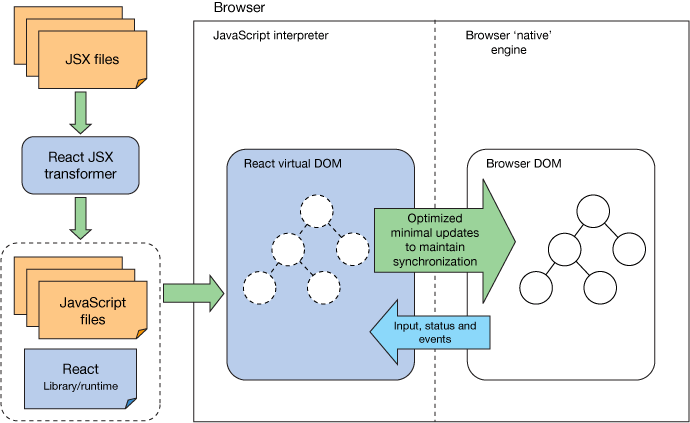
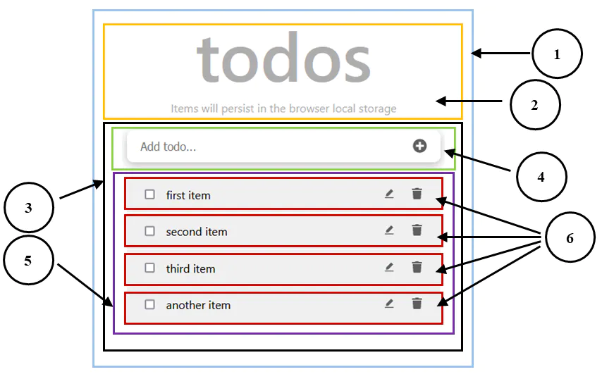
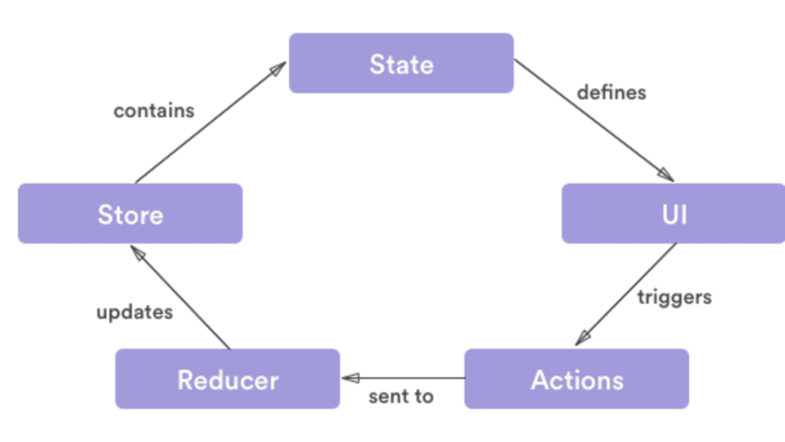
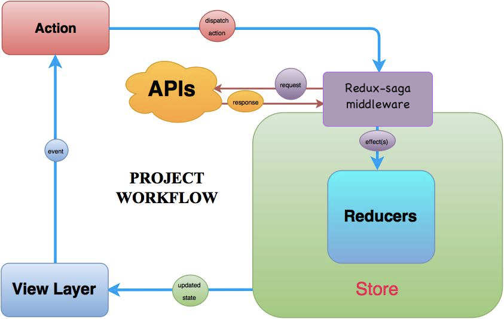
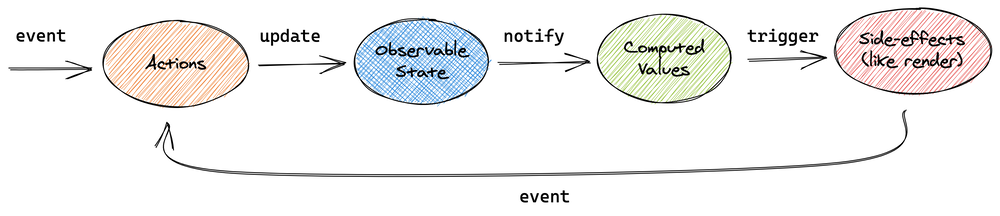
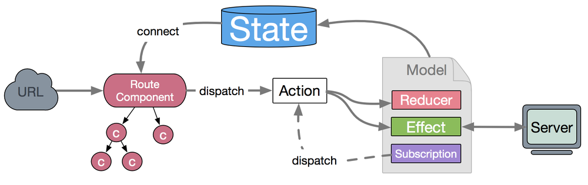
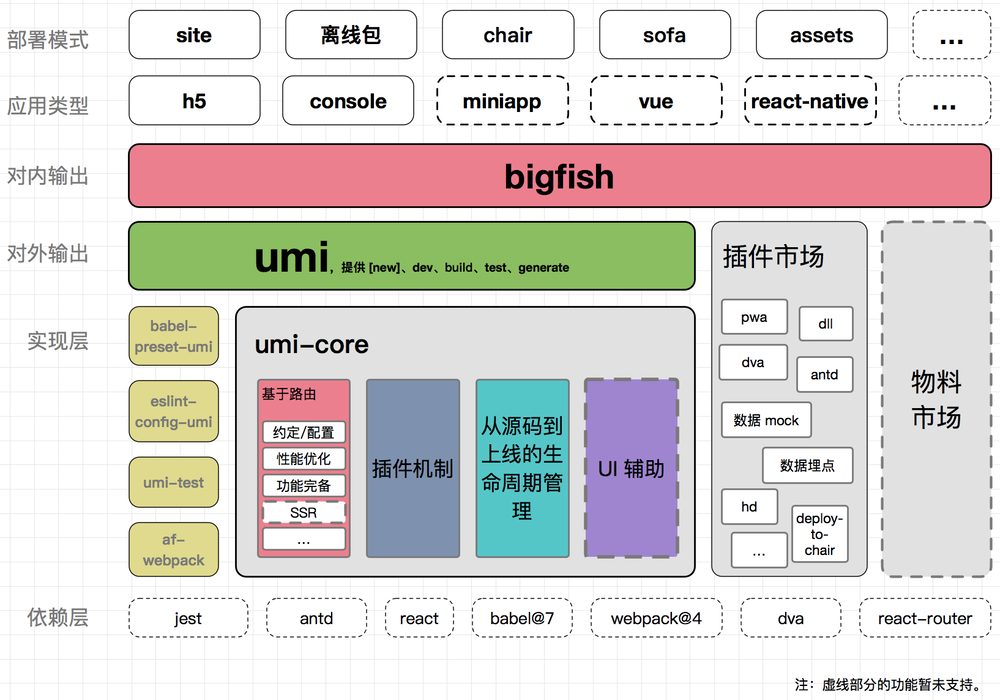

---
## Overview

> Update 2023-07 这篇文章躺在草稿箱一年，最近我恰好开始做了一个项目，基于 Taro + React 框架的微信小程序。这次又重温了一遍 React 全家桶。小程序上线后也终于一鼓作气，把本文整理出来

公司内部大量使用 Bigfish（即 umijs + antd + 蚂蚁定制插件），为了能够高效 **自己** 开发项目不要依赖第三方，趁着五一封闭在家中，我又认真学习一遍相关知识。

本来以为凭借自己能写写 jQuery / Angular 代码能力快速上手，没想到这几年过去前端世界日新月异。学习过程中不断涌现出新的知识点，甚至唤醒了一点点我读书时代学习 MFC 的记忆。这里记录一下学习过程，方便未来温故知新。

我自己的学习顺序是 Bigfish -> AntD / AntDesignPro -> UmiJS -> dva -> React -> Redux。
为了便于读者入门，本文整理了顺序则是从基础开始，TypeScript -> React -> Redux -> dva -> umijs。

注：本文并不是一个常规教程，而是结合了官方、社区优质的教程梳理一下学习脉络，介绍一下笔者的经验。就好像我是一位导游给你介绍景点，但游览和感受还得自己亲自来。

## 2023 年前端基本状况

TODO
图片

前端发展阶段 2023-07 @alswl

三大阶段

每个阶段的代表技术。

## 后端工程师的一脑门问题

-   [入门 Redux | Redux 中文官网](http://cn.redux.js.org/introduction/getting-started)
-   [Redux 学习 - umijs | yukaPriL上午茶时间](https://www.yukapril.com/2019/11/12/react-redux-umi.html)
-   [umijs+dva 实践 - 掘金](https://juejin.cn/post/6952508913321246728)

- 什么是前后端分离
- 为什么 React 要替换 jQuery
- 为什么 React 有这么复杂的生命周期管理
- Redux 又是什么

- saga 是什么
- Reducer 是什么？是函数式那个么？Effect 又是什么？Subscription 是什么？
- typescript 里面那个 type.d 是什么？es5/es6/typescript 差异？
- 异步函数 `await` / `async` 是什么

带着一系列问题，我们展开对当下前端技术的学习。我认为去学习一个新技术，始终要围绕几个问题去解构一门技术：

- 现在遇到了什么问题？
- 过去没有这个问题么？
- 这个技术是怎么解决这个问题的？
- 这是解决这个问题的最佳方法么？有没有可替代方案？

尤其第四个问题，由于前端技术发展迅猛，往往看到的文档（甚至是官方文档）都不是最新的讲述。以 `React.Component` 举例，这个类名是根正苗红，但是事实上现在写代码应该不会使用这个类而是使用函数组件 + `hooks` 来解决 UI 和表现分离的问题。

好了，先来看看 React 全家桶（React + Redux + dva + umijs）等解决的核心：

-   现在遇到了什么问题？
	- 前端系统业务变复杂，交互变复杂，这对数据流管理、状态管理、页面小片段可复用能力、编程 Pattern 提出了渴望
	- SPA 单页面更是剧烈加大这方面诉求
- 过去没有这个问题么？
	- 过去使用 Form 页面级别提交，以及使用 jQuery 这类简单的模式就解决了
- 这个技术是怎么解决这个问题的？
	-   初级，所有组建都是单向渲染，app -> ui
	-   这时候 ui 想感知到数据的变化，需要订阅数据变化，即在 mound 时候添加 listener 以及对应的卸载
	-   使用 `withSubscription` 高阶组件函数创建组件
-   这是解决这个问题的最佳方法么？有没有可替代方案？
	- vue？（完全没学过），Angular2（好像不是很活跃）
	- 似乎 React 已经成为某种事实标准了

-   `createStore`，`getState` `subscribe` `dispatch`
-   包含数据存储、观察者模式（订阅通知）

-   增强能力

-   Time Travelling
-   Redux DevTool

## 2023 年学 React 全家桶需要学会

接下来我们进入 React 全家桶的学习，学习路径如下，先学习语言，再学习 React 基础知识，最后进阶知识学习。

- ES6 和 TypeScript
- React Basic
- React Hooks
- React 进阶
- Redux

## ES6 和 TypeScript 基本知识

- 现在遇到了什么问题？
- 过去没有这个问题么？
- 这个技术是怎么解决这个问题的？
- 这是解决这个问题的最佳方法么？有没有可替代方案？

优势：

- 类型系统
- 常见数据结构
- 匿名类型（好像 es6 也有？）
- 语法糖

PS：React 官方教程是 es6，但是考虑 AntDesignPro 大量使用 ts，还是要掌握基本语法。

[解构赋值 - JavaScript | MDN](https://developer.mozilla.org/zh-CN/docs/Web/JavaScript/Reference/Operators/Destructuring_assignment)
注意按值解析（这是 es5 特性）。

TODO
对比一下 es5/es6/ts 区别。

ECMAScript 是 JavaScript 的标准规范， JavaScript 是 ECMAScript 的具体实现。

ES5 引入了一些重要的功能，包括严格模式（Strict Mode）、数组方法（如 `forEach`、`map`、`filter`、`reduce` 等）、对象属性的属性描述符（`Object.getOwnPropertyDescriptor`）、原生 JSON 支持（`JSON.parse` 和 `JSON.stringify`）等。

**ES6：** ECMAScript 6 是 JavaScript 的第六个版本，于2015年发布。ES6 带来了许多重要的新功能和语法改进，使得 JavaScript 更加现代化和强大。它引入了类（Class）、箭头函数（Arrow Functions）、解构赋值（Destructuring Assignment）、模板字面量（Template Literals）、扩展运算符（Spread Operator）、默认参数（Default Parameters）、模块化（Modules）等。

对比 ES6 和 TypeScript，简单来说 TS 是 ES6 超集，核心是增强了类型系统。

注：ES6 class 是 function 语法糖

我的建议是，能用 TS 就写 TS，兜底使用 ES6 写代码。如果有细微的语法不会写，交给 IDE 来协助。

## React Basis

- 现在遇到了什么问题？
- 过去没有这个问题么？
- 这个技术是怎么解决这个问题的？
- 这是解决这个问题的最佳方法么？有没有可替代方案？

Image from [React: Create maintainable, high-performance UI components - IBM Developer](https://developer.ibm.com/tutorials/wa-react-intro/)

React 的核心特性：

- 语言扩展 JSX
    - 早期使用 Class，后期提出了 Function Component
- 组件定义
	- 新项目一般不用类组件，以函数组件为主。
	- Component 和 FC [【React+Typescript】React.FC与React.Component使用和区别 - 掘金](https://juejin.cn/post/6987297731157065758)
	-  React.FC是函数式组件，是在TypeScript使用的一个泛型。FC是FunctionComponent的缩写，React.FC可以写成React.FunctionComponent。
	- React.Component为es6形式
- 组件通信
	- 注：从这里开始，就意味着 react 超越了 ui render 职责，开始跟数据处理挂钩了。
	- 不过也是，ui 单独存在是静态的，本质上还是要使用双向绑定完成数据流动。难的是如何管理住复杂的逻辑关系，将 render 和逻辑处理分离
	-   父传子： `props`
	-   子传父，就是调用 props 里面函数
	-   兄弟：通过父间接传递
	-   其他：`useContext`，生成 Provider / Consumer
	- 通信的意义，单向数据流动（props），双向通讯

image from [React Tutorial: A Comprehensive Guide for Beginners | Ibaslogic](https://ibaslogic.com/react-tutorial-for-beginners/)

## React 核心 - 生命周期

React 除了定义了组件和渲染能力，接下来引来了 UI 层面难题。这也是我个人认为桌面端要解决的核心问题，理解了生命周期就可以理解 React 哲学。生命周期管理之于前端就好比数据密集型应用之于后端。

- 现在遇到了什么问题？
- 过去没有这个问题么？
- 这个技术是怎么解决这个问题的？
- 这是解决这个问题的最佳方法么？有没有可替代方案？

官方教程学习 [开始 – React](https://zh-hans.reactjs.org/docs/getting-started.html) 。

一些重点记录：

- [State & 生命周期 – React](https://zh-hans.reactjs.org/docs/state-and-lifecycle.html)
    - 使用 State 完成 immutable 数据结构，避免数据被篡改，**将数据的修改入口约束为唯一的构造函数**
    - 不要共享变量，如果需要共享，将其提权到父元素
- [组合 vs 继承 – React](https://zh-hans.reactjs.org/docs/composition-vs-inheritance.html)
    - 特殊的 `props.children`
- [React 哲学 – React](https://zh-hans.reactjs.org/docs/thinking-in-react.html)
    - 设计稿 -> 层级拆分（建模） -> 静态 React -> MVP -> 确定 states（归属）-> 反向数据流

> 通过问自己以下三个问题，你可以逐个检查相应数据是否属于 state：
>
> 1.  该数据是否是由父组件通过 props 传递而来的？如果是，那它应该不是 state。
> 2.  该数据是否随时间的推移而保持不变？如果是，那它应该也不是 state。
> 3.  你能否根据其他 state 或 props 计算出该数据的值？如果是，那它也不是 state。

> 哪个组件应该拥有某个 state 这件事，**对初学者来说往往是最难理解的部分**。

有时间要完成这个 [入门教程: 认识 React – React](https://zh-hans.reactjs.org/tutorial/tutorial.html)，之前我做了一半。
TODO

React Render Props：

一个小技巧，不 redner 静态数据，而是 render 一个 render 函数，用来提供可扩展性。

## React 进阶 - Hooks

严格来说，Hooks 知识 React 在 ES6 之上扩展的语法糖，但这个语法糖大大简化了 React 开发的工程负担。

- 现在遇到了什么问题？
- 过去没有这个问题么？
- 这个技术是怎么解决这个问题的？
- 这是解决这个问题的最佳方法么？有没有可替代方案？

Redux 要求了解 hooks，说简单方案直接使用 hooks 即可。这段话也出现在 `connect` 函数介绍处。

> Hook 是一些可以让你在函数组件里“钩入” React state 及生命周期等特性的函数。

教程：

-   [Hook 简介 – React](https://zh-hans.reactjs.org/docs/hooks-intro.html)
-   [Hook 概览 – React](https://zh-hans.reactjs.org/docs/hooks-overview.html)
-   [使用 Effect Hook – React](https://zh-hans.reactjs.org/docs/hooks-effect.html#tip-use-multiple-effects-to-separate-concerns)

Effect Hook 相当于 `componentDidMount`，`componentDidUpdate`，`componentWillUnmount`。

> Hook 是一种复用状态逻辑的方式，它不复用 state 本身。

自定义 hook 都是以 `use` 开头。

常见：`useState` `useReducer` `useContext`

使用自定义 hook 可以取代 高阶组件 HOC 和 render props。

按示例的描述，使用 `useFriendStatus` 就可以完成数据的双向绑定，即实时订阅数据状态，完成。

`useState` 获取数据。

`useEffect` 根据 ui 反馈，完成 API 调用，里面封装副作用（其实就是 Monad 封装 io）

> 有时候我们会想要在组件之间重用一些状态逻辑。目前为止，有两种主流方案来解决这个问题：高阶组件和 render props。自定义 Hook 可以让你在不增加组件的情况下达到同样的目的。

[Hook API 索引 – React](https://zh-hans.reactjs.org/docs/hooks-reference.html)

解决的问题，逻辑复用，使用函数式组件。更加`ui = f(data`。

优势：

-   告别 class
-   拆分业务逻辑
-   利于逻辑复用
-   更加函数式

useState 底层依赖调用顺序，来作为读取和写入依据（很 hack）

[useState 的原理及模拟实现 —— React Hooks 系列（一） - 知乎](https://zhuanlan.zhihu.com/p/100714485)

useState 到底是什么：

- [Ant Design Pro V5精讲（基础篇三）：useState - 掘金](https://juejin.cn/post/6981480045109854238)
- React Hooks 是什么

useEffect 专门设计用来做副作用处理。（无依赖）每次组件更新时候，都会被执行一次。（有依赖）依赖变化就执行，可以使用空数组。

这时候我想通了一个点，整个 React.Component 都是对组件的描述。具体的运行都是靠 React 框架进行解释的。靠各个碎片化的逻辑插入，进行执行。

这个和常见的框架非常不同，即白箱开的不够。

## Redux

Redux 是 SPA（Single Page Application） 基石，其重要性好比数据库操作能力之于后端应用。

- 现在遇到了什么问题？
- 过去没有这个问题么？
- 这个技术是怎么解决这个问题的？
- 这是解决这个问题的最佳方法么？有没有可替代方案？

[General | Redux 中文官网](http://cn.redux.js.org/faq/general/#when-should-i-use-redux)

[Idiomatic Redux: The Tao of Redux, Part 1 - Implementation and Intent · Mark's Dev Blog](https://blog.isquaredsoftware.com/2017/05/idiomatic-redux-tao-of-redux-part-1/)
[Idiomatic Redux: The Tao of Redux, Part 2 - Practice and Philosophy · Mark's Dev Blog](https://blog.isquaredsoftware.com/2017/05/idiomatic-redux-tao-of-redux-part-2/)

> You'll know when you need Flux. If you aren't sure if you need it, you don't need it.

> I would like to amend this: don't use Redux until you have problems with vanilla React.

Redux is most useful when in cases when:

-   You have large amounts of application state that are needed in many places in the app
-   The app state is updated frequently
-   The logic to update that state may be complex
-   The app has a medium or large-sized codebase, and might be worked on by many people
-   You need to see how that state is being updated over time

当遇到如下问题时，建议开始使用 Redux：

-   你有很多数据随时间而变化
-   你希望状态有一个唯一确定的来源（single source of truth）
-   你发现将所有状态放在顶层组件中管理已不可维护

云谦：

> Redux 本身是一个很轻的库，解决 component -> action -> reducer -> state 的单向数据流转问题。

Redux-saga 是什么？

推特好友建议，不要看 redux，可以看 mobx。

> MobX is a battle tested library that makes state management simple and scalable by transparently applying functional
> reactive programming (TFRP).

[redux、mobx、concent特性大比拼, 看后生如何对局前辈 - SegmentFault 思否](https://segmentfault.com/a/1190000022332809)

> redux、mobx本身是一个独立的状态管理框架

## 番外 - Ant Design / Ant Design Pro

- 现在遇到了什么问题？
- 过去没有这个问题么？
- 这个技术是怎么解决这个问题的？
- 这是解决这个问题的最佳方法么？有没有可替代方案？

聊一下轻松的话题，Ant Design 几乎是 2B 建站的最优选择，这也是我非常喜欢的前端风格和类库。

Ant Design 是一套设计语言下的组件，并在其设计风格之后提供了一套 React 的组件实现，

Ant Design Pro 则是一套高阶的组件，学习这些组件有一定门槛，但是一旦了解了这些组件的设计思路和工作机制，在日常使用中就大大提效。

一定要掌握的组件是 Pro Table。掌握这个基本掌握了最核心的精髓。

## 番外 - DvaJS

DvaJS 是针对 React 的简化，DvaJS 在 React 之上进行了 API 的抽象和简化。基于一些约定简化使用成本。即作者提供了一套自己的最佳实践。

- 现在遇到了什么问题？
- 过去没有这个问题么？
- 这个技术是怎么解决这个问题的？
- 这是解决这个问题的最佳方法么？有没有可替代方案？

[介绍 | DvaJS](https://dvajs.com/guide/#%E7%89%B9%E6%80%A7)

还是基于 redux / redux-saga 的数据流方案，意味着简单系统不需要启用这个复杂方案。

[支付宝前端应用架构的发展和选择 · Issue #6 · sorrycc/blog](https://github.com/sorrycc/blog/issues/6)

[dva 介绍 · Issue #1 · dvajs/dva](https://github.com/dvajs/dva/issues/1)

## 番外 - UmiJs

上述所有提到的技术系统都是 Library，而 UmiJs 是本文唯一逃到的一个 Framework。

- 现在遇到了什么问题？
- 过去没有这个问题么？
- 这个技术是怎么解决这个问题的？
- 这是解决这个问题的最佳方法么？有没有可替代方案？

- 理念梳理
    - 框架：路由、构建、部署、测试
    - 插件
    - 高级特性：快速刷新、ssr、mfsu
    - 对标：next.js
- [目录结构](https://umijs.org/zh-CN/docs/directory-structure)
- [API](https://umijs.org/zh-CN/api)
    - umijs API 整体体现在路由侧
-   [Dva 概念 | DvaJS](https://dvajs.com/guide/concepts.html#%E6%95%B0%E6%8D%AE%E6%B5%81%E5%90%91)

问题：

-   解决什么问题
  -   提供框架式服务，将 reducers / effects / subscription 组织起来
-   一样的 Reduce 和 Effects
  -   其实就是 FP 无副作用和有副作用的调用，用来隔离影响范围
-   Subscription 来自 elm
  -   用来被动管理变化
-   connect 起到什么作用
  -   技术上是一个部分函数，输入一个 `x->x` 函数，然后应用到 Component 上
  -   输入是 props，输出是一个新的
  -   代码被连接到 `redux.connect`
  -   （猜测）注册 subscription，管理依赖关系
  -   > connect 也是一个代理模式实现的高阶组件，为被代理的组件实现了从 context 中获得 store 的方法。
  -   [Dva 源码解析 | DvaJS](https://dvajs.com/guide/source-code-explore.html#src-index-js-2)
  -   [react-redux/connect.md at master · reduxjs/react-redux](https://github.com/reduxjs/react-redux/blob/master/docs/api/connect.md#connect)
  -   提示 > connect still works and is supported in React-Redux 8.x. However, we recommend using the hooks API as the default.
  -   所以 connect 确实是 hooks 出现之前，经常使用的高阶组件
