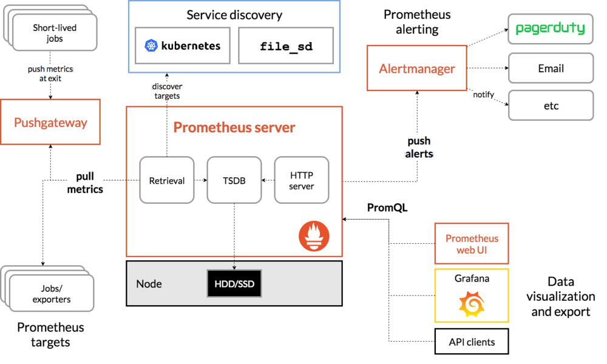
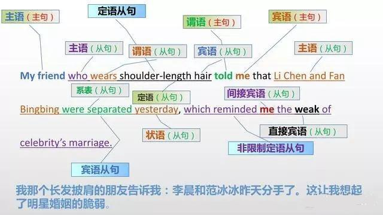
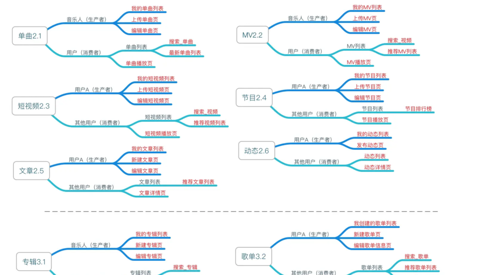
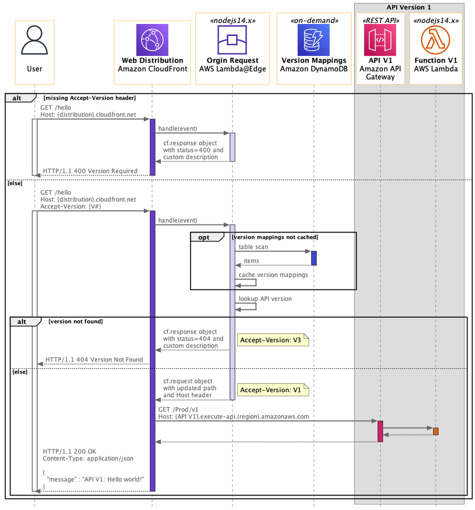

<small>image via [Pixabay](https://pixabay.com/photos/child-tower-building-blocks-blocks-1864718/)</small>

## 概览

前几日，我在团队内部举行了一场技术分享，我介绍了关于架构设计的最佳实践。将这些实践凝练成了 <mark>20 字口诀</mark>：

1. 架构看问题
2. 需求看用例
3. 设计看模型
4. 细节看时序

我将顺口溜转到了 [Twitter](https://twitter.com/alswl/status/1683778487726006272)，不少朋友对这些顺口溜产生了浓厚兴趣，希望深入了解。因此，我将我分享中的观点扩展成了这篇文章。

## 架构设计和系统分析

让我们首先澄清 <mark>什么是架构设计和系统分析</mark>（简称系分）。有些朋友对前者很熟悉，对后者却不太了解。
不过没关系，以下是维基百科上的介绍：

> 架构，**软件架构**是有关软件整体结构与组件的抽象描述，用于指导大型软件系统各个方面的设计。
>
> 系统分析，旨在研究特定系统结构中各部分（各子系统）的相互作用，系统的对外接口与界面，以及该系统整体的行为、
功能和局限，从而为系统未来的变迁与有关决策提供参考和依据。

来看一下英文定义可能会更清晰：

- 架构 = 软件架构（设计） = Software Architecture [Software architecture - Wikipedia](https://en.wikipedia.org/wiki/Software_architecture)
- 系分 = 系统分析 = System Analysis
  [Systems analysis - Wikipedia](https://en.wikipedia.org/wiki/Systems_analysis) + [Systems design - Wikipedia](https://en.wikipedia.org/wiki/Systems_design)

我们有时候提到的设计文档，可能涵盖整个设计过程，包括架构设计、系统分析以及其他设计活动（交流、PoC）。

软件架构（设计）= Software Architecture

- 设计和实现软件系统的基本结构和组织形式
- 在业务层面：明确问题，厘定概念，呈现价值
- 在技术层面：确定基础框架，将不确定性转化为确定性
- 工程层面：识别边界和拆分各个模块，提高应用开发效率

系统分析 = System Analysis

- 对业务需求和问题进行分析和研究的过程
- 在业务层面：需求收集、需求分析
- 在技术层面：建模，绘制流程图、数据流图和接口设计
- 工程层面：在应用、系统框架内实现需求

最后，我来解释一下我对这两者边界的理解。实际上，我认为<mark>架构设计和系统分析并没有明显的界限</mark>。
一个系统或模块不管如何都会进行系统分析，而当出现以下几个特征时，就开始考虑架构设计问题：

- 当有超过 3 个团队在协作时，因为这时涉及到利益和边界的问题。
- 当开始主动或被动引入不确定性。
- 当开始平衡取舍，需要先做到什么程度，再做到什么程度。
- 当不系统过于复杂，太容易达成一致，开始有解释成本时。
- 当能够提供别人不了解的信息。

## 什么是架构

在这里，我们讨论的是技术架构，不会涉及业务架构或产品架构等方面。技术方面的讨论重点是<mark>如何更高效地利用技术能力和方法来解决特定类型的问题</mark>。

进一步地，技术架构可以分为两种：一种是<mark>从顶层向下</mark>看，包括业务、战略和框架划分；
另一种是<mark>关注工程实现（编码）</mark>层面需要解决的架构问题。

那些经验丰富的人常常有较宏观的视角，使用的常见名词有：全局、宏观、领域、战略、平衡、规划。我将这些词汇整理成了一个词云如下：

<small>generted by https://tendcode.com/tool/word-cloud/</small>

以上这些概念在架构设计和系统分析中都非常重要，因为它们帮助我们在整体上考虑问题，甚至超越技术层面，
从业务价值、商业策略和业务战略的角度思考问题。

另一种架构偏重于工程设计和实现。常见的关键词有：领域建模、UML、GoF23，SOLID，高内聚低耦合等等。对应的词云如下：

<small>generted by https://tendcode.com/tool/word-cloud/</small>

架构的话题非常广泛，本文选择从一个切入点出发：<mark>通过实践和方法论，使架构意识在日常工作中发挥作用，以满足 80%的工程设计开发场景</mark>。
我称之为「架构设计 the easy way」。

## 极简架构设计 - 架构看问题

理解架构的第一步，也是最重要的一步，就是关注「问题」。也就是说，<mark>你遇到了什么问题，你将如何去解决它</mark>？

通常情况下，如果我们的业务和系统都稳定运行，没有遇到任何问题，我们就不太需要进行架构设计。但是，只要涉及到架构设计，
必定是因为我们遇到了问题。这些问题可能源自新的需求，也可能是外部环境的变化，
亦或是系统自身随着时间的发展而出现的。无论问题的来源如何，我们都遇到了问题。

遇到问题之后，我们该如何解决？就像将大象装进冰箱一样，需要分成几个步骤。

<small>image via unkown</small>

因此，解决问题也有三个步骤：第一步是将问题描述清楚，第二步是进行协商和决策达成一致，第三步则是着手解决问题。

我还想问一个听上去很愚蠢的问题：为什么不能直接解决问题？

因为问题是复杂的，有许多解决路径，不同的解决方案各有优劣和成本。在架构设计中，我们需要完成这些决策。

那为什么不直接进行决策，甚至直接开始动手？

首先可能涉及到职权问题，架构师未必有最终决策权，需要有决策权的人来做最后的决定。
第二个原因是架构师未必是方方面面的专家，设计一个复杂系统时候需要协调多个部分和领域专家来一起评估决策。

### 案例

我举 Prometheus 的架构设计来作为例子。

<small>image via [Prometheus](https://prometheus.io/docs/introduction/overview/)</small>

这个架构图回答了很多问题，我举几个例子：

- 问题：数据采集使用 Push 还是 Pull？使用什么存储？如何设计告警链路？
- 决策：采用 Pull（少量情况下使用 Pushgateway）；使用自己实现的 TSDB；使用 Alertmanager 与外部系统对接
- ROI：采用 Pull 降低 Target 观测成本，不需要使用 Push-based 的 Registry；没有现成的外部实现（当时）；提供 Router / Sub 的告警机制以便灵活接入外部系统

### 小结

问题驱动架构变化，架构方案应对问题，架构评审统一解决方案。

关于决策拍板问题。我强烈推崇架构师根据自己具备的领域知识、对行业的判断以及对现状的了解，
做出自己的思考和独立判断。这些思考过程应该有因果关系的支持，<mark>一个优秀的架构师必定拥有自己的观点</mark>。

最后，我补充一个小问题：为什么这里没有提到架构分层、模块分层？

不是因为分层和框架不重要，而是在因为大家都很专业。分层和模块化已经是基本常识和技能，因此反而往往不会成为争论和决策的焦点。
如果分层和框架无法快速形成一致，有可能团队构成上存在问题，也可能问题过于复杂已经不是 80% case。

在本阶段，产出的成果包括架构图以及对问题、价值、成本、风险和分工达成一致的认识。

## 极简架构设计 - 需求看用例

需求是对问题的解答。我个人喜欢用<mark>思维导图或白纸来画图</mark>，将需求讲清楚。
画什么内容呢？理清角色，并列出各种动作和行为。

那有什么技巧可以将事项都整理出来呢？我经常使用<mark>主谓宾状从</mark>的方法。也就是说，明确哪些人，在什么场景（可选），以什么状态（可选）做着什么事情。

<small>image via unkown</small>

通过用例将需求清晰地拆解，并在这个过程中不断与需求提供方进行交流和沟通。

Demo 稿是产品经理的武器，而需求用例则是工程师的武器。

有些初入职场的研发人员会不自然地变成需求的执行者。我比较果断地判断，不了解业务的工程师和外包没什么区别。而需求分析环节是最重要的，是对业务输入进行理解、梳理、重新设计的机会。通过用例的整理，我们可以将一些不切实际、不可靠的需求反馈给需求方。

这是少数可以推动（反馈）需求方的阶段，一定要珍惜。

### 案例

这里有一个产品用例的范例：

<small> image via [网易云音乐产品分析报告](https://www.woshipm.com/evaluating/3493594.html)</small>

实际上，这个用例是敌对势力那边总结的 😄，但仍然能够体现用例的重要性。

### 小结

除了使用主谓宾的方式来进行设计，还有一些其他技巧：

- 使用动线（行动路线）：想象用户（或行动者）完成他们目标的行动路线
- 可以优先考虑解决核心路径中的 20%问题
- 通过分角色、正交拆分等方式将用例整理得更加清晰；将用例分类分到各个模块

本阶段的产出物包括：Demo 稿、用例图。

## 极简架构设计 - 设计看模型

在我看来，设计的核心在于模型：<mark>模型确定了数据的载体和边界</mark>。而<mark>数据确定了组成部分，边界则确定了归属和职责</mark>。
在 UML 中，大量的 Entity 和 Object 用于确定模型的边界。
随着业务系统复杂程度的增加，建模也会面临更加复杂的挑战。

我总结了一下我建模的几个要点：

- 明确术语（中英文）、含义、备注。
- 确定核心模型（重点放在最关键的 20%）。
- 提炼和抽象模型。
- 明确模型之间的关联关系。
- 结合动态和静态：少量模型具有行为，关注其提供的功能（Functions）。
- 业务模型 <-> 数据模型转换。

很多人对中英文术语表不屑一顾，但我却很在意这点。有一个效应叫做「外语陌生感」（Foreign Language Effect），
就像博物学使用拉丁语 / 希腊语来描述物种一样。我们非英语母语的工程师，使用英文描述术语可以快速地聚焦问题。

始终牢记 80/20 原则的存在，特别是在设计阶段，一定要关注核心对象，将其放大而非过度关注细节。
一般来说，关注最核心的 20%模型就可以满足大部分场景。

在模型的提炼和抽象过程中要反复斟酌，并且可以将这个过程联动到前期的用例定义和后期的时序设计，
这需要大量领域知识的支持。我个人喜欢在这个阶段参考外部的代码和设计。

模型之间的关联关系主要是 1:1 / 1:N / M:N 关系，需要使用箭头清楚地标记主从关系。主从关系意味着从属关系，
这会影响后续一系列细节设计（如 URL、数据库、生命周期管理等）。
我个人推荐避免使用 M:N 关系，这种形式通常表明中间会有一个凭证（Credential）或关系（Relationship / Binding）。

除了关注静态的数据，还要关注模型的行为（极少量模型才有）。这个阶段可以进一步做一些识别，方便下一步的细节设计。

完成业务模型设计之后，同时要考虑数据模型。对于普通业务系统，这个转换会非常直观简单。业务系统通常是无状态系统，
完全依赖数据库进行存储。如果面临 DIA（Data Intensive Application）系统，就要考虑运行时数据的管理，
以及一系列复杂的生命周期管理和可用性管理（我估计有这个需求的朋友，不会看到这里了）。

### 案例

我举例一个 Kubernetes 的 RBAC（Role-Based Access Control）系统，这是常见的 AuthZ 授权鉴权系统（注意，不是 AuthN 认证系统）。

<small>image via [Kubernetes RBAC  - DEV Community](https://dev.to/alcide/kubernetes-rbac-moving-from-it-s-complicated-to-in-a-relationship-1bbm) </small>

这里我抛几个问题：

- 为什么需要使用 Role / ClusterRole 两种？它们的结构如何？
- 为什么不使用 ACL？使用 ACL 和使用 RBAC 有什么差异？
- 为什么不用 Policy？为什么不使用 Policy？

这些答案都需要建模来回答的。

### 非业务系统的模型

在我们的讨论中，更多关注的是业务模型，即用户能感知并产品能理解的模型，通常需要存储在数据库中。

但在基础设施领域，也是有模型的，有时候称之为"概念"（Concept）。基础设施领域的模型通常会简单得多，
而业务模型可能会非常复杂，因为世界本身就很复杂，而基础设施则专注于解决非常垂直领域的问题，因此相对简单。

此外，基础设施领域的特殊性会导致有很多抽象的建模，例如最简单到我们常常忽略的（Manager / Service）类别。
一些带有数据和状态的模型，比如 Executor，是常见的概念，而 Registry / Queue 也是常见的概念。

这是 Kubernetes的 [Concepts](https://kubernetes.io/docs/concepts/)，十几个子类，上百个概念更显这个系统的复杂性。

### 小结

模型不仅仅是数据，还涉及边界，边界决定了其归属和职责。

模型的设计需要动静结合来看，静态方面关注其持有的内容，动态方面则关注其提供的功能。

在基础设施领域，模型的产出可能包括 UML Model 图、ER 图、数据库 DML、类文件、OpenAPI Swagger（部分）等。

## 极简架构设计 - 细节看时序

> 程序设计 = 数据结构 + 算法 + 流程控制

在将设计转换为模型之前，最后一个重要的步骤是控制细节。对于需求方和决策者来说，这一步可能并不重要，
但对于实施方（开发团队）来说，这个步骤直接影响交付结果的质量和时间。

我认为细节应该在时序图上进行呈现。

通常我们有两种常用的图形来展示细节：<mark>流程图和时序图</mark>。两者实际上有很多相似之处，但我个人更喜欢时序图，因为它不仅包含顺序的概念，还清晰地展示了流程和系统之间的交互边界。

我的技巧是，一般每个用例都会对应一个时序图。

### 案例

这里以 AWS 一个官方博客作为范例：

<small>via [Sequence Diagrams enrich your understanding of distributed architectures | AWS Architecture Blog](https://aws.amazon.com/blogs/architecture/sequence-diagrams-enrich-your-understanding-of-distributed-architectures/)</small>

在上图中，展示了 AWS 中使用 CloudFront 的一个时序图，从时序图中可以清晰地看到多个系统之间请求的流转以及多种异常状态的处理。

### 小结

这里我总结一下时序图的小技巧：

- 用户动作是发起
- 系统边界要清晰
- 有去有回是同步
- 有去无回是异步

一般来说，时序图画好了，就可以放心地交给项目团队开始实施，不会有大的错误。如果没有时序图，依赖的就完全是彼此之间的合作经验和信任度了。

产出：时序图、API 文档（Open API Swagger）、前端 service 生成（如果有）。

## 极简架构设计 - 小结

在这个阶段，尽管我们还没有开始编写代码，但已经清楚了需要做什么，以及实现的样子。我们也有了类结构、API 定义、前端服务生成等产出。多个团队可以同时开始协作，没有明显的瓶颈。

- ✅ 问题定义
- ✅ 解决方法
- ✅ 类结构、API 定义
- ✅ 服务端代码生成
- ✅ 流程确定
- ✅ 汇报材料 1/3
- ✅ 技术分享材料 1/2

如果未来需要汇报，汇报材料已经有了 1/3 的内容。如果需要撰写技术分享文档，也已经具备了 1/2 的内容。

如果这个项目是一个简单的 CRUD 应用系统，那么基本不会有什么难点。

如果是一个 DIA 系统（Data Intensive Application），则需要开始设计和实施数据存储部分，并考虑数据一致性和并发相关的问题。对于一个复杂的系统，还需要继续实施多个系统连接处是否存在不确定性。如果在工程上面临同步方面的挑战，例如应用框架改造、通讯系统改造等，也要提前进行风险排除。（个人认为同时进行技术升级和业务开发并不明智）。

## 番外 - 画图工具

我对于画图非常着迷，涵盖了系统架构图、流程图等绘制。或许这与我内心渴望成为一名设计师有关吧~

作为一名工程师，必须积累自己的画图工具，熟练掌握其技巧，构建一套属于自己的 UI 工具包，
从而能够将脑海中的构思快速还原到文档中。

我的画图工具组合相当丰富。用于绘制架构图的工具包括：

- 框图
  - OmniGraffle（复杂、美观）
  - Excalidraw（简单、随性）
- 部署图
  - Excalidraw
- 脑图 MindMap
  - SimpleMind（收费）
  - XMind（收费）

用来做工程设计（UML）的工具如下：

- use case 用例
  - 语雀画图
  - plantuml（语雀支持渲染）
- sequence 时序图
  - plantuml
- state 状态图
  - 语雀
- ER 图
  - Excalidraw
- Gantt 甘特图
  - plantuml

这里我再软广一下我维护的 [Excalidraw Fork](https://excalidraw.alswl.com/)，支持中文首先字体，保持风格的统一。

## 番外 - the hard way

回到本次分享的出发点，给大家一份简单可行的架构设计方案。
但是对于你这样好学的人来说，肯定不会满足于如此简单的流程，
毕竟还有那 20% 的复杂场景无法完全涵盖。
我给你一个关键词列表和一些建议的书单，帮助你进一步加深学习：

- 原则
- 理念
- 思想
- 规律
- 方法论
- 案例

以下是一些书单，可以帮助你深入学习：

- 业务架构
  - [UML 和模式应用 - Craig Larman](https://book.douban.com/subject/1792387/)
  - [领域驱动设计 - Eric Evans](https://book.douban.com/subject/5344973/)
- 技术架构
  - [重构 - Martin Fowler](https://book.douban.com/subject/30468597/)
  - [代码整洁之道 - Robert C. Martin](https://book.douban.com/subject/4199741/)
