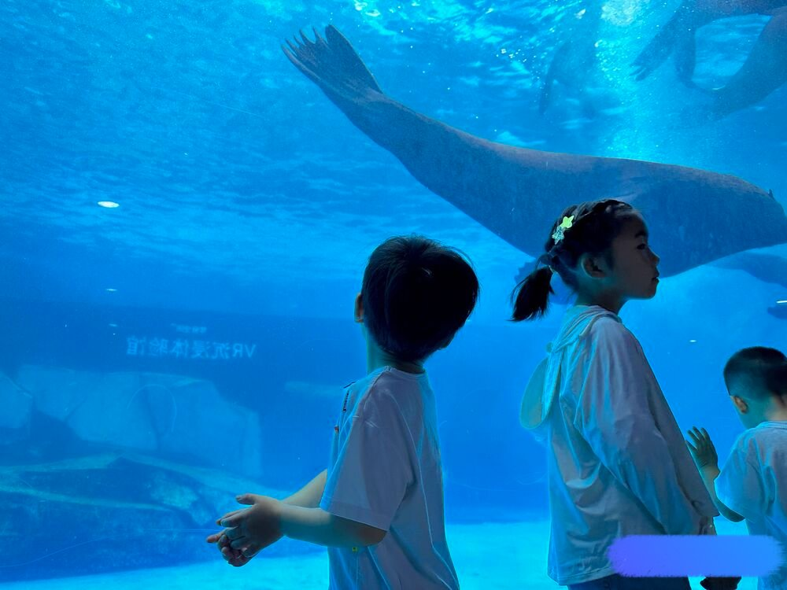
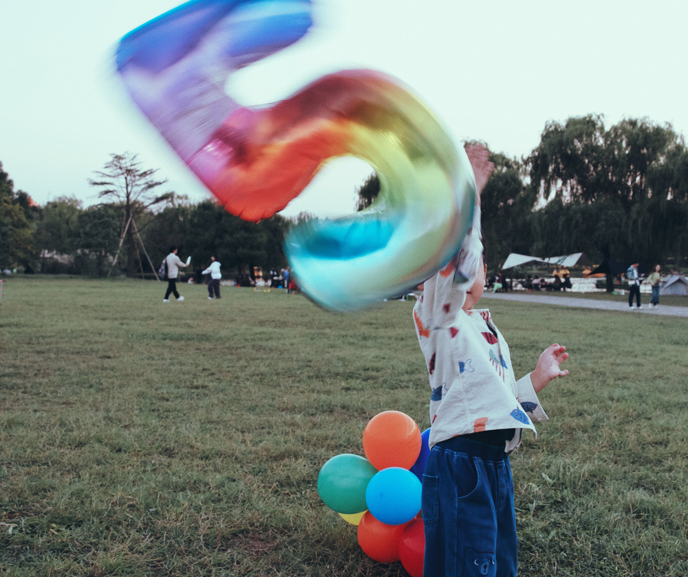
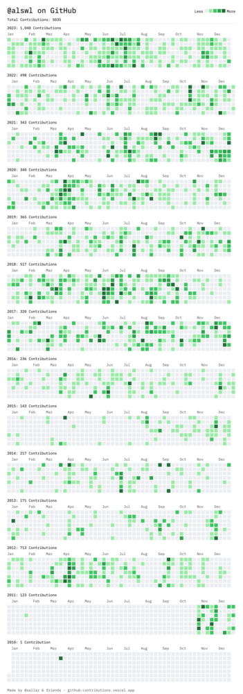
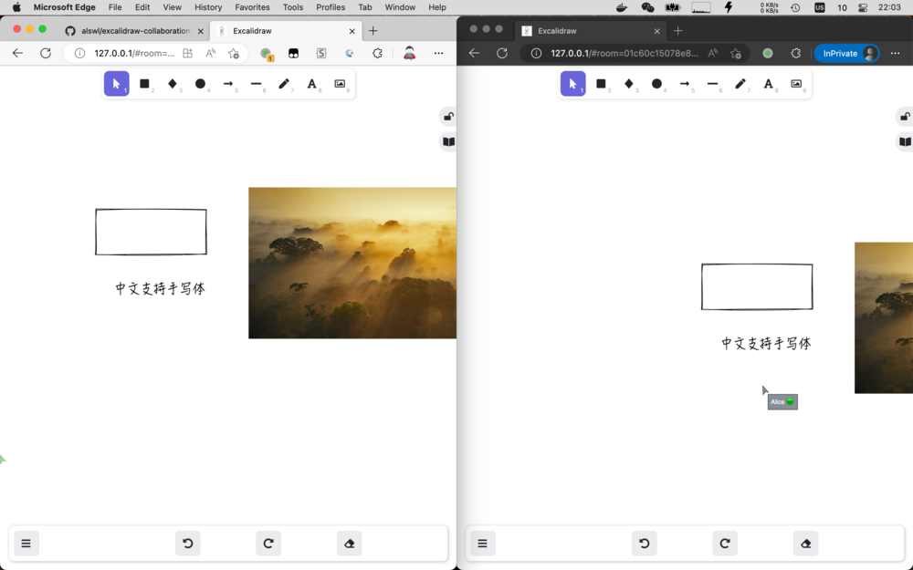
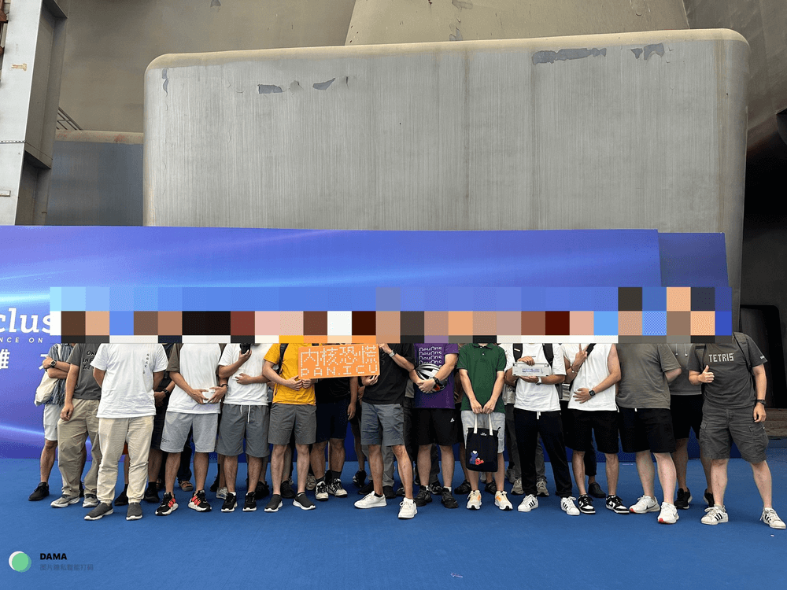
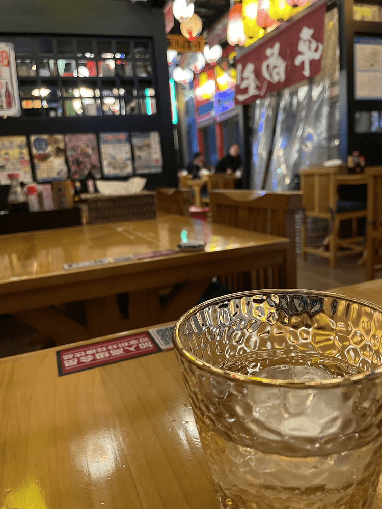

> 时间已做了选择，太多感受，绝非三言两语能形容

## 生活 - 陪伴和成长

这是第 35 个年头，我熟悉地扮演着多个角色，父亲、丈夫、儿子，每一刻都在陪伴和成长中交织。
生活的步伐似乎匆匆，但我努力让自己拥有一颗年轻的心，渴望保持对世界的好奇和激情。

时光大多被生活所占据，只有地铁上和饭桌上我能成为时间主宰。
好在我并未感到疲惫或沉闷，反而逐渐适应了这个身份的变化。
或许，正是在这些琐碎的日常中，我找到了一种生活的节奏，一种平和而温馨的状态。

今年我们走过了北京、汉中、西安、淳安、长沙、张家界、台州。
新年即将到来，准备给孩子办理一下护照，走出去看看。

在陪伴孩子的过程中，参与各种自然知识课程，参观各种展览，我发现在陪伴的同时，我们也在不知不觉中共同成长。
生活中的另一个领域，我从母亲那里薅了两只相机，终于决心好好学习摄像，
我把 Canon 6D 出售，保留了 SONY a6500 这支轻便的 APS-C 相机。
期望摄影成为我表达内心、记录生活的一种方式，每一张照片都是时光的凝固，是岁月的见证。

游戏的世界中，我似乎进入了一段电子阳痿期。购买的游戏几乎只能玩上一个小时就变得索然无味，
也许现实生活才是最引人入胜的游戏吧。

或许，人生就是一场不断变化的冒险。在时间的舞台上，我们扮演着各色角色，
演绎着属于自己的故事。

## 工作 - 精进

工作上一直压力和张力巨大，我开始进一步成为探索者。
这两年，我在工作中不断推动项目的上线，部门推出的新产品中的一半是我负责的，我很喜欢这个领域，也确实想把事情做好。

但有时候，我感觉自己有点像是公司招进来的清理工，身处于一个「散多垂」的状态，
面对复杂的环境，解决问题绝非易事。在整理垃圾的过程中还在自动产生垃圾，而清理的工作永远不会终结。
现实往往是，大家注意力持续被新事物（比如 AIGC）吸引走，对现存的问题更容易选择性忽视。

企业的大环境在不断变化，一些老朋友选择离开，大部门也经历了一些变革。
从面向风险的团队 re-org 到面向算力的基础设施团队。我认为这是一个好的信号，
AI Infra将继续裹挟着整个 Infra 领域前进，算力管理将成为一个新的命题。

## 业余 - 更多连接

在 Github 数据的细碎图形中，映射出一年的自娱自乐，可惜的是，未给开源社区更多的贡献。

今年，我在开源领域主要的贡献是 [alswl/excalidraw-collaboration](https://github.com/alswl/excalidraw-collaboration)。
这个 self-host 的 Excalidraw 版本集协作和中文化字体于一身。这个项目以及相关项目吸引了近300个
star，成为我个人最有影响力的开源项目之一，尽管它是一个前端产品。

在暑假期间，趁着家中小神兽不在，我开发了一个关于起名的小程序。虽然这款产品目前有点烂尾，
亏损严重，但我依然希望花更多时间进行开发和改进。一个美好的名字可以给家庭带来无限愉悦，
希望这个项目可以养活服务器资源~

另外，今年我重新活跃在 Twitter 上，分享一些技巧和心得。我的 Follower 从几百人增长到近 4000 人，
虽然离有影响力的推友还有差距，但与许多有趣的朋友交流本身就是一种有趣的事情。

今年一年最受欢迎的内容是：

- 167k 转载：对抗软件复杂度的战争 [X](https://twitter.com/alswl/status/1714467723567329309)
- 160k 英语学习经验介绍 [X](https://twitter.com/alswl/status/1742558249260286368)
- 127k 介绍 Lightboard [X](https://twitter.com/alswl/status/1726526339568795667)
- 120k Web 框架讨论 - Kratos [X](https://twitter.com/alswl/status/1666118124276699136)
- 90k 介绍 dumi [X](https://twitter.com/alswl/status/1684951997752168448)

今年最具价值的文章是介绍「许世伟的架构课」[X](https://twitter.com/alswl/status/1738411522756665350)，赚了几个月 Twitter 的订阅费。

今年我还重新开始听播客，聆听了一大半「内核恐慌」的存档，虽然未能赶上他们活跃的时期。
幸运的是，在外滩大会上我有机会参与了他们的聚会，与 Rio 和吴涛面对面交流。搞笑的是，虽然现场还有一位同事，
但我们却没有互相认出来，令人感叹在庞大的公司中，有时即便共事也未必能够相识（我们一起担任 Go 语言评委）。

除了内核恐慌，我还一直在听「硬地骇客」，一集都没拉，最近还开始听「有知有行」的播客。

在博客输出方面，我分享了两篇关于工程实践心得的文章，希望能够对读者有所帮助。

- [实用 Web API 规范](https://blog.alswl.com/2023/04/web-api-guidelines/)
- [架构设计 the Easy Way](https://blog.alswl.com/2023/07/architecture-design-the-easy-way/)

我最想分享的是 Obsidian Tasks 插件，详细信息可以在我的博客文章中找到，
[从 Toodledo 到 Obsidian Tasks - 我的 GTD 最佳实践](https://blog.alswl.com/2023/02/gtd/)。我也很高兴成为 Obsidian Tasks 的 Sponser。

回顾一年的时间，我意识到自己在业余时光中的每周时间仅有10小时左右，非常宝贵。
期许着未来能够实现财务自由，以获得更多的自由时间，投入更多的兴趣爱好。

## 读书

读书仍然大部分都是非虚构类书籍。

[牛棚杂忆 (豆瓣)](https://book.douban.com/subject/26318286/)

士可杀亦可辱；过去带来惆怅，现在带来迷惘，未来带来希望。

[素书 (豆瓣)](https://book.douban.com/subject/26628557/)

讲述做人做事的道理，古人的智慧。常读常新，尤其烦躁时候可以翻出来静一下。

[翻译乃大道 (豆瓣)](https://book.douban.com/subject/26279084/)

就是为了看 中文的常态与变态。

[沙丘 (豆瓣)](https://book.douban.com/subject/26836970/)

老男爵举家迁新球，贵公子初入沙漠星。 老皇帝密授哈克南，雷托族全体遭判断。 小保罗掌权弗雷曼，杰西卡诞下遗腹子。 穆阿迪布反攻沙丘，娶伊勒朗再封帝位。

[跌荡一百年 (豆瓣)](https://book.douban.com/subject/30147790/)

国、企、民、央、地。 悲观。

[被讨厌的勇气 (豆瓣)](https://book.douban.com/subject/36150914/)

好希望自己能在 20 岁时候读到这本书。（现在的我已经不需要啦）。教读者如何和自己、周边、世界相处，如何和自己对话以及改变自己。和遇见未知的自己属于同一个路数。

[旧制度与大革命 (豆瓣)](https://book.douban.com/subject/24530465/)

治乱循环在反复。群体的无意识；民主和精英政治是否是解药？评估稳定性一个指标是贫富差距。极权下也孕育变革风险。

[门后的秘密 (豆瓣)](https://book.douban.com/subject/5401859/)

管理入门快速操作手册

[为什么 (豆瓣)](https://book.douban.com/subject/33438811/)

这本书我给不出星级，超出了我的评价范围。 它可能是一个新学科（因果推断）理论，也可能是统计学中的一个星火闪烁。 作者 Pearl 是统计学大拿，也是人工智能领域权威专家，他确在晚年提出了反对自己过去一系列方法路线。 今天为我们所熟知的大部分机器学习技术，都是基于概率上相关性，从啤酒和尿布，到今天 GPT 大杀四方，AIGC 智能涌现。Peral 认为真正有意义的是提出「为什么」，即解释因果关系。因果关系的论述需要智能能够想象不存在的事物，而这正是当前人工智能无法理解的（Maybe？） 本书成于 2019 年，作者今年已经 87 高龄，不知道他对当前 AIGC 风起云涌是怎么看待的。

[为什么中国人勤劳而不富有 (豆瓣)](https://book.douban.com/subject/3248513/)

作者说的正确但是不全面。

## Flag

> 高质量陪伴家人，放下手机，走向户外

执行了周三、周五家庭日给小朋友陪伴；每天早上送小朋友上学；周末一定有一天陪出行。

陪伴小孩这块我做的不如我老婆好，感谢老婆对家庭的贡献。

> 每月输出文章，特别是 Kubernetes / 研发设计领域可以写一些心得

今年输出 6 篇文章，达标率 50%。其中两篇 [实用 Web API 规范](https://blog.alswl.com/2023/04/web-api-guidelines/) 和 [架构设计 the Easy Way](https://blog.alswl.com/2023/07/architecture-design-the-easy-way/) 我都是很满意的。

> 经历了新冠，今年计划安排个私教教我健身房运动

没有完成。

> 投资收益率能做到 10%，今年新手阶段投资以股票型基金为主，投资收益 3.9%，跑赢了大盘和余额宝

今年投资收益率 -1.35%，刚出新手村就被暴击，我还是缺乏对市场和商业的理解。

新的一年 Flag：

- 高质量陪伴家人，走向户外，一起参与
- 持续高质量输出文章，特别是 Kuberntes / PaaS 领域
- 更多运动
- 学习投资的基本框架，建立常识和投资逻辑

## Last

每段经历，每次重逢，每本书籍，都是独特的命运线。新的一年已经来临，
期待着与家人、朋友一同继续探寻生活的真谛，去体验伟大与渺小。

往年总结：

- [2022 年终总结](https://blog.alswl.com/2022/12/2022-review/)
- [20 21](https://blog.alswl.com/2022/01/20-21/)
- [再见 2019](https://blog.alswl.com/2020/03/2019/)
- [从 2018 到 2019](https://blog.alswl.com/2019/04/2018/)
- [从 2017 到 2018](https://blog.alswl.com/2018/01/2017-2018/)
- [2014 惑](https://blog.alswl.com/2015/01/2014/)
- [My 2012](https://blog.alswl.com/2013/01/my_2012/)
- [My 2011](https://blog.alswl.com/2011/12/my-2011/)
