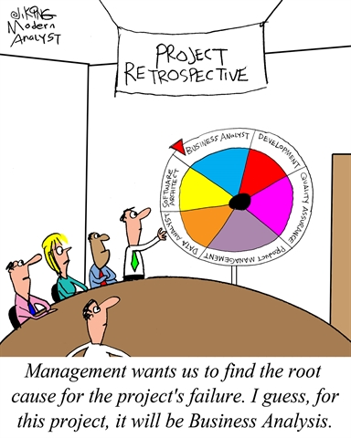
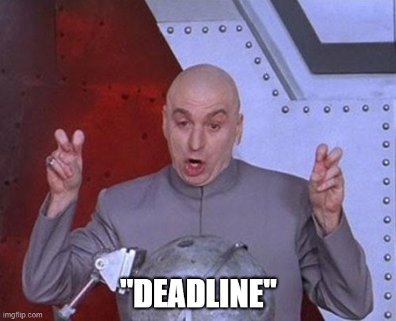
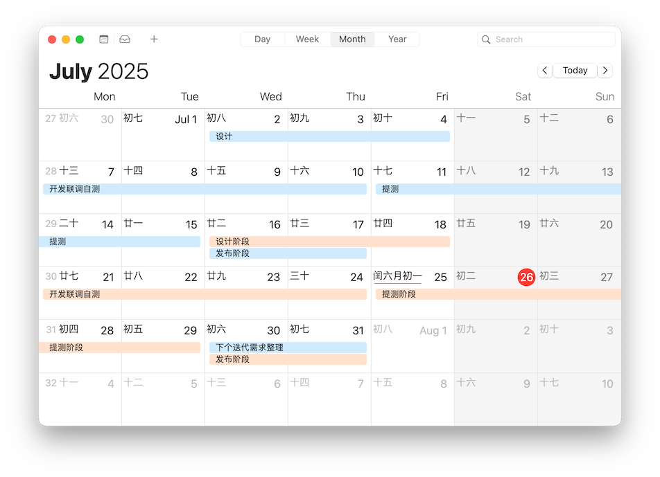
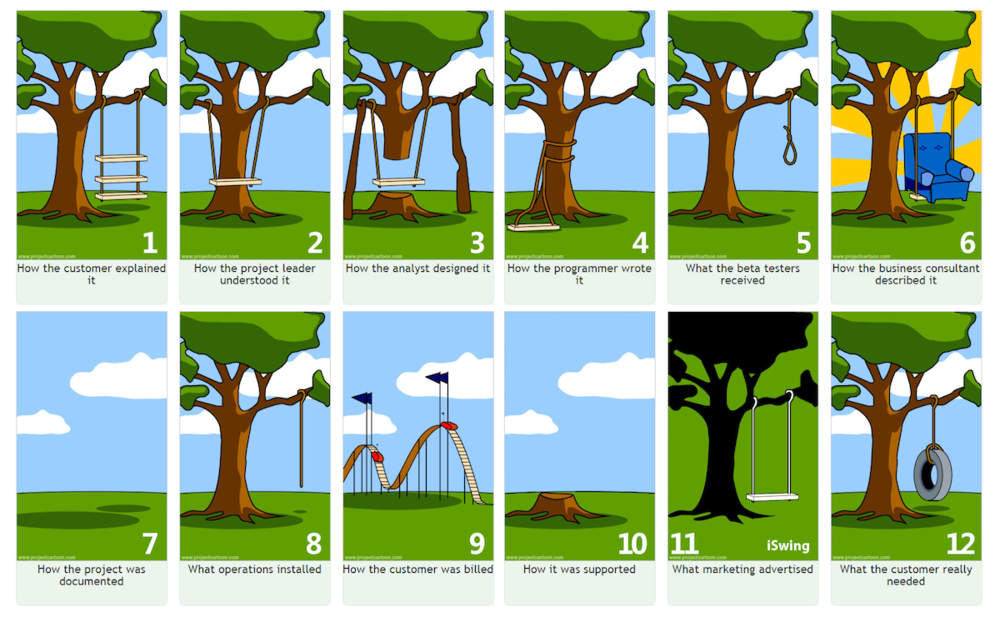
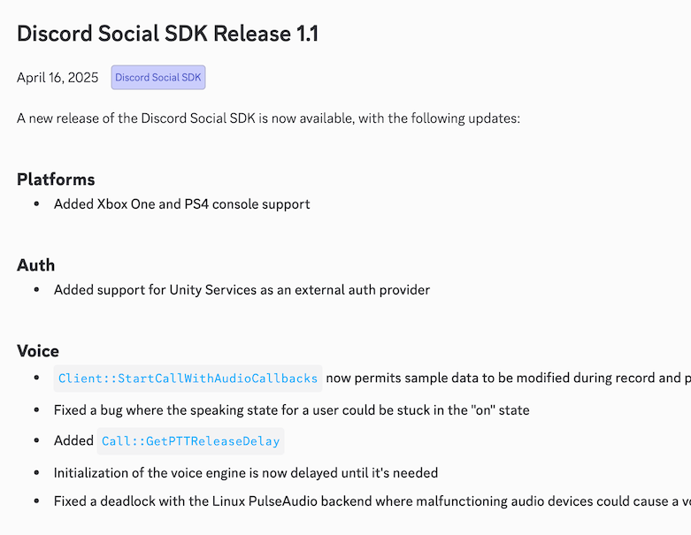
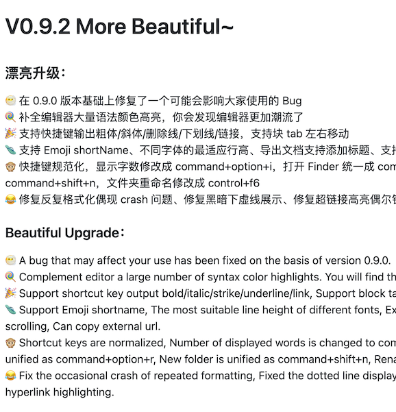
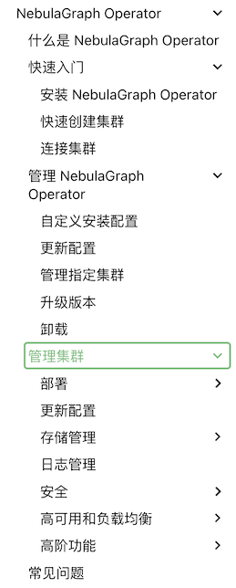
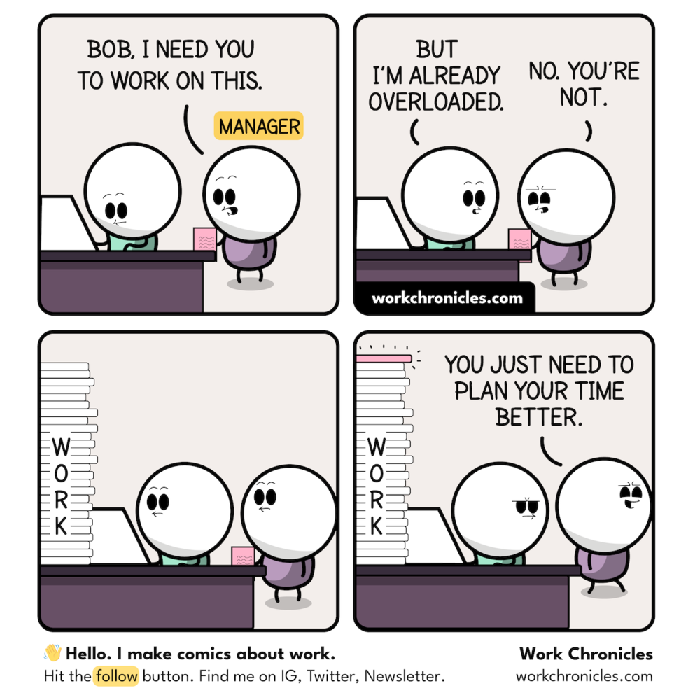
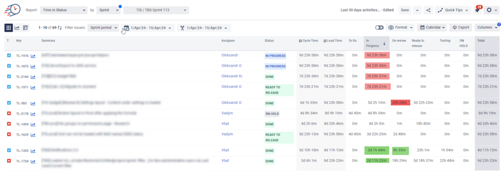

## 概述

本文阐述一套适用于工程应用开发项目的迭代管理实践，重点解决如何高效低成本推进项目的问题。该方案适用于小型团队协作，核心特征在于**固定产研节奏、标准化交付物以及高频异步协作机制**。

本文仅针对技术方案与实施路径明确的项目场景，不涉及工程决策或目标管理范畴。本文也更注重实操，注重立即可以上手实施，不会花太多篇幅去解释这套方案背后的思考和原因。

关于**实用（Pragmatic）** 的定位：该理念贯穿于我的多项实践方案，包括
[架构设计 the Easy Way](https://blog.alswl.com/2023/07/architecture-design-the-easy-way/)
[实用 Web API 规范](https://blog.alswl.com/2023/04/web-api-guidelines/)
[如何做好 PRR（Production Rediness Review）？](https://blog.alswl.com/2021/06/prr/)
等等。实用意味着注重可操作性和实际效果，要领是简单易实施落地，任何人都可以上手执行操作。我对实用的追求来自于《The Pragmatic Programmer》这本书。

注：本文不特定区分项目（Project）和产品迭代（Product Sprint）区别，可以将这里项目管理等同于研发过程管理。

免责申明：没有银弹，本文方法论不一定适合所有场景，并且方案也在持续迭代。如果你的项目有 PM，请优先咨询 Ta。

Mural of La Bre Tar Pits（C.R. 奈特雷阿的焦油坑壁画)，图片被人月神话所引用。

## 在软件项目管理中我们遇到什么问题

软件项目管理常面临各类挑战。就个人经验而言，最直接的困境在于项目无法按期交付。其原因可归纳如下：

- 我的协作方依赖方有问题，他没时间没空或者方案无法满足我
- 需求频繁变更，没想清楚做着做着要改方案，或者实施过程中插入新的需求
- 产出的东西质量不达标，测试阶段一堆问题，迟迟无法交付
- 产出的东西不是想要的，和需求方一对发现偏差太大
- 依赖资源未能及时到位
- 项目计划过于乐观，过度承诺，交付时间比预计的要长，工作量比预期大，难以完成
- 工程难度大，实施过程遇到技术风险，成本高或者难以完成，
- 多项目进行，人力资源挤占
- 多项目并行导致工程上无法满足
- 项目成员的档期不一致，无法有效协作

问题不可怕，定义清楚问题就成功了一半，回到问题本身，让我们来看如何解决。

## 问题根因分析

现实中遇到的问题可能更多，我分分类说到底是这么几个原因：

- **需求问题**：描述模糊、频繁变更及沟通未对齐
- **协作问题**：衔接断层、预期差异及信息同步失效
- **时间问题**：周期限制及过程中突发需求插入
- **工程问题**：技术实现难度超预期或成本制约

## 我的项目管理最佳实践

基于上述问题分析，我将这些问题的解法归到几个方向：**节奏、交接物、协作**。

注意，本文不聚焦解决工程难度问题，也不解决架构师要解决的问题，最多能从项目管理的思路来降低技术风险。

另：对架构问题如何处理问题请移步
[架构设计 the Easy Way](https://blog.alswl.com/2023/07/architecture-design-the-easy-way/)
；遇到了具体工程难题的同学请咨询团队技术专家。

## 节奏 - 固定产研节奏比 ddl 更重要

什么是项目的节奏，什么是好项目节奏？

项目节奏的本质在于建立**可预期的周期化交付机制**。相较于单纯设定最终截止期限（Deadline），采用 Scrum 敏捷框架中的冲刺（Sprint）模式更为有效。每个冲刺构成包含需求分析、设计、开发、测试及上线的完整闭环。良好的迭代节奏具备三重价值：1. 建立明确的时间预期，实现周期化交付；2. 强制需求拆解，推动产品从最小可行版本（MVP）向完善形态演进，避免关门憋大招，最后拉了一泡稀的；2. 规避长期封闭开发导致的交付风险，最怕大搞 58 天，最后 2 天都交不了货

### 双周迭代

一个好的迭代周期多长比较合适呢？在小型团队协作里面，最长不要超过 1 个月，**尽量保持在 2 周**，最好能做到 1 周。以一次迭代的周期来看，我自己体感是 1/2 时间用来设计， 1/2 用来建设（开发测试和上线）。不要低估设计花费时间，投入少了后面想追也追不会来。

迭代管理需设置专职**迭代经理**，该角色承担三项核心职责：规划迭代排期、协调各类会议安排、核验交付材料规范性（依据标准化模板执行，不负责方案质量，材料质量由架构师+下游签收）。此岗位实质承担部分项目管理职能，若短期内无合适人选，应由项目负责人兼任。迭代经理通常从项目成员中产生，建议实施轮值机制。轮岗制度具有双重价值：使成员亲身体验管理挑战，促进跨角色理解；同时通过岗位实践识别流程瓶颈，推动协作机制优化。执行时需确保轮值期间管理职能的完整履行。

高频迭代带来的不少附加优势：直接化解了需求插入问题（任何需求最长等待周期 ≤1 周），紧急需求则通过紧急修复流程（hotfix）处理；大型需求必须进行拆分验证，无法拆解者需通过概念验证（PoC）先行评估技术风险。

### 迭代中评估需求耗时

这是一个一直被提及的问题，我有两个方案来解决，第一个是提供一个需求时间评估公式：工作量 = （最乐观 + 最悲观） / 2。

第二个是避免搞大需求，所有需求需要评估一下规模，我提供这几种级别标准，extra-large（月级别）/ large（周级别） / medium（天级别） / small（小时级别），我不接受 xl / l 需求，必须拆成 m / s。

需求时间评估是一个普遍存在的挑战，我提出两种解决方案。

第一种方案采用工作量估算公式：工作量 = （最乐观 + 最悲观） / 2。这个公式相当实用，比单一指标更多考虑到不确定性。（其实我还有一套更复杂的通过技术采纳性角度的评估方式，但是不如上一个公式简单易操作）

第二种方案聚焦需求规模控制，要求所有需求划分规模级别，包括 extra-large（月级别）、large（周级别）、medium（天级别）和 small（小时级别）。迭代中要尽量避免 extra-large 与 large 规模需求，将其拆解为 medium 或 small 规模后再行处理。

### 迭代范例

我们的一个实际**案例分享**，这是 我负责 产品的 7 月 两个迭代，分成 07a 和 07b 两个迭代。

## 交接物 - 标准化每个环节输入和交付物

软件的**不可见性和抽象性**是导致软件复杂性的根本原因。

清楚明确的交接物可以有效降低不可见性和抽象性，这是用来抵抗交付复杂性的核心武器。掌握这个核心武器的最重要口诀是：**写下来**。

把你的长远需求规划写下来，不管是年度计划，还是月度计划。把你的需求明细写下来；把你的系统设计写下来；把你的发布功能写下来；

整个过程中，我推荐使用到这些面向项目管理的**交接物**，大部分交接物我们都耳熟能详，但请特别注意我这里的最佳实践：**需求清单**和 **Release Note**。

| 阶段     | 输入 / 输出  | 备注                                                                                                         |
| -------- | ------------ | ------------------------------------------------------------------------------------------------------------ |
| 产品规划 | 产品项目 OKR |                                                                                                              |
| 产品思路 | 需求清单     | 需求清单是一个非常特别的形式，是我个人发明的，正面对抗一句话需求。                                           |
| 产品需求 | 需求文档     | 我们产品经常不配置 PD，所以需要自己写需求文档。我们有两种文档格式：文字型 / 配图型                           |
| 系统设计 | 系统设计     | 文字内容设计结构必须是明确的，大家应该使用相同的模式来进行文字创作。比如系统设计文档可以使用语雀自带的模板。 |
| 开发     | 自测报告     | 截图证明你可以。                                                                                             |
| 测试     | 测试报告     |                                                                                                              |
| 发布     | 发布计划     |                                                                                                              |
| 上线     | Release Note | Release Note 做轻薄一些，尽量链接到产品功能使用文档。                                                        |
| 日常使用 | 产品说明文档 | 多截图，常更新，跟随产品上线发布。                                                                           |

下面我会展示一些我实践的需求范例（可能来自不同的产品和迭代）。

### 需求清单范例

这是我使用的需求清单范例：

|                                 |           |            |                |              |
| ------------------------------- | --------- | ---------- | -------------- | ------------ |
| **功能描述**                    | **Owner** | **优先级** | **前端页面数** | **质量介入** |
| 用户 A 可以使用 功能 B 完成授权 | 狗哥      | 高         | 2 页           | 是           |
| 用户 B 可以使用 功能 C 查看报表 | 谢宝      | 高         | 2 页           | 否           |
| 用户 C 可以使用 功能 C 发布视频 | 落九      | 高         | 很少           | 是           |

### 需求文档范例

**需求文档模板**：

> 需求标题：简洁明了地描述需求
> 用户角色：谁会使用这个功能
> 用户目标：用户想要达成什么
> 前置条件：使用该功能需要满足的条件
> 主要流程：详细描述用户如何使用该功能
> 替代流程：描述可能的例外情况
> 验收标准：如何判断需求已经被正确实现

一个**需求文档范例（文字型）**：

> **视频发布流程 MVP**
>
> **用户角色**：内容运营者
> **需求标题**：用户上传视频并完成自动化发布流程
> **用户目标**：
>
> - 运营者通过标准化流程完成视频从上传到发布的完整生命周期管理。
> - 关键步骤自动化处理（如转码、审核），减少人工操作，关键节点保留人工确认机制。
> - 支持异常处理（如审核失败、转码错误），允许人工介入重试或跳过。
>
> **主要流程**
>
> 1. **创建视频发布任务**
>    - 用户上传原始视频文件（支持主流格式：MP4/MOV/AVI）
>    - 填写基础元数据（标题、分类、标签、封面图）
> 2. **自动化预处理**
>    - **转码引擎**：自动生成多分辨率版本（1080P/720P/480P）
>    - **内容审核**：
>      - AI自动审核（敏感画面、违禁内容）
>      - 若AI审核通过 → 进入发布队列
>      - 若AI审核失败 → 暂停流程并通知人工复审
> 3. **人工确认节点**（流程暂停点）
>    - **人工复审**：运营者在后台查看AI标注的违规片段，选择：
>      - 通过（继续流程）
>      - 驳回（需编辑视频后重新上传）
>      - 强制跳过（需填写跳过原因）
> 4. **发布执行**
>    - 自动推送至指定发布渠道（Web/APP/第三方平台）
>    - 生成可跟踪的发布ID（用于效果分析）
> 5. **异常处理机制**
>    - **转码失败**：自动重试（≤3次）→ 仍失败则通知人工
>    - **发布中断**：支持手动重试/跳过/终止任务
>
> **替代流程**
>
> - **转码模块不可用**：允许上传预转码视频文件（需符合分辨率规范）
> - **AI审核服务宕机**：切换为全人工审核模式（需在SOP中注明应急预案）
>
> **验收标准**
>
> 1. **全流程验证**：
>    - 运营者从上传到发布成功耗时 ≤15分钟（不含人工审核等待）。
>    - 模拟审核失败场景，人工强制跳过步骤后流程可继续。
> 2. **异常处理验证**：
>    - 转码失败时，系统自动告警并允许手动替换文件。
>    - 发布中断后重试，视频状态可恢复至中断前节点。
> 3. **文档交付**：
>    - 提供《视频发布SOP手册》，含人工操作指引及故障处理方案（A负责维护）。

### 产品 Release Note 范例

Discord 的 Change Log（Release Note）发布大纲，没有前端产品用那么多 emoji。

妙言 [tw93/MiaoYan](https://github.com/tw93/MiaoYan) 的某个 Release 更新日志：

### 产品使用手册范例

我建议可以使用基于 Git 仓库管理的 markdown 方案，比如 [MkDocs](https://www.mkdocs.org/) 这类方案：

我推荐的范例是 NebulaGraph Operator 的文档范例，注意这仅仅是 NebulaGraph 的其中一个子产品，但是规模更小更适合起步。

关于交付物，特别是文档类型的交付物，虽然我列了这么多类型，但是我认为一定不要写多写复杂，**提纲挈领，量少为宽**。

## 高频异步沟通 - 同步和异步 风险和透明

不要陷入巴别塔。

在分布式协作场景下，需建立「**异步为主、同步为辅**」的沟通范式，重点解决信息孤岛、风险滞后及依赖阻塞三大痛点。有效的协作机制应包含三个核心要素：**全局可视化任务管理、结构化风险预警及精准化依赖协调**。

我讨厌开会，甚至从某种意义上我痛恨开会。我之前写过关于会议的暴论：

这个月代码写得太少了，会议时间占据了 1/3，这很可怕。

会议很低效，很低效，很低效。有些会缺少材料准备，问题不聚焦，主持人不控场，一拉一大把人，不少人又不好意思走就硬挂着。

如果我有权利，我甚至想禁止公司开会，全都回归到基于文档的异步交互模式。

还是多建设，少空谈，有明确主张，材料提前分发，开会不当聋哑人，非干系勇敢离开会议。让大家回到方案设计和代码上吧。

有效沟通需规避信息失真，核心在于建立风险透明机制与依赖协同体系。具体实施包含三个维度：全局可视化看板：实时呈现任务进度与风险状态；精准进度追踪：量化每个节点的完成度；异步协作平台：通过在线任务管理工具（如 Jira）实现全周期信息同步。

### 开两种会 - 方案评审和日会

我们不需要开会了么？还要，但是只要两种：**方案评审会与日会**。

评审会的要点在于：

1. 明确评审会的对象是谁，**谁负责为方案点头**，没有人负责点头的会不用开，既没有对抗又没有讨论，是纯走过长
2. 不要做无准备的讨论，在方案宣讲之前，尽量先和受众对象达成一致，让评审会变成一个**宣讲会**
3. 评审会要有结论，通过还是不通过要有人确认。通知之后的执行项全部落入在线协作平台，特别是需求类，一定要记录，这是未来日会跟踪的依据

日常进度沟通模式，我推荐**每日站会沟通**，最少也得双日沟通（每周二、四）。每天都进行站会同步，每次 15m 搞定。一般一个项目成员在 7 人左右（披萨原理），每人一两分钟。

**站会的主持人很重要**，要引导参与人同步进度，同步风险，寻求帮助，帮助需要有明确的接收方。

### 基于看板的在线沟通

核心准则：**以文档异步协同为基础**，将同步会议压缩至必要场景，最大化建设性工作时间。

下面是会议看板范例，根据迭代过滤，根据 Assginee 分组（其实也很普通，没什么特别的）：

每天迭代经理在日会上面就是拿着这个看板，先明确我们几号提测几号上线，再挨个成员自述进展如何，最后挨个问有没有上线风险。

## 最后

没有万灵的项目管理机制，根据自己面临的问题进行实际调整。本文的命题对我（一个开发工程师）来说也是极具挑战。我在过去有多次因为项目无法交付问题失眠无法入睡。现在来看，其实大可不必，平常心来应对问题，**对预期内问题建立预案，对计划外变更保持弹性**。当团队已完成可行性范围内的最大努力，即应视作有效交付。项目管理的终极目标，是在资源约束下实现可持续的技术价值输出。

## 扩展阅读

[人月神话 (豆瓣)](https://book.douban.com/subject/1102259/)
软件工程项目管理的圣经，20 年后读起来仍然觉得字字珠玑。

[项目管理修炼之道 (豆瓣)](https://book.douban.com/subject/4058336/)
这是我的项目管理入门指导书，更通用更适合 PM。我写过一个读书笔记 [《项目管理修炼之道》笔记 | Log4D](https://blog.alswl.com/2014/08/manage-it/)。

[代码之殇 (豆瓣)](https://book.douban.com/subject/24284853/)
作者是微软高级架构师/管理者，而本书实际上是一个随笔式的文章集合。尽管如此，书中的许多观点犀利且具有独特的见解，展现了从一线到高层的全方位视野。其中关于工程过程管理（比如死亡行军）事项，确实值得深思。
